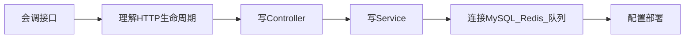
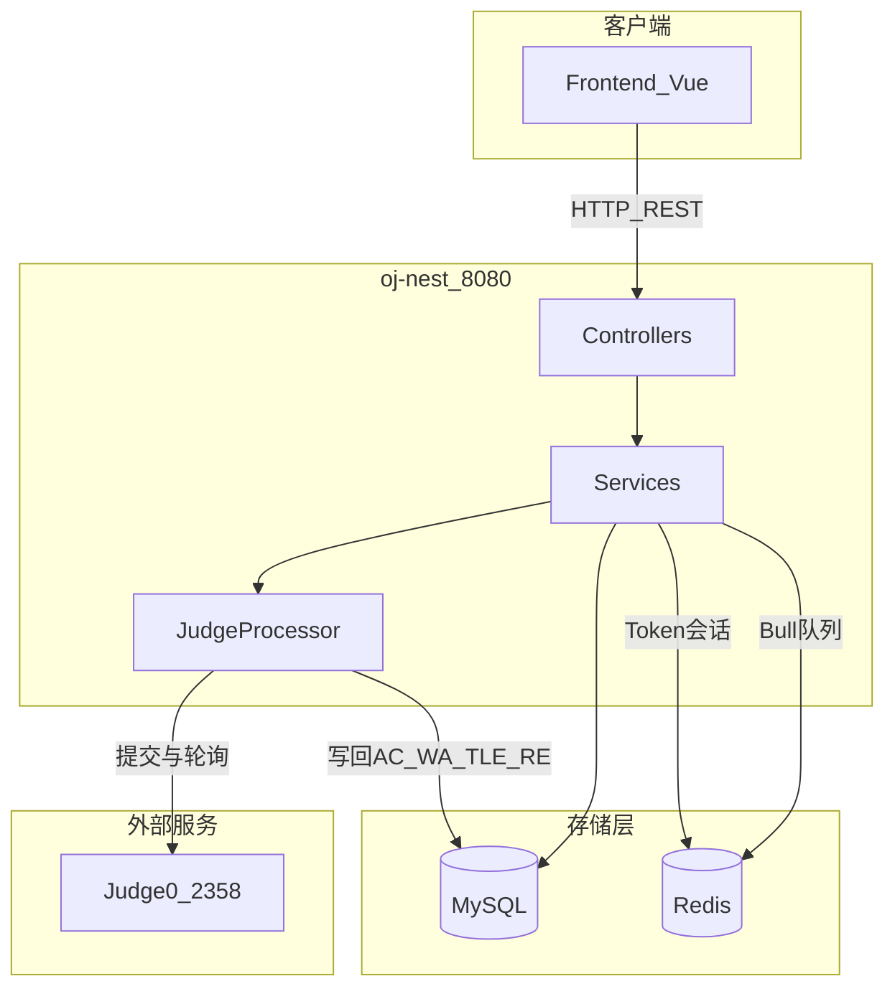

> 本系列基于 Campus-OJ 项目的真实后端代码 `backend/oj-nest`，用前端熟悉的概念帮你建立服务端开发心智模型。

## 讲什么

`oj-nest` 是一个 **NestJS 11** 写的在线判题（OJ）后端。本文档不是单纯讲项目代码，而是把这个项目当成练习场，帮有 Vue / TypeScript 基础的前端开发者补齐后端核心能力：

- 用户注册 / 登录 / 会话
- 题目 CRUD、测试点管理
- 代码提交与异步判题
- 题目评论与点赞

技术栈：**NestJS + TypeORM + MySQL + Redis + Bull 队列 + Judge0**

## 为什么本项目选 NestJS

NestJS 对前端开发者友好，原因很直接：

| NestJS 特性 | 对前端开发者的价值 | 本项目对应 |
|-------------|------------------|-----------|
| TypeScript 优先 | 不需要从动态类型切换到全新语言 | DTO、Entity、Service 都是 TS 类 |
| 装饰器语法 | 路由、校验、注入都能声明式表达 | `@Controller`、`@Post`、`@Injectable` |
| 模块化 | 像拆 Vue 模块一样拆业务边界 | `UserModule`、`QuestionModule`、`JudgeModule` |
| Controller / Service 分层 | 路由接参和业务逻辑分开 | Controller 薄，Service 厚 |
| IOC / DI | 依赖由框架创建和注入 | Repository、Redis、Queue 自动注入 |
| 生态集成 | 数据库、缓存、队列都有成熟接法 | TypeORM、ioredis、Bull |

Nest 官方文档把核心模型拆成 First steps、Controllers、Providers、Modules：`main.ts` 用 `NestFactory` 创建应用并监听请求，Controller 处理 HTTP 请求，Provider / Service 承载复杂逻辑，Module 组织依赖关系。后面的 01 到 07 会按这个顺序落到项目代码里。

## 阅读本文档前推荐先看什么

| 资料 | 建议阅读内容 | 用途 |
|------|-------------|------|
| [Nest 官方文档 First steps](https://docs.nestjs.com/first-steps) | `NestFactory`、应用启动 | 知道后端进程怎么跑起来 |
| [Nest 官方文档 Controllers](https://docs.nestjs.com/controllers) | 路由、参数装饰器 | 知道请求怎么进 Controller |
| [Nest 官方文档 Providers](https://docs.nestjs.com/providers) | Service、依赖注入 | 知道业务类怎么被创建 |
| [Nest 官方文档 Modules](https://docs.nestjs.com/modules) | `imports/providers/controllers` | 知道模块怎么组织 |
| [小满 Nest.js 专栏](https://blog.csdn.net/qq1195566313) | NestJS 介绍、IOC/DI、连接数据库 | 中文预习，先建立直觉 |

推荐顺序：先用小满专栏做中文预习，再用官方文档校准概念，最后回到本项目看真实代码。

## 前端进阶全栈路线



这 8 篇文档对应的目标是：

1. 会调接口：知道前端请求在后端落到哪个 Controller
2. 理解 HTTP 生命周期：知道 Guard、Pipe、Interceptor、Filter 各在什么位置
3. 写 Controller：能新增一个路由并正确接收参数
4. 写 Service：能把业务逻辑放到可注入的服务类里
5. 连数据库 / Redis / 队列：能读写持久化数据，处理异步任务
6. 部署：能用环境变量和 Docker 把服务跑起来

## 阅读顺序

| 序号 | 文章 | 你会学到 |
|------|------|----------|
| 00 | 本篇 | 全局地图、前后端概念对照 |
| 01 | [从 main.ts 看服务如何启动](./01-从main.ts看一个后端服务如何启动.md) | 进程常驻、全局中间件管线 |
| 02 | [模块与依赖注入](./02-模块与依赖注入-NestJS的心智模型.md) | Module / Controller / Service |
| 03 | [一个请求的完整生命周期](./03-一个请求的完整生命周期.md) | DTO 校验、拦截器、异常处理 |
| 04 | [数据库与 ORM](./04-数据库与ORM-TypeORM实战.md) | Entity、Repository、分页 |
| 05 | [认证与会话](./05-认证与会话-Token和Redis.md) | Token、Guard、Redis |
| 06 | [异步任务与判题队列](./06-异步任务与消息队列-Bull判题系统.md) | Bull、Judge0、并发控制 |
| 07 | [配置与部署](./07-配置与部署-环境变量与Docker.md) | .env、docker-compose |

建议按顺序读。每篇独立成文，但后面的概念会引用前面的。

## 全局架构



## 前端概念 ↔ 后端概念

| 前端你熟悉的 | 后端对应（NestJS） | 在本项目里 |
|-------------|-------------------|-----------|
| Vue 根组件 `App.vue` | 根模块 `AppModule` | 注册 DB、Redis、业务模块 |
| 路由 `router` | Controller + 装饰器 `@Get/@Post` | `user.controller.ts` |
| composable / store 逻辑 | Service `@Injectable()` | `user.service.ts` |
| axios 请求拦截器 | Nest Interceptor | `ResponseInterceptor` |
| axios 响应错误处理 | Exception Filter | `AllExceptionsFilter` |
| 表单校验 rules | DTO + class-validator | `LoginDto` |
| 路由守卫 beforeEach | Guard | `TokenGuard` |
| localStorage 存 token | Redis 存 token | 登录时 `redis.set` |
| 组件 props 类型 | DTO 类型定义 | `SubmitTestQuestionDto` |
| npm run dev 热更新 | 进程常驻 `app.listen` | 8080 端口一直监听 |
| Web Worker 干重活 | Bull Queue + Processor | 判题异步执行 |

## 目录结构速览

```
backend/oj-nest/
├── src/
│   ├── main.ts              # 入口：启动 + 全局配置
│   ├── app.module.ts        # 根模块：组装一切
│   ├── config/              # DB / Redis / Judge0 / 队列配置
│   ├── entities/            # 数据库表 ↔ TypeScript 类
│   ├── modules/
│   │   ├── user/            # 用户
│   │   ├── question/        # 题目 + 提交
│   │   ├── comment/         # 评论
│   │   └── judge/           # 判题 Worker（无 HTTP 接口）
│   └── common/              # Guard、拦截器、工具函数
├── database/                # 建表 SQL
└── docker-compose.yml       # MySQL + Redis + oj-nest
```

## 和前端的根本区别

**前端**：浏览器里跑，用户打开页面才执行，关 tab 进程就没了。

**后端**：Node 进程 7×24 常驻，监听端口等请求进来。一次请求 = 一次完整的「接收 → 处理 → 返回」流水线。

下一篇从 `main.ts` 开始，看这条流水线是怎么搭起来的。
