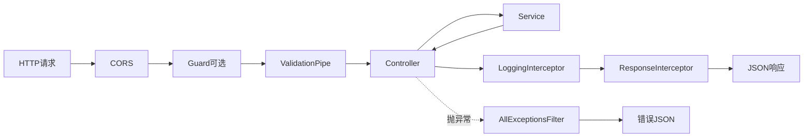

> 上一篇：[00 序言](./00-序言-前端如何快进后端.md) | 下一篇：[02 模块与依赖注入](./02-模块与依赖注入-NestJS的心智模型.md)

## 本篇学习入口

| 类型 | 内容 |
|------|------|
| 官方概念 | [First steps](https://docs.nestjs.com/first-steps)：`NestFactory` 创建应用，`app.listen` 监听端口；[Pipes](https://docs.nestjs.com/pipes)、[Exception filters](https://docs.nestjs.com/exception-filters)、[Interceptors](https://docs.nestjs.com/interceptors)：全局管线 |
| 小满知识点 | NestJS 介绍、项目入口、应用启动流程 |
| 本项目代码入口 | `backend/oj-nest/src/main.ts`、`backend/oj-nest/src/app.module.ts`、`src/common/filters`、`src/common/interceptors` |

## 前端 vs 后端：运行方式

| | 前端 (Vite dev) | 后端 (NestJS) |
|--|----------------|---------------|
| 启动命令 | `npm run dev` | `npm run start:dev` |
| 进程 | 开发服务器 + 浏览器 | **一个 Node 进程一直跑** |
| 触发 | 用户操作页面 | **HTTP 请求打进来** |
| 端口 | 5173（举例） | 8080 |

后端不是「有人访问才启动」，而是启动后**一直等着**请求。

## main.ts 做了什么

文件路径：`backend/oj-nest/src/main.ts`

```typescript
async function bootstrap() {
  const app = await NestFactory.create(AppModule);
  app.enableCors({ origin: '*' });
  app.useGlobalPipes(new ValidationPipe({ transform: true, whitelist: true }));
  app.useGlobalFilters(new AllExceptionsFilter());
  app.useGlobalInterceptors(new LoggingInterceptor(), new ResponseInterceptor());
  const port = process.env.PORT ?? 8080;
  await app.listen(port);
}
bootstrap();
```

逐步拆解：

### 1. NestFactory.create(AppModule)

创建 Nest 应用实例，加载根模块 `AppModule`。类比 Vue 的 `createApp(App)` —— 从这里开始组装整个应用。

> 知识点：`NestFactory` 是 Nest 应用的启动工厂，默认创建基于 Express 的 HTTP 应用，也可以切换 Fastify 等 HTTP adapter。
>
> 前端类比：`createApp(App)` 只创建前端应用实例；`NestFactory.create(AppModule)` 创建的是一个长期监听端口的服务端应用实例。
>
> 本项目落点：`main.ts` 把 `AppModule` 作为根模块传入，后续所有 Controller、Service、数据库、Redis、队列都从这里被装配进应用。

### 2. enableCors

允许跨域。前端 `localhost:5173` 调后端 `localhost:8080` 属于跨域，不加 CORS 浏览器会拦。

`origin: '*'` 表示允许任意来源（生产环境应收紧）。

> 知识点：CORS 是浏览器安全策略，不是后端业务鉴权。后端允许跨域后，浏览器才会放行前端页面发出的跨源请求。
>
> 前端类比：本地 Vite 代理可以绕开跨域；生产环境通常由后端 CORS 或网关统一处理。
>
> 本项目落点：`app.enableCors({ origin: '*' })` 让前端开发环境可以直接请求 `8080` 端口。

### 3. useGlobalPipes(ValidationPipe)

**管道（Pipe）**：请求进 Controller 之前，对入参做转换和校验。

- `transform: true` — 把 query 字符串 `"1"` 转成数字 `1`
- `whitelist: true` — 去掉 DTO 里没声明的字段，防注入

类比：前端表单提交前的 `rules` 校验，但在服务端强制执行。

> 知识点：Pipe 运行在 Controller 方法参数绑定阶段，适合做 DTO 校验、类型转换、参数清洗。
>
> 前端类比：前端 rules 是用户体验；后端 Pipe 是安全边界，因为请求可以绕过页面直接打接口。
>
> 本项目落点：登录、注册、提交题目等 DTO 都会先过全局 `ValidationPipe`，不合法参数不会进入 Service。

### 4. useGlobalFilters(AllExceptionsFilter)

**过滤器（Filter）**：任何地方抛异常，统一 catch 成 JSON 返回。

成功和失败格式不同，前端可以统一处理：

```json
// 成功
{ "code": 1, "message": "success", "data": { ... } }

// 失败
{ "code": 401, "message": "Token无效或已过期", "data": null }
```

### 5. useGlobalInterceptors

**拦截器（Interceptor）**：包裹 Controller 返回值，做日志、格式包装。

- `LoggingInterceptor` — 打日志：`GET /api/user/status 200 12ms`
- `ResponseInterceptor` — 把返回值包成 `{ code: 1, message: 'success', data }`

类比 axios 的 request/response interceptor。

> 知识点：Interceptor 可以在 Controller 执行前后插入逻辑；Filter 专门处理异常分支。
>
> 前端类比：axios interceptor 统一处理请求和响应；Nest Interceptor 统一包装服务端返回值。
>
> 本项目落点：`LoggingInterceptor` 记录请求耗时，`ResponseInterceptor` 把成功结果包装成统一 JSON，`AllExceptionsFilter` 把异常包装成统一错误 JSON。

### 6. app.listen(8080)

开始监听端口。此后每个 HTTP 请求都会走 Nest 的路由分发。

> 知识点：`listen` 之后 Node 进程不会退出，而是进入事件循环，持续等待新请求。
>
> 前端类比：Vite dev server 也会常驻监听端口；区别是 Nest 监听的是业务 API 请求。
>
> 本项目落点：服务启动后输出 `Server running on http://localhost:8080`，前端所有 API 都打到这个进程。

## 请求经过的全局管线



顺序要点：

1. **Pipe** 在 Controller **之前** — 先校验参数
2. **Interceptor** 在 Controller **之后** — 包装返回值
3. **Filter** 捕获 **整个链路** 的异常

Guard（如 `TokenGuard`）不是全局的，在 Controller 上用 `@UseGuards(TokenGuard)` 按需加。

## AppModule：根模块

`main.ts` 只负责「壳」，业务模块在 `app.module.ts` 注册：

```typescript
@Module({
  imports: [
    ConfigModule.forRoot({ isGlobal: true, envFilePath: '.env' }),
    TypeOrmModule.forRootAsync({ ... }),   // MySQL
    RedisModule.forRootAsync({ ... }),      // Redis
    BullModule.forRootAsync({ ... }),       // 消息队列
    UserModule,
    QuestionModule,
    CommentModule,
    JudgeModule,
  ],
})
export class AppModule {}
```

类比 Vue 根组件 import 子组件 + 注册 pinia/vue-router。

## 本地启动

```bash
cd backend/oj-nest
npm install
npm run start:dev   # 热重载开发
# 或
npm run start:prod  # node dist/main
```

看到 `Server running on http://localhost:8080` 即成功。

## 本篇小结

| 概念 | 作用 | 文件 |
|------|------|------|
| bootstrap | 启动入口 | `main.ts` |
| AppModule | 模块组装 | `app.module.ts` |
| ValidationPipe | 入参校验 | 全局 |
| AllExceptionsFilter | 统一错误格式 | `http-exception.filter.ts` |
| ResponseInterceptor | 统一成功格式 | `response.interceptor.ts` |
| LoggingInterceptor | 请求日志 | `logging.interceptor.ts` |

下一篇进入 NestJS 核心：**Module、Controller、Service 和依赖注入**。
