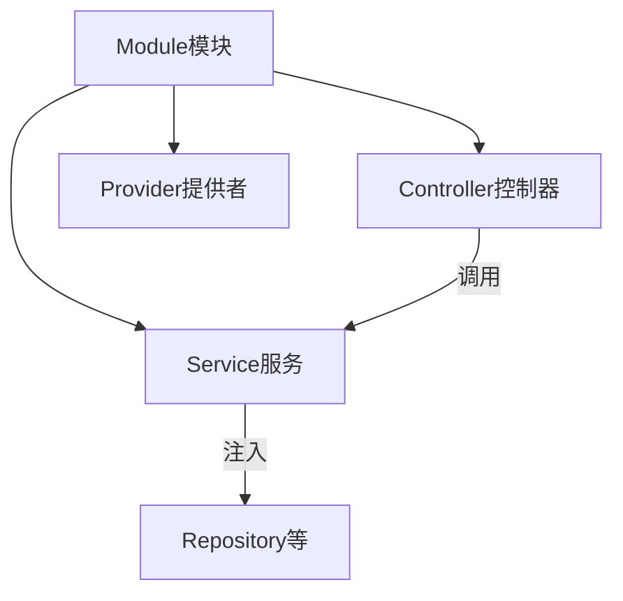
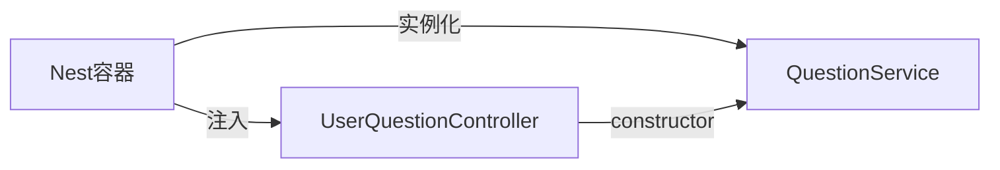
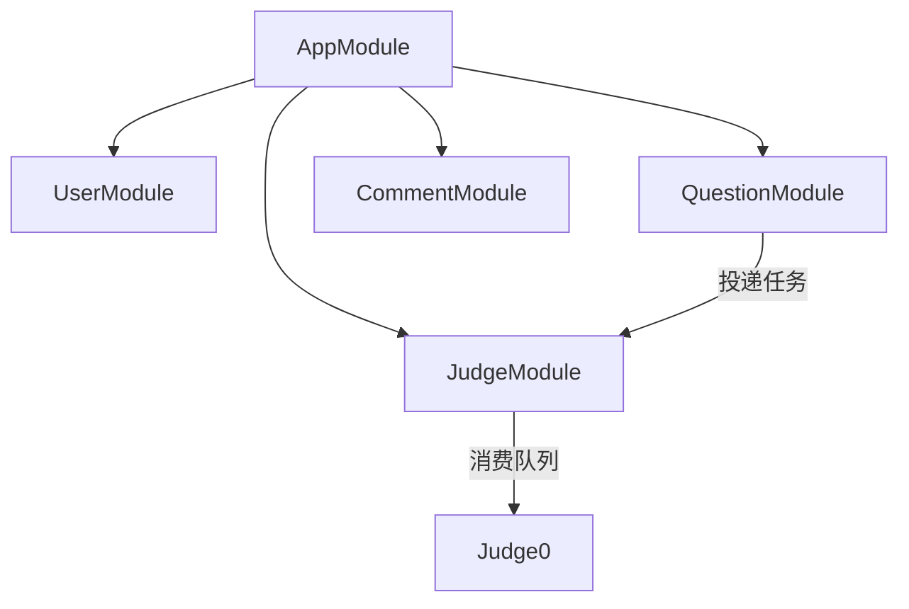

> 上一篇：[01 从 main.ts 看服务如何启动](./01-从main.ts看一个后端服务如何启动.md) | 下一篇：[03 一个请求的完整生命周期](./03-一个请求的完整生命周期.md)

## 本篇学习入口

| 类型 | 内容 |
|------|------|
| 官方概念 | [Modules](https://docs.nestjs.com/modules)、[Providers](https://docs.nestjs.com/providers)：模块组织依赖，Provider 被容器创建和注入 |
| 小满知识点 | IOC、DI、Provider、Module 的 `imports/providers/controllers` |
| 本项目代码入口 | `backend/oj-nest/src/app.module.ts`、`src/modules/question/question.module.ts`、`src/modules/question/question.service.ts` |

## 四件套

NestJS 业务代码围绕四个角色组织：



| 角色 | 职责 | 前端类比 |
|------|------|----------|
| **Module** | 把相关功能打包、声明依赖 | Vue 子组件 + `defineOptions` |
| **Controller** | 定义 HTTP 路由，接收请求 | Vue Router 的 route + 页面只负责接参 |
| **Service** | 业务逻辑、调数据库/Redis | composable / pinia action |
| **Provider** | 可被注入的类（Service 也是 Provider） | 可复用的逻辑单元 |

> 知识点：IOC 是“对象由框架容器管理”，DI 是“依赖由容器注入进来”。在 Nest 里，Service、Repository、Queue 这类对象通常都交给容器管理。
>
> 前端类比：组件里直接 `import` composable 是手动拿依赖；Nest 通过 constructor 声明依赖，由框架传入实例。
>
> 本项目落点：`QuestionService` 不自己创建 Repository 和 Queue，而是在构造函数里声明，由 `QuestionModule` 配好后自动注入。

## 以 QuestionModule 为例

文件：`backend/oj-nest/src/modules/question/question.module.ts`

```typescript
@Module({
  imports: [
    TypeOrmModule.forFeature([Questions, TestPoint, UserSubmissionCode, UserSubmissionRecord]),
    BullModule.registerQueue(judgeQueueRegister()),
  ],
  controllers: [AdminQuestionController, UserQuestionController],
  providers: [QuestionService],
})
export class QuestionModule {}
```

解读：

- **imports** — 这个模块需要的外部能力（数据库表、Bull 队列）
- **controllers** — 对外暴露的 HTTP 接口（管理员 + 用户两套路由）
- **providers** — 内部业务逻辑类，Nest 容器会实例化并管理

> 知识点：Module 是依赖边界。`imports` 让当前模块获得外部能力，`controllers` 注册路由入口，`providers` 注册可注入对象。
>
> 前端类比：一个业务模块同时声明自己要用哪些 store、有哪些页面入口、有哪些可复用逻辑。
>
> 本项目落点：`QuestionModule` 声明了题目相关 Entity、判题队列、管理员 Controller、用户 Controller 和 `QuestionService`。

## Controller：路由层

文件：`backend/oj-nest/src/modules/question/user-question.controller.ts`

```typescript
@UseGuards(TokenGuard)
@Controller('api/user/testQuestion')
export class UserQuestionController {
  constructor(private readonly questionService: QuestionService) {}

  @Get('getTestQuestionById')
  getById(@Query('id') id: string) {
    return this.questionService.getById(id);
  }

  @Post('submitTestQuestion')
  submit(@Body() dto: SubmitTestQuestionDto) {
    return this.questionService.submitTestQuestion(dto);
  }
}
```

- `@Controller('api/user/testQuestion')` — 路由前缀
- `@Get('getTestQuestionById')` — 完整路径 `GET /api/user/testQuestion/getTestQuestionById`
- `@Query('id')` — 取 URL 查询参数 `?id=xxx`
- `@Body()` — 取 POST JSON body
- `@UseGuards(TokenGuard)` — 整个 Controller 都要登录

**Controller 不写业务逻辑**，只做三件事：接参、调 Service、返回 Promise。

> 知识点：Controller 负责把 HTTP 世界转换成函数调用，例如从 query、body、header 取参数。
>
> 前端类比：页面组件不应该塞满请求和业务细节，而是把复杂逻辑交给 composable 或 store。
>
> 本项目落点：`UserQuestionController` 只接收题目查询和提交请求，真正的题目读取、提交记录保存、队列投递都在 `QuestionService`。

## Service：业务层

文件：`backend/oj-nest/src/modules/question/question.service.ts`

```typescript
@Injectable()
export class QuestionService {
  constructor(
    @InjectRepository(Questions) private readonly questionRepo: Repository<Questions>,
    @InjectRepository(TestPoint) private readonly testPointRepo: Repository<TestPoint>,
    @InjectQueue('judge') private readonly judgeQueue: Queue,
  ) {}

  async getById(id: string) {
    const q = await this.questionRepo.findOne({ where: { id } });
    if (!q) throw new NotFoundException('题目不存在');
    return q;
  }
}
```

- `@Injectable()` — 告诉 Nest「这个类可以被注入」
- 构造函数里声明依赖 — Nest 自动帮你 new 好传进来

> 知识点：Provider 是 Nest 容器能管理的对象，`@Injectable()` 是最常见的 Provider 声明方式。
>
> 前端类比：Service 像一个可复用业务模块，但它的依赖不是自己 import 后 new，而是由容器注入。
>
> 本项目落点：`QuestionService` 同时依赖多个 Repository 和 Bull Queue，依赖关系清楚写在 constructor 里。

## 依赖注入（DI）原理

前端常见写法：

```javascript
// 手动 new，耦合紧
const service = new QuestionService(repo, queue);
```

NestJS 写法：

```typescript
constructor(private readonly questionService: QuestionService) {}
// Nest 容器：QuestionModule 注册了 QuestionService → 自动注入
```



好处：

1. **不用自己 new** — 生命周期由框架管
2. **单例默认** — 同一 Module 内 Service 共享一个实例
3. **易测试** — 测试时可 mock 注入的依赖
4. **模块边界清晰** — imports 声明「我用谁」

> 知识点：DI 的核心不是“少写 new”，而是让依赖关系显式、可替换、由框架统一管理生命周期。
>
> 前端类比：把全局单例散落在各处 import 会越来越难替换；DI 把依赖集中在模块和构造函数里。
>
> 本项目落点：Redis、TypeORM Repository、Bull Queue 都通过模块注册后注入，业务类不用关心底层连接怎么创建。

## 项目模块划分



| 模块 | Controller | Service | 特殊 |
|------|-----------|---------|------|
| UserModule | user.controller | user.service | Redis 存 token |
| QuestionModule | admin + user 两个 controller | question.service | 注册 Bull 队列 |
| CommentModule | comment.controller | comment.service | 嵌套评论 |
| JudgeModule | **无** | judge.processor | 纯后台 Worker |

JudgeModule 没有 Controller — 它不对外提供 HTTP，只消费 Redis 里的 Bull 队列任务。

## TypeOrmModule.forFeature

```typescript
TypeOrmModule.forFeature([Questions, TestPoint, ...])
```

在 Module 里注册「这个模块要用哪些表」，之后 Service 里才能 `@InjectRepository(Questions)`。

类比：在组件里 import 某个 store，才能 `useXxxStore()`。

> 知识点：`forFeature` 是 TypeORM 和 Nest 模块系统的连接点，它把指定 Entity 的 Repository 注册到当前模块。
>
> 前端类比：只在当前业务域里引入需要的 store，避免所有模块都拿到所有状态。
>
> 本项目落点：`QuestionModule` 注册题目、测试点、提交代码、提交记录四类 Entity，所以 `QuestionService` 能注入这些 Repository。

## 两个 Controller 共用一个 Service

QuestionModule 有：

- `AdminQuestionController` → `api/testQuestion` — 增删改
- `UserQuestionController` → `api/user/testQuestion` — 查 + 提交

两者注入同一个 `QuestionService`，**逻辑复用、路由分离**。类似 admin 路由和普通用户路由共用一套 API 层。

## 自定义装饰器

文件：`backend/oj-nest/src/common/decorators/current-token.decorator.ts`

```typescript
export const CurrentToken = createParamDecorator(
  (_data: unknown, ctx: ExecutionContext): string => {
    const request = ctx.switchToHttp().getRequest();
    return request['token'] as string;
  },
);
```

Guard 校验通过后把 token 挂到 `request['token']`，Controller 用 `@CurrentToken()` 直接取 — 不用每个方法重复解析 header。

## 本篇小结

| 你要写的 | 放哪里 | 装饰器 |
|----------|--------|--------|
| 路由 | Controller | `@Controller` `@Get` `@Post` |
| 业务 | Service | `@Injectable()` |
| 打包 | Module | `@Module({ imports, controllers, providers })` |
| 鉴权 | Guard 挂 Controller | `@UseGuards(TokenGuard)` |
| 取参 | Controller 方法参数 | `@Body` `@Query` `@Headers` |

下一篇跟踪一个真实请求：**从 axios 发 login 到拿到 JSON 的全链路**。
