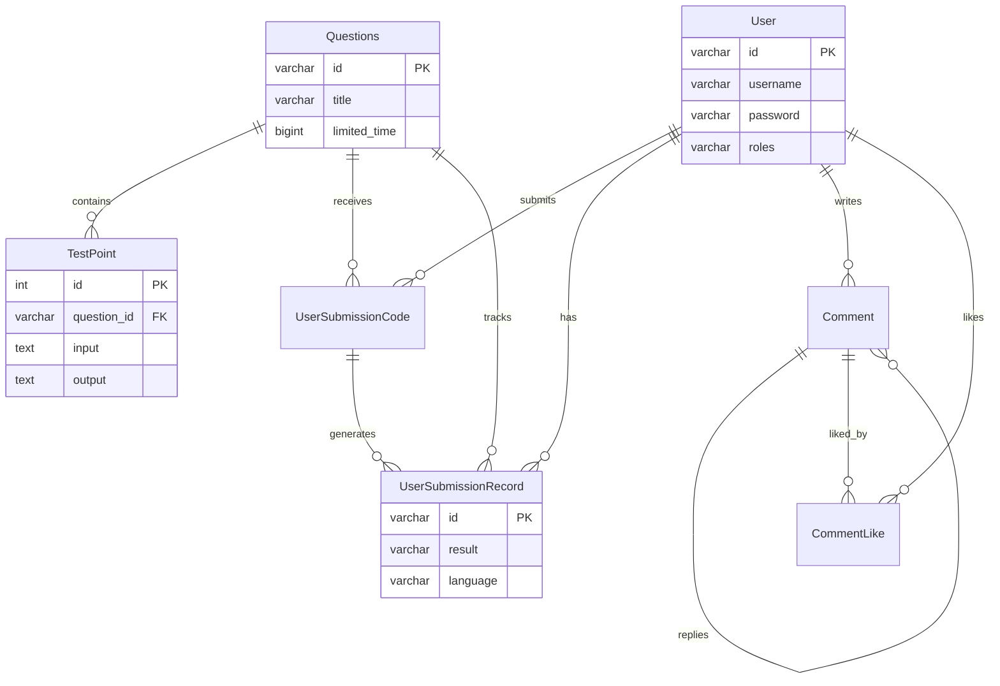

> 上一篇：[03 一个请求的完整生命周期](./03-一个请求的完整生命周期.md) | 下一篇：[05 认证与会话](./05-认证与会话-Token和Redis.md)

## 本篇学习入口

| 类型 | 内容 |
|------|------|
| 官方概念 | [Providers](https://docs.nestjs.com/providers)：Repository 作为可注入依赖进入 Service；[Modules](https://docs.nestjs.com/modules)：数据库能力由模块注册 |
| 小满知识点 | NestJS 连接数据库、ORM、Entity、Repository |
| 本项目代码入口 | `src/config/database.config.ts`、`src/entities`、`src/modules/question/question.module.ts`、`src/modules/question/question.service.ts` |

## 为什么需要数据库

前端 state 刷新就没了。后端要把用户、题目、提交记录**持久化** — 关机重启数据还在。

本项目用 **MySQL 8** 关系型数据库 + **TypeORM** 做 ORM（Object-Relational Mapping）。

## ORM 是什么

把数据库表映射成 TypeScript 类，用对象操作代替写 SQL：

| 数据库 | TypeORM |
|--------|---------|
| 表 `questions` | 类 `Questions` |
| 列 `title` | 属性 `title` |
| 行 | 类实例 |
| `SELECT * WHERE id=?` | `repo.findOne({ where: { id } })` |

> 知识点：ORM 把表、列、查询封装成对象 API，但底层仍然是 SQL 和数据库连接。
>
> 前端类比：像用数组对象操作列表数据，但这些操作最终会变成数据库查询。
>
> 本项目落点：`QuestionService` 大量使用 Repository 完成题目分页、提交记录创建、判题结果更新。

## Entity：表 ↔ 类

文件：`backend/oj-nest/src/entities/questions.entity.ts`

```typescript
@Entity('questions')
export class Questions {
  @PrimaryColumn({ type: 'varchar', length: 36 })
  id: string;

  @Column({ type: 'varchar' })
  title: string;

  @Column({ name: 'limited_time', type: 'bigint', nullable: true })
  limitedTime: number;

  @CreateDateColumn({ name: 'create_time' })
  createTime: Date;

  @UpdateDateColumn({ name: 'update_time' })
  updateTime: Date;
}
```

常用装饰器：

| 装饰器 | 含义 |
|--------|------|
| `@Entity('表名')` | 绑定表 |
| `@PrimaryColumn` | 主键（本项目多用 UUID 字符串） |
| `@Column` | 普通列，`name` 映射蛇形命名 |
| `@CreateDateColumn` | 插入时自动填时间 |
| `@UpdateDateColumn` | 更新时自动改时间 |

> 知识点：Entity 是数据库表结构在 TypeScript 里的映射，不等于业务返回 DTO。
>
> 前端类比：Entity 更像后端的数据模型；DTO 更像接口入参或出参类型。
>
> 本项目落点：`Questions` 对应 `questions` 表，`limitedTime` 通过 `name: 'limited_time'` 映射数据库蛇形列名。

## 七张表关系



Schema 定义在 `backend/oj-nest/database/本地构建数据库.sql`，**以 SQL 为准**，不用 ORM 自动建表。

## 数据库配置

文件：`backend/oj-nest/src/config/database.config.ts`

```typescript
export const databaseConfig = (cs: ConfigService): TypeOrmModuleOptions => ({
  type: 'mysql',
  host: cs.get('DB_HOST'),
  port: cs.get<number>('DB_PORT'),
  username: cs.get('DB_USERNAME'),
  password: cs.get('DB_PASSWORD'),
  database: cs.get('DB_DATABASE'),
  entities: [User, Questions, TestPoint, ...],
  synchronize: false,
  extra: { connectionLimit: cs.get<number>('DB_POOL_SIZE') ?? 20 },
});
```

关键：

- **`synchronize: false`** — 生产必关。不让 TypeORM 自动改表结构，避免误删数据
- **`connectionLimit: 20`** — 连接池，复用 DB 连接，避免每个请求新建连接

> 知识点：`synchronize` 会让 ORM 根据 Entity 自动同步表结构，学习阶段方便，生产环境风险很高。
>
> 前端类比：像工具自动改你的线上配置文件，一旦推断错就会影响真实数据。
>
> 本项目落点：数据库结构以 `database/本地构建数据库.sql` 为准，TypeORM 只负责映射和查询，所以 `synchronize: false`。

## TypeOrmModule.forFeature

```typescript
TypeOrmModule.forFeature([Questions, TestPoint, UserSubmissionCode, UserSubmissionRecord])
```

`forFeature` 把指定 Entity 对应的 Repository 注册到当前模块。注册后，Service 才能这样注入：

```typescript
@InjectRepository(Questions) private readonly questionRepo: Repository<Questions>
```

> 知识点：Repository 是操作某张表的入口，属于可以被 Nest 注入的依赖。
>
> 前端类比：在一个业务模块里显式引入要用的 store，然后只操作这个模块需要的数据。
>
> 本项目落点：`QuestionModule` 注册四个 Entity，`QuestionService` 因此能同时读题目、测试点、提交代码和提交记录。

## Repository 常用 API

Service 里注入：

```typescript
@InjectRepository(Questions) private readonly questionRepo: Repository<Questions>
```

### 查询

```typescript
// 单条
await this.questionRepo.findOne({ where: { id } });

// 列表 + 分页 + 总数
const [list, total] = await this.questionRepo.findAndCount({
  where: keyword ? { title: Like(`%${keyword}%`) } : {},
  skip: (pageNum - 1) * size,
  take: size,
  order: { createTime: 'DESC' },
});

// 计数
await this.questionRepo.count({ where: { questionId: id } });
```

### 新增

```typescript
const question = this.questionRepo.create({ id: uuidv4(), title: dto.title, ... });
await this.questionRepo.save(question);
```

`create` 只是内存对象，`save` 才真正 INSERT。

### 更新

```typescript
Object.assign(question, { title: dto.title });
await this.questionRepo.save(question);

// 或按 id 局部更新
await this.recordRepo.update(recordIds[i], { result: 'AC', time: '12' });
```

### 删除

```typescript
await this.testPointRepo.delete({ questionId: id });
await this.questionRepo.delete({ id });
```

## 业务示例：题目分页

文件：`question.service.ts`

```typescript
async getByPage(pageNum: number, size: number, keyword: string) {
  const [list, total] = await this.questionRepo.findAndCount({
    where: keyword ? { title: Like(`%${keyword}%`) } : {},
    skip: (pageNum - 1) * size,
    take: size,
    order: { createTime: 'DESC' },
  });
  return { list, total, pageNum, size };
}
```

前端分页组件需要的 `list + total` 一次查齐。

## 业务示例：评论点赞原子 +1

文件：`comment.service.ts`

```typescript
await this.commentRepo
  .createQueryBuilder()
  .update(Comment)
  .set({ likeCount: () => 'like_count + 1' })
  .where('id = :id', { id: dto.commentId })
  .execute();
```

为什么不用 `comment.likeCount++` 再 save？

并发下两个请求同时读 `likeCount=5`，都写成 6，丢一次点赞。SQL 层 `like_count + 1` 是原子的。

取消点赞用 `GREATEST(like_count - 1, 0)` 防止负数。

## 业务示例：嵌套评论

```typescript
const [rootList, total] = await this.commentRepo.findAndCount({
  where: { questionId, parentCommentId: IsNull() },
  skip: (pageNum - 1) * pageSize,
  take: pageSize,
  order: { createTime: 'DESC' },
});

// 每条根评论再查 childComments
const children = await this.commentRepo.find({
  where: { parentCommentId: c.id },
  order: { createTime: 'ASC' },
});
```

两层结构：根评论 `parentCommentId IS NULL`，回复挂在根评论 id 下。

## 提交记录模型

一次代码提交产生：

1. **一条** `user_submission_code` — 代码快照
2. **N 条** `user_submission_record` — 每个测试点一条，初始 `result: 'Pending'`

```typescript
const records = testPoints.map((tp, i) =>
  this.submissionRecordRepo.create({
    id: recordIds[i],
    userId: dto.userId,
    questionId: dto.id,
    codeId: codeRecord.id,
    language: dto.language,
    result: 'Pending',
  }),
);
await this.submissionRecordRepo.save(records);
```

判题完成后 Worker 逐条 update 为 AC/WA/TLE/RE。

## 题目 ID 用 UUID

`questions.id` 是 `varchar(36)` UUID，不是自增 int。迁移脚本见 `database/fix-questions-id-to-varchar36.sql`。

好处：分布式生成不冲突；前端可直接用字符串 id。

## 本篇小结

| 操作 | TypeORM 写法 |
|------|-------------|
| 定义表结构 | Entity 装饰器 |
| 注入 | `@InjectRepository(Entity)` |
| 查 | `findOne` / `find` / `findAndCount` |
| 增 | `create` + `save` |
| 改 | `save` / `update` |
| 删 | `delete` |
| 复杂 SQL | `createQueryBuilder()` |

下一篇讲 **Token 怎么存 Redis、Guard 怎么拦请求**。
