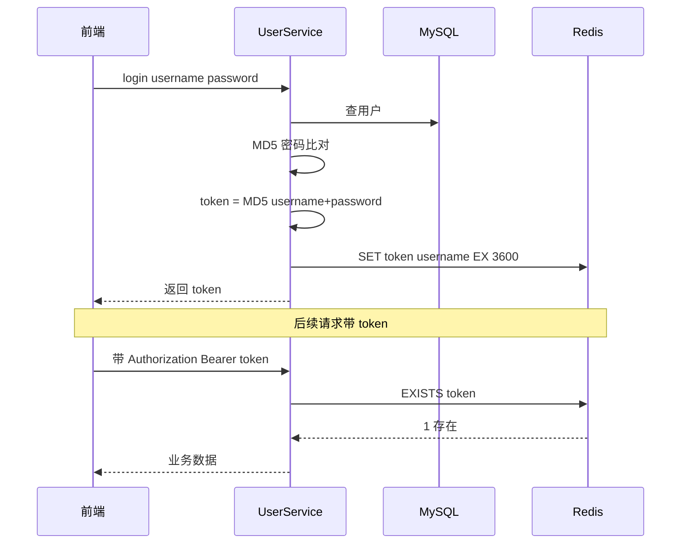
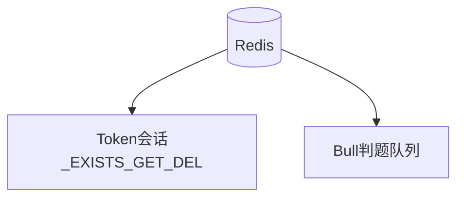

> 上一篇：[04 数据库与 ORM](./04-数据库与ORM-TypeORM实战.md) | 下一篇：[06 异步任务与判题队列](./06-异步任务与消息队列-Bull判题系统.md)

## 本篇学习入口

| 类型 | 内容 |
|------|------|
| 官方概念 | [Controllers](https://docs.nestjs.com/controllers)：Header 参数读取；[Guards](https://docs.nestjs.com/guards)：请求前鉴权 |
| 小满知识点 | HTTP 无状态、Guard、Redis 会话、依赖注入 |
| 本项目代码入口 | `src/modules/user/user.service.ts`、`src/common/guards/token.guard.ts`、`src/common/decorators/current-token.decorator.ts`、`src/config/redis.config.ts` |

## HTTP 是无状态的

每个请求互相独立，服务器默认「不认识」上一个请求是谁。

前端登录后要知道「我是谁」，常见方案：

| 方案 | 原理 | 特点 |
|------|------|------|
| Cookie Session | 服务端存 session，浏览器带 cookie id | 传统，跨域麻烦 |
| JWT | token 自带签名信息，服务端只验签 | 无状态，难主动失效 |
| **Redis Token** | token 作 key 存 Redis，查 key 知用户 | 本项目方案，可 TTL、可 logout 删 key |

> 知识点：HTTP 无状态意味着后端不会天然记住“刚才登录的是谁”，每次请求都必须带身份凭证。
>
> 前端类比：刷新页面后内存状态丢失，需要从 localStorage 或接口重新恢复登录态。
>
> 本项目落点：前端保存 token，后续接口把 token 放到 Header；后端用 Redis 判断 token 是否有效。

## 本项目登录流程



核心代码：

```typescript
const token = CryptoJS.MD5(dto.username + dto.password).toString();
await this.redis.set(token, user.username, 'EX', this.tokenTtl);
```

- **key** = token 字符串
- **value** = username
- **EX 3600** = 3600 秒后自动过期（`TOKEN_TTL` 环境变量）

> 知识点：Redis Token 是有状态会话，服务端保存 token 和用户的对应关系，因此可以主动删除、设置过期时间。
>
> 前端类比：localStorage 只是在浏览器保存凭证；真正的登录态是否有效，由服务端 Redis 决定。
>
> 本项目落点：`UserService.login` 生成 token 后执行 `redis.set(token, username, 'EX', this.tokenTtl)`。

## TokenGuard：路由守卫

文件：`backend/oj-nest/src/common/guards/token.guard.ts`

```typescript
@Injectable()
export class TokenGuard implements CanActivate {
  constructor(@InjectRedis() private readonly redis: Redis) {}

  async canActivate(context: ExecutionContext): Promise<boolean> {
    const request = context.switchToHttp().getRequest<Request>();
    const token = this.extractToken(request);
    if (!token) throw new UnauthorizedException('未携带Token，请先登录');

    const exists = await this.redis.exists(token);
    if (!exists) throw new UnauthorizedException('Token无效或已过期，请重新登录');

    request['token'] = token;
    return true;
  }

  private extractToken(request: Request): string | null {
    const authHeader = request.headers['authorization'];
    if (authHeader?.startsWith('Bearer ')) return authHeader.substring(7).trim();
    const tokenHeader = request.headers['token'] as string;
    if (tokenHeader) return tokenHeader.trim();
    return null;
  }
}
```

类比 Vue Router：

```javascript
router.beforeEach((to, from, next) => {
  if (!token) next('/login');
  else next();
});
```

用法 — 挂在 Controller 或单个方法上：

```typescript
@UseGuards(TokenGuard)
@Controller('api/user/testQuestion')
export class UserQuestionController { ... }
```

> 知识点：Guard 的返回值决定请求能不能继续进入 Controller；抛出异常会直接走全局 Filter。
>
> 前端类比：Vue Router 守卫决定能不能进入某个页面；Nest Guard 决定能不能进入某个接口。
>
> 本项目落点：`TokenGuard` 支持 `Authorization: Bearer <token>` 和自定义 `token` Header，两种前端写法都能识别。

## 哪些接口要 Guard

| 路由 | Guard | 说明 |
|------|-------|------|
| `POST /api/user/login` | 无 | 登录本身不需要 token |
| `POST /api/user/register` | 无 | 注册 |
| `GET /api/user/status` | 无（自行解析 header） | 用 authorization 查状态 |
| `api/testQuestion/*` | 有 | 管理员题目 |
| `api/user/testQuestion/*` | 有 | 用户题目/提交 |
| `api/comment/*` | 有 | 评论 |

User 模块部分接口没用 Guard，而是在方法里手动从 header 取 token — 风格不统一，读代码时注意。

## 登出：删 Redis key

```typescript
async logout(token: string) {
  await this.redis.del(token);
  return { message: '已退出登录' };
}
```

token 删掉后，Guard 里 `exists` 返回 0，后续请求 401。

> 知识点：服务端会话的优势是可控，登出、改密、封禁都可以通过删除 Redis key 立即生效。
>
> 前端类比：只删 localStorage 只能让当前浏览器退出；删 Redis key 才能让这个 token 对所有客户端失效。
>
> 本项目落点：`logout` 和 `changePassword` 都会 `redis.del(token)`，让旧 token 失效。

## 改密码：强制重新登录

```typescript
async changePassword(token: string, dto: ChangePasswordDto) {
  const username = await this.redis.get(token);
  // ... 验证旧密码、更新 DB ...
  await this.redis.del(token);
  return { message: '密码修改成功，请重新登录' };
}
```

密码变了，旧 token 对应的 MD5(username+password) 也对不上了，删 key 最安全。

## CurrentToken 装饰器

Guard 通过后 token 挂在 `request['token']`：

```typescript
export const CurrentToken = createParamDecorator(
  (_data: unknown, ctx: ExecutionContext): string => {
    return ctx.switchToHttp().getRequest()['token'];
  },
);
```

Controller 可写 `@CurrentToken() token: string`，避免重复解析 header（本项目部分 Controller 仍手动解析，可统一改进）。

## 前端怎么带 Token

两种方式任选（Guard 都支持）：

```javascript
// 方式 1：标准 Bearer
axios.defaults.headers.common['Authorization'] = `Bearer ${token}`;

// 方式 2：自定义 header
axios.defaults.headers.common['token'] = token;
```

## Redis 在本项目的两个用途



同一 Redis 实例，不同 key 空间 — 别和队列数据混为一谈。

配置：`backend/oj-nest/src/config/redis.config.ts`

```typescript
export const redisConfig = (cs: ConfigService): RedisModuleOptions => ({
  type: 'single',
  url: `redis://:${cs.get('REDIS_PASSWORD')}@${cs.get('REDIS_HOST')}:${cs.get('REDIS_PORT')}/${cs.get('DB') ?? 0}`,
});
```

## 安全提醒（了解即可）

当前实现适合学习，生产需加强：

1. **密码 MD5** — 应换 bcrypt/argon2 + salt
2. **token = MD5(username+password)** — 改密后 token 理论上会变，但逻辑耦合；更常见用随机 UUID 或 JWT
3. **CORS origin: *** — 生产应限制域名
4. **roles 未在 Guard 校验** — 管理员接口和普通用户共用 TokenGuard，未区分 role

这些不影响理解架构，是后续迭代方向。

## 本篇小结

| 环节 | 实现 |
|------|------|
| 登录发 token | `redis.set(token, username, 'EX', ttl)` |
| 鉴权 | `TokenGuard` → `redis.exists(token)` |
| 登出 | `redis.del(token)` |
| 过期 | Redis TTL 自动删 key |

下一篇进入 OJ 核心：**提交代码后为什么不阻塞等待，而是丢进队列**。
