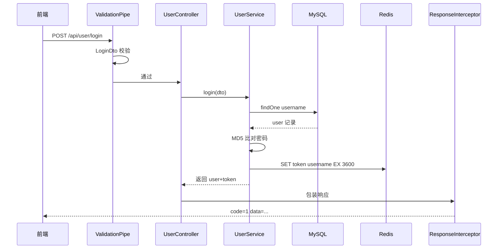
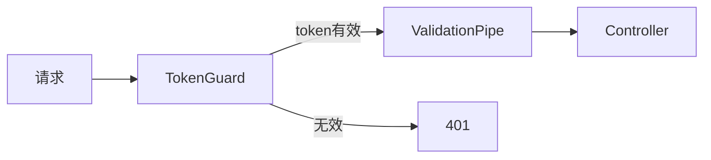

> 上一篇：[02 模块与依赖注入](./02-模块与依赖注入-NestJS的心智模型.md) | 下一篇：[04 数据库与 ORM](./04-数据库与ORM-TypeORM实战.md)

## 本篇学习入口

| 类型 | 内容 |
|------|------|
| 官方概念 | [Controllers](https://docs.nestjs.com/controllers)：路由和参数装饰器；[Pipes](https://docs.nestjs.com/pipes)、[Guards](https://docs.nestjs.com/guards)、[Interceptors](https://docs.nestjs.com/interceptors)、[Exception filters](https://docs.nestjs.com/exception-filters)：请求生命周期 |
| 小满知识点 | Controller、DTO、Pipe、Guard、Interceptor、Filter 的请求顺序 |
| 本项目代码入口 | `src/modules/user/user.controller.ts`、`src/modules/user/user.service.ts`、`src/common/guards`、`src/common/interceptors`、`src/common/filters` |

## 案例：用户登录

前端发：

```http
POST /api/user/login
Content-Type: application/json

{ "username": "alice", "password": "123456" }
```

后端返回：

```json
{
  "code": 1,
  "message": "success",
  "data": {
    "message": "登录成功",
    "id": "uuid-xxx",
    "username": "alice",
    "token": "a1b2c3...",
    "roles": "user"
  }
}
```

## 全链路时序



## Controller 接路由

文件：`backend/oj-nest/src/modules/user/user.controller.ts`

```typescript
@Controller('api/user')
export class UserController {
  constructor(private readonly userService: UserService) {}

  @Post('login')
  login(@Body() dto: LoginDto) {
    return this.userService.login(dto);
  }
}
```

- `@Post('login')` 匹配 POST + `/api/user/login`
- `@Body() dto: LoginDto` — body 自动映射到 DTO 类

> 知识点：Controller 是请求进入业务代码的第一层，它把 URL、HTTP 方法和方法参数绑定起来。
>
> 前端类比：Vue Router 负责匹配页面；Nest Controller 负责匹配接口。
>
> 本项目落点：`UserController.login` 只负责接收 `LoginDto` 并调用 `UserService.login`。

## DTO 校验

文件：`backend/oj-nest/src/modules/user/dto/user.dto.ts`

```typescript
export class LoginDto {
  @IsString()
  @IsNotEmpty()
  username: string;

  @IsString()
  @IsNotEmpty()
  password: string;
}
```

全局 `ValidationPipe` 会检查：

- `username` 必须是字符串且非空
- 多余字段会被 `whitelist` 剥掉

校验失败自动返回 400，**进不了 Service**。

类比 Element Plus / Ant Design 表单 rules，但在服务端强制执行 — 前端可以绕过，后端不能信前端。

> 知识点：DTO 定义接口输入结构，Pipe 按 DTO 上的校验装饰器执行校验。
>
> 前端类比：前端表单 rules 提升体验，后端 DTO + Pipe 保证接口边界可靠。
>
> 本项目落点：全局 `ValidationPipe` 会处理 `LoginDto`、`RegisterDto`、`SubmitTestQuestionDto` 等输入对象。

## Service 执行业务

文件：`backend/oj-nest/src/modules/user/user.service.ts`

```typescript
async login(dto: LoginDto) {
  const user = await this.userRepo.findOne({ where: { username: dto.username } });
  if (!user) throw new NotFoundException('用户不存在');

  const md5Pass = CryptoJS.MD5(dto.password).toString();
  if (user.password !== md5Pass) throw new UnauthorizedException('密码错误');

  const token = CryptoJS.MD5(dto.username + dto.password).toString();
  await this.redis.set(token, user.username, 'EX', this.tokenTtl);

  return { message: '登录成功', id: user.id, username: user.username, token, roles: user.roles };
}
```

流程：查用户 → 验密码 → 生成 token 写 Redis → 返回。

`throw new NotFoundException(...)` 会被全局 Filter 捕获，转成 `{ code: 404, message: '...', data: null }`。

> 知识点：Service 是业务层，不关心 HTTP 路由怎么匹配，只关心业务规则和数据读写。
>
> 前端类比：把页面事件里的请求、状态计算、错误处理抽到 store action 或 composable。
>
> 本项目落点：登录流程里的查用户、比对密码、写 Redis token 都在 `UserService.login`。

## 参数装饰器一览

| 装饰器 | 来源 | 示例 |
|--------|------|------|
| `@Body()` | POST JSON body | `login(@Body() dto)` |
| `@Query('id')` | URL `?id=xxx` | `getById(@Query('id') id)` |
| `@Headers('authorization')` | 请求头 | `getUserStatus(@Headers('authorization') auth)` |
| `@Param('id')` | 路径 `/user/:id` | 本项目较少用 |

Query 参数默认是字符串，`ValidationPipe` 的 `transform: true` 可配合 DTO 里的 `@Type(() => Number)` 做类型转换。

## ResponseInterceptor 包装

文件：`backend/oj-nest/src/common/interceptors/response.interceptor.ts`

```typescript
intercept(_ctx: ExecutionContext, next: CallHandler<T>): Observable<any> {
  return next.handle().pipe(
    map((data) => ({ code: 1, message: 'success', data: data ?? null })),
  );
}
```

Service 返回 `{ message: '登录成功', token: '...' }`，拦截器包一层：

```json
{ "code": 1, "message": "success", "data": { "message": "登录成功", "token": "..." } }
```

前端 axios 可以统一：

```javascript
if (res.data.code === 1) { /* 成功 */ }
else { /* 业务/HTTP 错误 */ }
```

> 知识点：Interceptor 处理成功返回链路，可以统一改写响应结构、记录耗时、做缓存等。
>
> 前端类比：axios response interceptor 统一拆包；Nest response interceptor 统一装包。
>
> 本项目落点：`ResponseInterceptor` 固定输出 `{ code, message, data }`，前端只需要按一种结构取数据。

## 异常 Filter

文件：`backend/oj-nest/src/common/filters/http-exception.filter.ts`

```typescript
@Catch()
export class AllExceptionsFilter implements ExceptionFilter {
  catch(exception: unknown, host: ArgumentsHost) {
    if (exception instanceof HttpException) {
      const status = exception.getStatus();
      const message = ...;
      response.status(status).json({ code: status, message, data: null });
    } else {
      response.status(500).json({ code: 500, message: '服务器内部错误', data: null });
    }
  }
}
```

| 异常类型 | HTTP 状态 | 前端看到的 code |
|----------|-----------|----------------|
| NotFoundException | 404 | 404 |
| UnauthorizedException | 401 | 401 |
| BadRequestException | 400 | 400 |
| 未捕获错误 | 500 | 500 |

> 知识点：Filter 处理异常链路，和 Interceptor 的成功包装分开，避免每个 Controller 自己写 try/catch。
>
> 前端类比：axios error handler 统一弹错误提示；Nest Filter 统一返回错误 JSON。
>
> 本项目落点：`AllExceptionsFilter` 让 `NotFoundException`、`UnauthorizedException` 等异常都变成前端可读的 `{ code, message, data: null }`。

## LoggingInterceptor

文件：`backend/oj-nest/src/common/interceptors/logging.interceptor.ts`

每个请求打一行日志：

```
[HTTP] POST /api/user/login 200 45ms [127.0.0.1]
```

排错时先看这行 — 比在前端 console 猜快。

## 带 Guard 的请求

需要登录的接口（如提交代码）多一步：



`TokenGuard` 检查 Redis 里 token 是否存在，详见 [05 认证与会话](./05-认证与会话-Token和Redis.md)。

> 知识点：Guard 运行在业务方法前，适合做登录、权限、角色判断。
>
> 前端类比：`router.beforeEach` 能拦页面跳转；Guard 能拦接口请求。
>
> 本项目落点：`TokenGuard` 会在提交题目、评论等接口前检查 Redis 中 token 是否存在。

## 前端对接要点

1. **BaseURL** — `http://localhost:8080`
2. **成功** — `code === 1`，业务数据在 `data`
3. **失败** — `code !== 1` 或 HTTP 4xx/5xx，`message` 可读
4. **鉴权** — Header 带 `Authorization: Bearer <token>` 或 `token: <token>`
5. **登录接口无 Guard** — login/register 不需要 token

## 本篇小结

一次请求 = **路由匹配 → 可选 Guard → Pipe 校验 → Controller → Service → Interceptor 包装 → JSON**。

异常走 Filter 旁路，不经过 Interceptor 的成功包装。

Controller 薄、Service 厚 — 这是 NestJS 社区惯例，也是你写后端时要养成的习惯。
