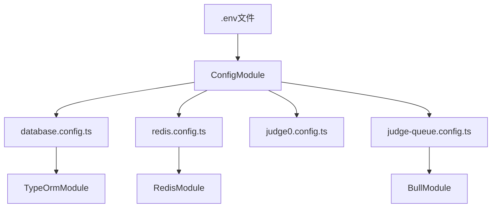
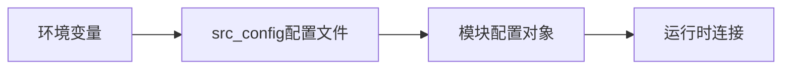
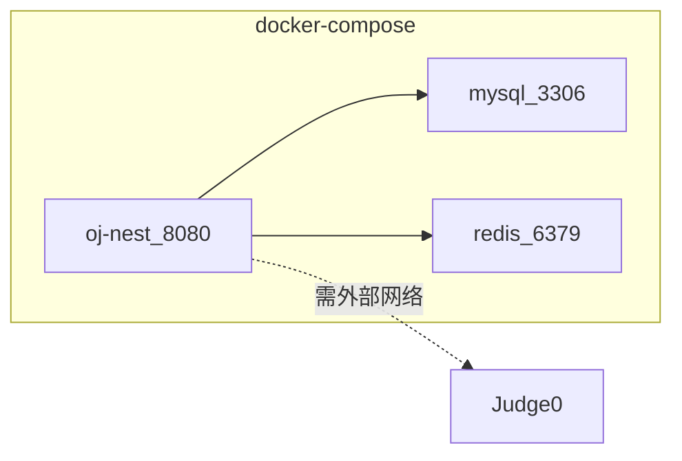
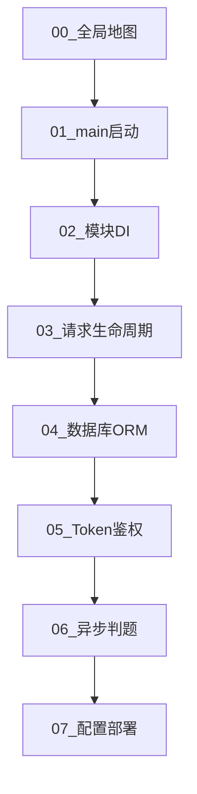

> 上一篇：[06 异步任务与判题队列](./06-异步任务与消息队列-Bull判题系统.md) | 回到：[00 序言](./00-序言-前端如何快进后端.md)

## 本篇学习入口

| 类型 | 内容 |
|------|------|
| 官方概念 | [Configuration](https://docs.nestjs.com/techniques/configuration)：`ConfigModule` 读取环境变量；[Modules](https://docs.nestjs.com/modules)：全局模块提供配置能力 |
| 小满知识点 | 环境变量、配置模块、连接数据库、Docker 部署 |
| 本项目代码入口 | `src/app.module.ts`、`src/config`、`Dockerfile`、`docker-compose.yml` |

## 配置与代码分离

数据库密码、Redis 地址不能写死在代码里 — 换环境（本地 / Docker / 生产）只改配置。

NestJS 用 `@nestjs/config` 读 `.env`：

```typescript
ConfigModule.forRoot({ isGlobal: true, envFilePath: '.env' })
```

`isGlobal: true` — 任何模块都能注入 `ConfigService` 读环境变量。

这叫 [12-Factor App](https://12factor.net/zh_cn/config) 里的「配置存在环境中」。

> 知识点：配置模块把环境变量变成可注入的 `ConfigService`，业务代码不用硬编码密码、端口、外部服务地址。
>
> 前端类比：Vite 用 `.env` 和 `import.meta.env` 区分本地、测试、生产接口地址。
>
> 本项目落点：`AppModule` 全局注册 `ConfigModule`，数据库、Redis、Bull、Judge0 配置都从环境变量读取。

## 主要环境变量

| 变量 | 用途 | docker-compose 示例值 |
|------|------|----------------------|
| `PORT` | 服务端口 | 8080 |
| `DB_HOST` | MySQL 主机 | mysql |
| `DB_PORT` | MySQL 端口 | 3306 |
| `DB_USERNAME` | 数据库用户 | root |
| `DB_PASSWORD` | 数据库密码 | 123456 |
| `DB_DATABASE` | 库名 | oj |
| `DB_POOL_SIZE` | 连接池大小 | 20 |
| `REDIS_HOST` | Redis 主机 | redis |
| `REDIS_PORT` | Redis 端口 | 6379 |
| `REDIS_PASSWORD` | Redis 密码 | 123456 |
| `REDIS_DB` | Redis 库号 | 0 |
| `JUDGE0_BASE_URL` | Judge0 地址 | http://judge0-...:2358 |
| `TOKEN_TTL` | Token 过期秒数 | 3600 |
| `JUDGE_QUEUE_CONCURRENCY` | 队列并发 | 5 |
| `JUDGE_TESTPOINT_CONCURRENCY` | 测试点并发 | 4 |
| `JUDGE_POLL_INTERVAL_MS` | 轮询间隔 | 500 |
| `JUDGE_POLL_MAX_RETRIES` | 轮询次数 | 20 |

本地开发 `.env` 示例：

```env
PORT=8080
DB_HOST=localhost
DB_PORT=3306
DB_USERNAME=root
DB_PASSWORD=123456
DB_DATABASE=oj
REDIS_HOST=localhost
REDIS_PORT=6379
REDIS_PASSWORD=123456
JUDGE0_BASE_URL=http://localhost:2358
TOKEN_TTL=3600
```

## 配置模块一览



> 知识点：源码只描述“需要哪些配置”，具体值由运行环境提供。
>
> 前端类比：同一套前端构建产物可以部署到不同环境，只要 API 地址配置不同。
>
> 本项目落点：本地可以用 `localhost`，Docker 内部用服务名 `mysql`、`redis`，代码不需要改。

## 配置文件怎么读

本项目里有两层配置：

| 层级 | 位置 | 作用 |
|------|------|------|
| 环境值 | `.env`、`docker-compose.yml` 的 `environment` | 放不同环境会变的值，比如端口、密码、主机名 |
| 配置转换 | `src/config/*.ts` | 把字符串环境变量整理成框架模块需要的配置对象 |



> 知识点：`.env` 只负责提供原始值，配置文件负责把这些值变成 TypeORM、Redis、Bull、Judge0 能直接使用的选项。
>
> 前端类比：`.env` 里写 `VITE_API_BASE_URL`，真正发请求时会在 request 封装里拼成完整 axios 配置。
>
> 本项目落点：`database.config.ts`、`redis.config.ts`、`judge-queue.config.ts` 都是在做“把环境变量翻译成模块配置”。

配置文件不要写业务逻辑，只做三件事：

1. 读取环境变量
2. 设置默认值
3. 组装第三方模块需要的配置对象

| 文件 | 读取内容 | 输出给谁 | 重点 |
|------|----------|----------|------|
| `database.config.ts` | `DB_HOST`、`DB_PORT`、账号、密码、库名 | `TypeOrmModule` | 注册 Entity、连接池、关闭 `synchronize` |
| `redis.config.ts` | `REDIS_HOST`、`REDIS_PORT`、密码、库号 | `RedisModule` | 拼 Redis URL |
| `judge0.config.ts` | `JUDGE0_BASE_URL` | `JudgeProcessor` / 判题逻辑 | 保存 Judge0 地址，维护语言 ID 映射 |
| `judge-queue.config.ts` | `JUDGE_*` 并发和轮询参数 | `BullModule` / `JudgeProcessor` | 队列名、重试策略、并发限制 |

新增配置时按这个判断：

| 需求 | 放哪里 |
|------|--------|
| 本地、Docker、生产环境值不同 | `.env` / compose environment |
| 第三方模块连接参数 | `src/config/*.ts` |
| 业务规则、业务开关 | 对应业务模块的 Service 或常量文件 |
| 密码、密钥、外部服务地址 | 只放环境变量，不写死进源码 |

### database.config.ts

MySQL 连接 + 注册 7 个 Entity + `synchronize: false`。

### redis.config.ts

拼 Redis URL：`redis://:password@host:port/db`

### judge0.config.ts

语言名映射 Judge0 language_id：

```typescript
const RAW_LANGUAGE_MAP = {
  C: 50, 'C++': 54, Java: 62, Python: 71, JavaScript: 63, Go: 60, ...
};

export function getLanguageId(name: string): number | undefined {
  return LANGUAGE_NAME_TO_ID[name.toLowerCase()];
}
```

### judge-queue.config.ts

队列名、并发数、重试策略，部分读 `process.env`。

## docker-compose 三容器

文件：`backend/oj-nest/docker-compose.yml`



| 服务 | 镜像 | 端口 | 说明 |
|------|------|------|------|
| mysql | mysql:8.0 | 3306 | 库名 oj，健康检查 |
| redis | redis:7-alpine | 6379 | requirepass 123456 |
| oj-nest | 本地 build | 8080 | 依赖 mysql healthy + redis started |

注意：**Judge0 不在 compose 里**。compose 写死 `JUDGE0_BASE_URL=http://judge0-v1131-extra-server-1:2358`，需你本地另有 Judge0 容器且网络互通。

> 知识点：Docker Compose 提供的是运行环境编排，容器之间通过服务名互相访问。
>
> 前端类比：前端 dev server、mock server、后端 API 可以同时跑，但它们是不同进程；Compose 把这些进程声明成服务。
>
> 本项目落点：`oj-nest` 容器通过 `mysql:3306` 访问数据库，通过 `redis:6379` 访问 Redis，对外暴露 `8080` 给前端调用。

## Dockerfile 多阶段构建

文件：`backend/oj-nest/Dockerfile`

```dockerfile
FROM node:22-alpine AS builder
WORKDIR /app
COPY package*.json ./
RUN npm ci
COPY . .
RUN npm run build

FROM node:22-alpine
WORKDIR /app
COPY package*.json ./
RUN npm ci --omit=dev
COPY --from=builder /app/dist ./dist
COPY .env .env
EXPOSE 8080
CMD ["node", "dist/main"]
```

- **builder 阶段** — 装全量依赖、编译 TS → `dist/`
- **运行阶段** — 只装 production 依赖 + 拷贝 `dist`，镜像更小

类比前端：build 出 `dist` 静态资源，生产只 serve 产物。

> 知识点：运行环境和源码开发环境要分离。生产容器只需要编译产物和生产依赖。
>
> 前端类比：上线不需要把 `src` 和 dev server 都放到服务器，只需要构建后的静态产物。
>
> 本项目落点：Nest 生产启动命令是 `node dist/main`，不是 `npm run start:dev`。

## 本地开发启动步骤

### 方式 A：Docker 全家桶（不含 Judge0）

```bash
cd backend/oj-nest
docker compose up -d mysql redis
# 导入数据库
mysql -h 127.0.0.1 -u root -p123456 oj < database/本地构建数据库.sql
# 本地跑 Nest（方便调试）
npm install
npm run start:dev
```

### 方式 B：compose 连 Nest 一起起

```bash
docker compose up -d
# 仍需先导入 SQL 到 mysql 容器
```

### Judge0

单独部署 Judge0（官方 docker 或 RapidAPI），确保 `JUDGE0_BASE_URL` 可达。不启 Judge0 时：登录、题目 CRUD 正常，**提交代码会一直 Pending**。

## npm scripts

| 命令 | 作用 |
|------|------|
| `npm run start:dev` | 开发热重载 |
| `npm run build` | 编译到 dist |
| `npm run start:prod` | `node dist/main` |
| `npm run test:e2e` | E2E 测试 |

## API 路由速查

| 前缀 | 模块 | 需登录 |
|------|------|--------|
| `POST /api/user/login` | User | 否 |
| `POST /api/user/register` | User | 否 |
| `GET /api/user/status` | User | 带 token |
| `api/testQuestion/*` | Question 管理 | 是 |
| `api/user/testQuestion/*` | Question 用户 | 是 |
| `api/comment/*` | Comment | 是 |

## 系列回顾



你从「会调接口的前端」到「能读能改 Nest 后端」，按这 8 篇走完，应该能：

1. 找到任意 API 对应的 Controller → Service → Entity
2. 加一个新接口（DTO + Controller + Service）
3. 理解判题为什么异步、结果写哪张表
4. 用 docker-compose 起 MySQL/Redis 并配 `.env`

## 推荐阅读的源码顺序

1. `src/main.ts` + `src/app.module.ts`
2. `modules/user/` — 最简单的 CRUD + Redis
3. `modules/question/question.service.ts` — 复杂业务 + 队列入队
4. `modules/judge/judge.processor.ts` — 后台 Worker
5. `modules/comment/comment.service.ts` — QueryBuilder、嵌套查询
6. `common/guards/token.guard.ts` — 鉴权
