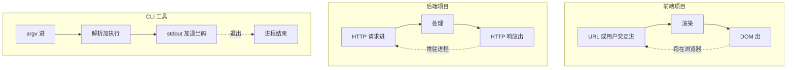
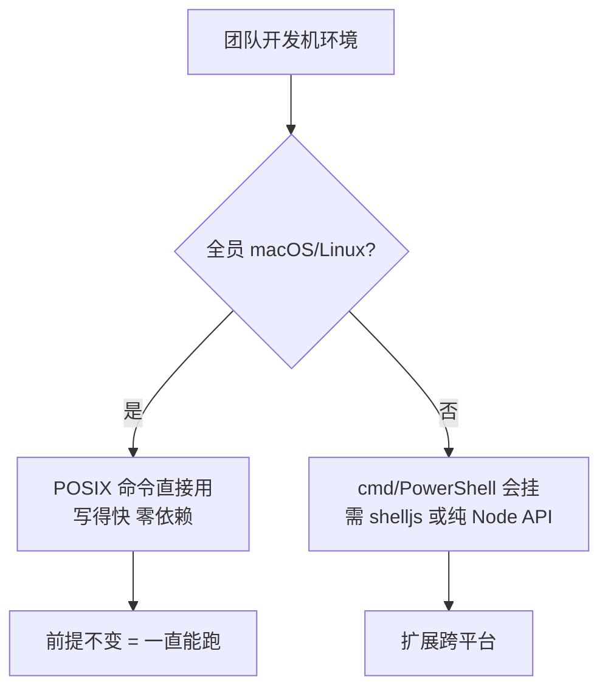

很多人觉得"会写前端或后端就能写 CLI"。真写起来处处踩坑，因为 CLI 和前端项目、后端项目的运行模型都不同。这篇讲差异，以及差异推导出的设计要求。

## 本质差异：CLI vs 前端 vs 后端



| 维度 | 前端项目 | 后端项目 | CLI 工具 |
|------|---------|---------|---------|
| 运行方式 | 构建产物跑浏览器 | 常驻进程 | 单次执行后退出 |
| 入口 | `index.html` + `main.js` | `server.listen` | shebang + `bin` 全局命令 |
| 输入 | 用户交互 / URL | HTTP 请求体 | argv 命令行参数 |
| 输出 | DOM / 渲染 | HTTP 响应 | stdout/stderr + 退出码 |
| 依赖位置 | 项目 `node_modules` | 项目 `node_modules` | 全局 / CLI 自身 `node_modules` |
| 用户 | 终端用户 | 终端用户 / 其他服务 | 开发者 / CI |
| 副作用 | DOM / 本地存储 | 数据库 / 缓存 | 文件系统 / git / 子进程 |
| 升级方式 | 重新部署 | 部署发版 | 自更新命令 |
| 失败标准 | 白屏 / 报错 | 5xx / 超时 | 退出码非 0 |

## 差异详解

### 入口与分发

前端靠 `index.html` 加载 JS，后端靠 `listen` 等请求；CLI 靠 shebang 把自己变成命令，靠 `bin` 字段做全局软链，靠约定式分发按目录加载子命令：

```js
#!/usr/bin/env node
const argv = require('minimist')(process.argv.slice(2));
const alias = require('./command/alias');

function loadModule(name) {
  const sub = alias[name] || name;        // 别名转换
  try {
    const mod = require(`./command/${sub}`);
    if (typeof mod.main === 'function') return mod;  // 约定：导出 main 才算合法命令
  } catch (e) {}
}

invokeCommand(argv._[0], argv);
```

`package.json` 里 `"bin": { "team-cli": "index.js" }` + 全局安装 = 终端任意位置可调。这是 CLI 和前后端项目的分界。

### 输入输出：argv 与退出码

前端输入是用户交互，后端是 JSON body，CLI 是 `process.argv`——要自己解析布尔、数组、别名。输出不只是文字，**退出码是契约**：前端靠白屏判断、后端靠 5xx 判断，CLI 靠 `exit code`——CI 据此判成败，`console.log` 喊得再响也没用：

```js
command.on('close', code => {
  if (code === 0) spinner.succeed('成功');
  else { spinner.fail(`失败: ${code}`); process.exit(1); }
});
```

### 进程模型：编排子进程

前端的副作用在 DOM，后端在数据库，CLI 的副作用大多靠子进程完成（`spawn` 跑 `vue-cli-service`、`git`、`npm`、`taro`）。要处理 `stdio: 'inherit'` 共享输入输出、`close/error` 事件、超时、退出码透传。前后端项目很少碰这些。

### 依赖边界

前后端依赖都装在项目 `node_modules`，和项目同生共死；CLI 全局安装，依赖装在自己 `node_modules`，**不能污染宿主业务项目**。所以本地配置要放 `~/.team-cli/`，不是项目目录；临时文件用完即删。

### 副作用：必须幂等可回滚

前端改坏 DOM 刷新就好，后端接口失败可以重试；CLI 改坏开发者本地的 `package.json` / `vue.config.js` 是事故。所以写文件前读、生成临时文件用完删、可逆操作优先。改完 `package.json` 写回前先读再改，不要整文件覆盖丢字段。

### 跨平台

前端产物跑浏览器无所谓系统，后端跑在 Linux 服务器也无所谓；CLI 跑在开发者机器——`rm -rf`、`tar`、`ln -s`、`which`、`cp -r` 这些 POSIX 工具在 Windows 下直接挂。Windows / macOS / Linux 都得活。



### 版本治理

前端版本由部署控制，后端版本由发版控制；CLI 散落在每台开发机，得自己管升级、锁版本、向后兼容。

## 设计要求

从差异反推 CLI 该满足的要求：

| 要求 | 为什么 | 落地 |
|------|--------|------|
| 约定优于配置 | 降低学习成本 | `command/<name>/index.js` 导出 `main` 即注册 |
| 零配置可用 | 新人开箱即跑 | 默认值兜底，缺配置走 `defaultConfig` |
| 可扩展 | 命令会越加越多 | 约定式 registry，不改主调度加新命令 |
| 启动要快 | 慢 = 体验差 | 检查更新用周节制流，不每次请求远程 |
| 副作用可回滚 | 别弄坏宿主项目 | 临时文件用完删，写前备份 |
| 退出码语义 | CI 靠它判成败 | 成功 `exit(0)`，失败 `exit(非0)` |
| 跨平台 | 开发机系统杂 | 慎用 POSIX，用 `shelljs` / 纯 Node API 替代 |
| 可观测 | 治理要数据 | 遥测上报用法，`try/catch` 不阻塞 |
| 可自更新 | 版本不能散落 | 私有源 + 周节制流 + `upgrade` 命令 |
| 不污染宿主 | 全局工具要克制 | 本地配置放 `~/`，依赖放自身 `node_modules` |

## 对开发者的要求

写 CLI 的人比写业务多一层：要熟 `child_process` 编排、跨平台 POSIX 坑、退出码契约，心态上把"改坏开发者本地"当事故——一切操作幂等可回滚。

下一篇逐个功能拆解难点和解法。
