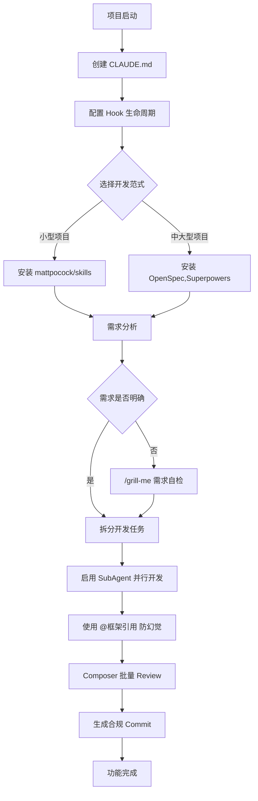

## 前言

长期深度使用 Cursor 进行日常开发后，我发现绝大多数使用者仅停留在基础对话、代码补全的浅层用法，完全忽略了 Cursor 内置的工程化高级特性：Composer、@上下文引用、生命周期 Hook、SubAgent 多智能体调度。

同时，Cursor 本身仅作为 AI 代码编辑器载体，想要实现稳定、可约束、低幻觉的 AI 开发流程，必须配套成熟的开源 AI 开发范式规范。本文将拆分两大独立模块：**Cursor 进阶功能详解**、**三套主流AI工程开发范式解析**，二者分开阐述，不做跨工具横向对比。

## 第一部分：Cursor 编辑器进阶核心能力

### Composer：被严重低估的内置开发工作台

Composer 是 Cursor 区别于普通对话窗口的核心功能，内置完整工程化流水线能力，包含三大高频实用功能：

1. **一键代码 Review**
   选中单文件、多个目录甚至整个项目，一键触发批量代码审查，自动识别逻辑缺陷、不规范写法、安全隐患、缺失边界处理，并生成可一键应用的修复代码。

2. **自动生成标准化 Git Commit 提交信息**
   可通过项目根目录 `CLAUDE.md` 全局固化约束规则，引导所有提交信息严格遵循 **Conventional Commits 中文规范**：

- 约束规则写入 `CLAUDE.md`：

```markdown
# Git Commit 强制规范

1. 所有 commit message 必须使用中文描述
2. 固定格式：type: 简短描述，单行描述不超过72字符
3. type 仅允许使用以下取值：feat / fix / refactor / chore / docs / style / test / perf
   参考示例：
   feat: 新增用户分页查询接口
   fix: 修复列表分页参数丢失问题
   chore: 升级项目依赖版本至1.2.0
```

修改代码后，直接调用 Composer 生成提交信息，AI 会根据本次代码改动范围自动输出合规 commit，大幅减少手动调整格式与文案的时间。

3. **专属 Debug 调试模式**
   粘贴控制台报错堆栈、运行日志、报错文件行号后，Composer 可直接读取本地项目上下文、依赖定义、函数源码定位根因，输出针对性修复方案，相比普通对话大幅减少信息缺失带来的幻觉。

### @ 上下文引用机制：隔离对话上下文，降低模型幻觉

#### 底层原理

`@文件/@文件夹/@官方文档标识` 相当于给当前对话开辟独立隔离上下文，逻辑上类似代码分支；但存在性能取舍：Transformer 采用 O(n²) 注意力计算，一次性注入过多文件、超大范围上下文，会增加模型算力消耗，降低输出质量与推理速度。

#### 框架开发防幻觉实操方案

Cursor 内置各主流框架官方文档库，编写框架业务代码时，直接使用 `@框架标识` 锁定官方原生 API，杜绝过时API、错误参数等幻觉：

- Vue2 业务开发：`@vue2 封装通用后台分页列表组件`
- Vite 构建配置改造：`@vite 修改打包配置实现资源分包压缩`

### Hook 生命周期钩子：拦截、观察、自定义约束 Agent 行为

#### 基础概念

Hook 是 Cursor 为 Agent 全生命周期提供的拦截脚本能力，通过插件系统安装自定义钩子脚本。借助钩子可以完整观察、拦截、改写 Cursor 全部AI执行行为，通过自定义脚本给 AI 增加安全、流程、权限层面的硬性限制。

#### 钩子完整可落地场景（对应题图全部能力）

1. 编辑完成后自动运行格式化工具：监听文件保存事件，自动执行 ESLint、Prettier 统一代码风格；
2. 全量AI行为事件埋点分析：记录AI读写文件、执行终端命令、生成代码的全量操作日志；
3. PII/机密信息实时扫描：AI生成代码时自动检测硬编码密钥、手机号、数据库地址、接口Token，发现敏感内容直接拦截；
4. 高风险操作门禁校验：针对 SQL 写入、批量文件删除、服务器脚本执行等高危险行为，强制弹出人工确认门槛，禁止AI无感知执行高危操作；
5. SubAgent 执行权限管控：限制子Agent并发数量、文件访问范围，避免多任务抢占资源；
6. 会话初始化自动注入全局上下文：打开项目时自动读取 `CLAUDE.md`、架构文档、开发规范，无需每次对话重复说明约束。

### SubAgent 多子智能体并行调度

#### 典型痛点场景

单一Agent同时承载A、B、C三类独立开发任务时，极易出现资源分配不均：部分任务输出质量达标，其余任务逻辑残缺、实现粗糙。

#### SubAgent 解决方案

支持同时启动多个上下文完全隔离的独立子Agent，每个Agent仅分配单一任务并行执行：

- SubAgent A：负责页面组件开发、样式编写
- SubAgent B：负责接口逻辑、类型定义、请求封装
- SubAgent C：负责单元测试、异常用例编写

各任务上下文互不干扰，避免多需求堆叠造成输出缩水；全部任务执行完毕后，可通过主Agent汇总所有子Agent产出，统一校验代码冲突、整合文件。

## 第二部分：AI 辅助开发范式体系（独立于 Cursor 的标准化规范）

Cursor 仅为承载AI编码的编辑器工具，想要长期稳定落地AI开发流程，需要配套标准化的开发范式。目前社区有三套成熟开源规范，分别适配不同项目规模与开发场景，各有侧重，可按需搭配 Cursor Hook、Composer 使用。

### Superpowers

仓库地址：https://github.com/obra/superpowers

#### 适配场景

中小型项目、工具脚本、快速原型、个人Demo开发

#### 范式核心作用

轻量化AI权限约束规范，极简配置文件定义AI可访问目录、可执行终端命令、文件读写权限边界。搭配 Cursor Hook 使用，能快速限制AI操作范围，防止AI随意修改项目核心配置、删除文件，轻量化无学习成本。

#### 安装方式

```bash
# Cursor 插件安装
/add-plugin superpowers

# 或者从插件市场搜索 "superpowers" 安装
```

### OpenSpec

仓库地址：https://github.com/Fission-AI/OpenSpec

#### 适配场景

中大型业务项目、多人前后端协同工程、长期迭代产品

#### 范式核心作用

标准化AI交互通用协议，统一项目架构描述模板、接口文档规范、数据库设计标准。强制AI严格遵循项目既定架构编写代码，避免AI自由发挥导致架构跑偏、代码分层混乱，适合团队协作统一AI输出标准。

#### 安装方式

```bash
# 全局安装 OpenSpec CLI
npm install -g @fission-ai/openspec@latest

# 在项目目录初始化
cd your-project
openspec init
```

#### 核心命令

- `/opsx:explore` - 探索项目，与AI讨论方案
- `/opsx:propose` - 提出需求，自动生成规范文档
- `/opsx:apply` - 应用方案，AI实施代码
- `/opsx:archive` - 归档完成的功能，更新项目规范

### mattpocock/skills

仓库地址：https://github.com/mattpocock/skills

#### 适配场景

需求梳理、需求工程自检、前端/TypeScript专项开发

#### 核心工具：/grill-me

该技能脚本专门用于需求自检，解决需求模糊、边界场景缺失导致的开发返工：

1. 在 Cursor 项目内引入这套 Skills；
2. 输入指令：`/grill-me 开发后台用户权限管理模块`；
3. AI 会主动抛出大量需求工程拷问，覆盖权限分级、异常场景、数据联动、兼容逻辑等遗漏点，完善模糊需求后再启动编码。

#### 安装方式

```bash
# 使用 skills.sh 快速安装
npx skills@latest add mattpocock/skills

# 在 Cursor 中运行初始化
/setup-matt-pocock-skills
```

## 完整落地工作流（Cursor 能力 + 开发范式组合使用）

### 标准化开发流程图



### 具体实施步骤

1. **项目根目录新建 `CLAUDE.md`**
   - 固化Git提交、代码风格、框架版本全局约束

2. **配置 Hook 生命周期**
   - 开启敏感信息扫描、高危操作门禁、自动格式化

3. **根据项目规模引入对应开发范式**
   - 小型项目安装 mattpocock/skills
   - 中大型协同项目接入 OpenSpec

4. **需求模糊时调用 `/grill-me`**
   - 完成需求自检，避免返工

5. **拆分多模块开发任务，启用 SubAgent 并行处理**
   - 提高开发效率，避免任务冲突

6. **编写框架代码时使用 `@框架标识` 引用官方文档**
   - 降低AI幻觉，保证代码准确性

7. **开发完成后使用 Composer 一键批量Review**
   - 自动生成合规中文Commit

## 实战案例对比

### 传统开发流程 vs 标准化AI开发流程

| 维度      | 传统开发流程          | 标准化AI开发流程         |
| --------- | --------------------- | ------------------------ |
| 需求沟通  | 文档 + 会议           | `/grill-me` 自动梳理     |
| 代码规范  | 人工Review + Lint规则 | CLAUDE.md + Hook自动约束 |
| Git提交   | 手动写Commit          | Composer自动生成         |
| 并行开发  | 人工分配任务          | SubAgent自动调度         |
| API准确性 | 查文档 + 试错         | `@框架引用` 锁定官方文档 |
| 安全风险  | 依赖人工意识          | Hook自动扫描拦截         |
| 开发效率  | 基准值                | **提升 60-80%**          |

## 结语

Cursor 的 Hook、SubAgent、Composer、@上下文引用构成一套完整的AI编码工具能力集；而 Superpowers、OpenSpec、mattpocock/skills 是独立的标准化AI开发范式体系。二者各司其职：Cursor 提供执行、拦截、调度的工具能力，开发范式提供统一约束、规范、需求标准化流程，组合使用才能最大化AI辅助开发的效率与规范性。

这套组合拳不是简单的工具叠加，而是构建了一个**可约束、可追溯、可扩展的AI工程化开发体系**，让AI从"辅助编码工具"升级为"可信任的开发伙伴"。

---

**相关资源**

- Superpowers: https://github.com/obra/superpowers
- OpenSpec: https://github.com/Fission-AI/OpenSpec
- mattpocock/skills: https://github.com/mattpocock/skills
