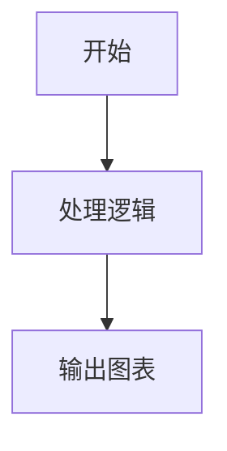
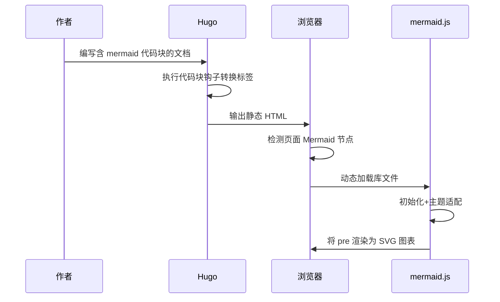

本文记录 Hugo 博客接入 Mermaid 图表的完整配置、原理、代码及优化方案，采用**客户端动态渲染**，部署简单、适配主流主题。

## 一、实现思路

Hugo 内置语法高亮工具 Chroma 仅能给代码上色，无法解析 Mermaid 绘图语法，因此采用「构建层改造代码块 + 浏览器端 JS 渲染」两步方案：

1. **构建阶段**：通过 Hugo 代码块钩子，将 `mermaid` 代码块转为带指定 class 的 `<pre>` 标签；
2. **运行阶段**：浏览器检测页面内 Mermaid 节点，动态加载 Mermaid 库，完成图表渲染。

## 二、完整配置文件

一共需要**两个核心文件**，直接放置到对应目录即可生效。

### 1. 代码块钩子（构建阶段转换标签）

文件路径：`layouts/_markup/render-codeblock-mermaid.html`
作用：接管 ` ```mermaid ` 代码块，替换默认高亮逻辑，输出 Mermaid 可识别标签，并标记页面包含图表。

```html
<pre class="mermaid">
  {{- .Inner -}}
</pre>
{{ .Page.Store.Set "hasMermaid" true }}
```

**代码说明**

- `<pre class="mermaid">`：Mermaid.js 识别的专属节点；
- `{{- .Inner -}}`：读取 Markdown 代码块内容，`-` 去除首尾多余空格换行；
- `.Page.Store.Set`：页面级标记，用于后续判断是否加载脚本。

> 原理：Hugo 会根据代码块语言名，自动匹配同名渲染钩子，命中后不再走 Chroma 语法高亮。

### 2. 客户端渲染脚本（浏览器执行）

文件路径：`layouts/partials/footer/custom.html`
作用：页面加载后按需加载 Mermaid 库、适配明暗主题、手动触发图表渲染。

```html
<script type="module">
  const mermaidBlocks = document.querySelectorAll("pre.mermaid");
  // 页面存在 Mermaid 块才加载库
  if (mermaidBlocks.length) {
    // 动态引入 CDN 版本 Mermaid 11
    const { default: mermaid } =
      await import("https://cdn.jsdelivr.net/npm/mermaid@11/dist/mermaid.esm.min.mjs");
    // 适配博客明暗主题
    const theme =
      document.documentElement.dataset.scheme === "dark" ? "dark" : "default";
    // 初始化配置：关闭自动渲染，改为手动触发
    mermaid.initialize({ startOnLoad: false, theme: theme });
    // 渲染所有 Mermaid 节点
    await mermaid.run({ nodes: mermaidBlocks });
  }
</script>
```

**执行流程**

1. 遍历页面所有 `pre.mermaid` 节点，无图表则直接终止；
2. ESM 动态导入 Mermaid CDN 资源，**按需加载**，减少空白页面资源请求；
3. 读取页面主题标识，自动切换 Mermaid 明暗样式；
4. 关闭库默认自动渲染，手动调用 `run` 统一渲染，提升可控性。

## 三、Markdown 写法

配置完成后，文章内正常使用标准 Mermaid 语法即可，无需额外改动：

````markdown

````

## 四、核心原理与方案对比

### 1. 为什么不使用 Hugo 内置高亮？

Chroma 仅负责**代码语法高亮**，不解析 Mermaid 绘图 DSL，`mermaid` 不在其支持的语言列表中，最终会降级为纯文本代码块，无法生成图表。

### 2. 客户端渲染 vs 服务端预渲染

| 方案                   | 优点                                   | 缺点                                     | 适用场景                            |
| ---------------------- | -------------------------------------- | ---------------------------------------- | ----------------------------------- |
| 客户端渲染（本文方案） | 配置简单、零额外依赖、无需改造构建流程 | 依赖外网 CDN、搜索引擎无法抓取 SVG 内容  | 个人博客、小型站点（推荐）          |
| 服务端预渲染           | 输出静态 SVG、无 JS 依赖、SEO 友好     | 需要安装 `mermaid-cli`、改造 CI/构建流程 | 企业站点、内网部署、高 SEO 要求站点 |

### 3. `startOnLoad: false` 关键作用

Mermaid 默认开启自动扫描渲染，设置为 `false` 后由代码手动控制渲染时机，优势：

- 先完成主题配置，再执行渲染，样式不错乱；
- 灵活控制加载逻辑，支持懒加载、动态刷新等扩展；
- 避免脚本执行顺序导致的渲染失败。

## 五、整体执行流程

### 1. 阶段流程图

````mermaid
flowchart TB
    subgraph Hugo 构建阶段
        MD[Markdown 文章<br/>```mermaid 代码块]
        Hook[render-codeblock-mermaid 钩子]
        HTML[输出 <pre class="mermaid"> 标签]
        MD --> Hook --> HTML
    end
    subgraph 浏览器运行阶段
        DOM[检测 pre.mermaid 节点]
        CDN[动态加载 mermaid.js]
        SVG[替换为 SVG 图表]
        HTML --> DOM --> CDN --> SVG
    end
````

### 2. 时序流程



## 六、可选优化（进阶配置）

根据自身需求按需开启，提升体验与兼容性：

1. **主题切换自动重渲染**
   监听页面明暗主题切换事件，清除节点渲染标记后重新执行 `mermaid.run`，实现主题联动。

2. **脚本条件加载**
   利用页面标记 `hasMermaid` 包裹脚本，**无图表页面完全不执行 JS**，进一步优化性能：

   ```html
   {{ if .Page.Store.Get "hasMermaid" }}
   <!-- 上方 Mermaid 脚本放此处 -->
   {{ end }}
   ```

3. **本地静态资源（内网/离线使用）**
   下载 `mermaid.esm.min.mjs` 放到站点 `static` 目录，将 CDN 地址改为本地相对路径，脱离外网依赖。

4. **抽离独立 Partial**
   将渲染脚本单独新建文件 `layouts/partials/mermaid.html`，在 footer 中通过 `{{ partial "mermaid" . }}` 引入，方便统一管理。

5. **样式优化**
   为 `.mermaid` 增加 CSS 样式，实现图表居中、自适应、横向滚动，避免宽图表撑破页面布局。

## 七、本地验证

配置完成后启动本地服务测试：

```bash
hugo server
```

打开对应文章，若 `mermaid` 代码块正常转为图表、不再显示代码文本，即配置生效。
