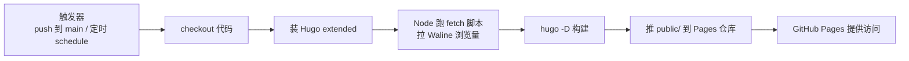
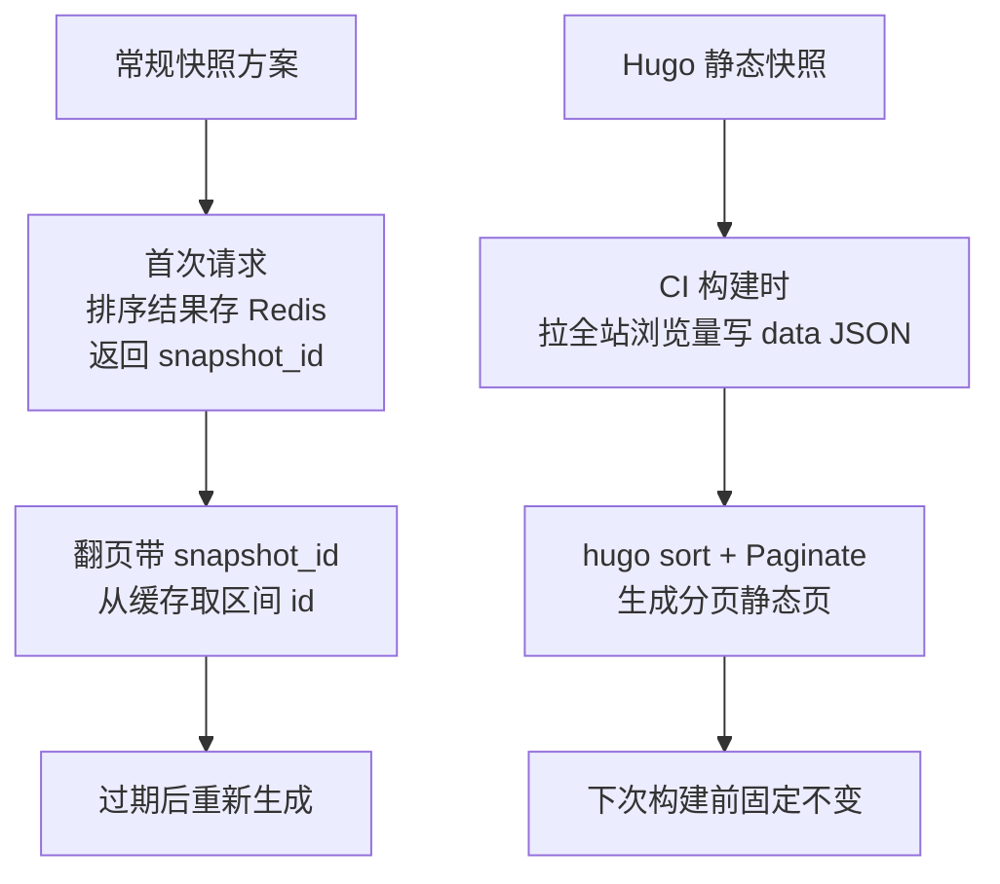

## 前言

Hugo 是纯静态站点生成器：写 Markdown，构建时生成 HTML，部署就是把这些 HTML 放到 web 服务器上，**没有运行时后端**。这带来两个常见疑问：

1. 没有后端，CI/CD 怎么做？
2. 我想按「浏览量」给文章排序，浏览量是实时数据，静态站没有数据库、没有运行时查询，怎么做分页？翻页会不会像动态接口那样出现数据重复/遗漏？

本文一次讲清这两件事，并把 Hugo 的静态方案和常规后端动态分页（offset / 游标 / 快照）摆在一起对比。

## Part 1：Hugo + GitHub Actions CI/CD 原理

### 整体链路



核心思路：**构建在 CI 里完成，部署就是把产物推到 GitHub Pages 仓库**。下面逐段拆 workflow。

### workflow 逐段

**触发器**：

```yaml
on:
  push:
    branches:
      - main
  schedule:
    - cron: "17 3 */3 * *"
```

- `push`：写完文章 push 到 main，立即构建部署。
- `schedule`：约每 3 天定时跑一次，用来**刷新浏览量排序**（浏览量是实时变化的，静态站要重新构建才能反映新数据）。`17 3 */3 * *` = 每月 1/4/7... 号 03:17 UTC。

**步骤**：

```yaml
jobs:
  deploy:
    runs-on: ubuntu-latest
    steps:
      - name: Checkout
        uses: actions/checkout@v4
        with:
          fetch-depth: 0

      - name: Setup Hugo
        uses: peaceiris/actions-hugo@v3
        with:
          hugo-version: "latest"
          extended: true

      - name: Setup Node
        uses: actions/setup-node@v4
        with:
          node-version: "20"

      - name: Fetch pageviews
        run: node scripts/fetch-pageviews.js

      - name: Build Web
        run: hugo -D

      - name: Deploy Web
        uses: peaceiris/actions-gh-pages@v4
        with:
          PERSONAL_TOKEN: ${{ secrets.TOKEN }}
          EXTERNAL_REPOSITORY: yourname/yourname.github.io
          PUBLISH_BRANCH: main
          PUBLISH_DIR: ./public
          commit_message: auto deploy
```

几点说明：

- `fetch-depth: 0`：Hugo 构建某些功能（如 lastmod 从 git log 取）需要完整历史。
- `peaceiris/actions-hugo`：装 Hugo extended 版（Stack 主题的图片处理需要 extended）。
- `Setup Node` + `Fetch pageviews`：装 Node 20 跑 `scripts/fetch-pageviews.js`，调 Waline API 拉每篇文章浏览量，写进 `data/pageviews.json`。这是按浏览量排序的数据来源，下面 Part 2 详讲。
- `hugo -D`：`-D` 包含 draft 文章（按需）。
- `peaceiris/actions-gh-pages`：把 `public/` 推到**另一个仓库** `yourname/yourname.github.io` 的 `main` 分支，GitHub Pages 从这个仓库出站。源码仓和 Pages 仓分离，构建产物不污染源码仓历史。

> 用 `PERSONAL_TOKEN` 而不是默认 `GITHUB_TOKEN`，是因为推到**外部仓库**需要跨仓权限，默认 token 只能推当前仓。

### 定时构建的意义

静态站的死穴是「数据不实时」。浏览量每分每秒在变，但静态页一旦生成就固定了。解决办法不是让静态站变动态，而是**定时重新构建**：

- push 触发：内容更新时立即重建。
- schedule 触发：内容没变但浏览量变了，定时拉新数据重建。

频率越高越实时，但 GitHub Actions 免费额度有限。每 3 天一次是「够用又不浪费」的折中。

## Part 2：按浏览量排序——Hugo 静态方案 vs 常规后端方案

### 核心难点：浏览量是实时变化的

按浏览量排序的分页列表，难的不是排序，是**翻页时的数据漂移**。

假设按 `views DESC` 排序，每页 20 条。用户看第 1 页时，第 20 条浏览量 100。等用户翻到第 2 页时，第 1 页某篇文章被看了一次，浏览量从 101 涨到 102，排到第 18 条去了——于是第 2 页的列表和第 1 页**出现重复或遗漏**。

这是所有按「会变化的字段」排序的分页都要面对的问题。下面先看常规后端怎么解，再看 Hugo 静态站怎么解。

### 常规后端的三种方案

#### 普通 offset 分页

```
GET /api/list?page=2&pageSize=20&sort=views&order=desc
```

后端 `ORDER BY views DESC, id DESC LIMIT 20 OFFSET 20`。

- 简单，支持跳页。
- **会漂移**：翻页过程中浏览量变化 → 重复/遗漏。
- 适用：浏览量更新慢、容忍度高的场景。

#### 游标分页

不用页码，用上一页最后一条的排序值做游标：

```
GET /api/list?cursor=15230&lastId=88&pageSize=20&sort=views&order=desc
```

```sql
SELECT * FROM articles
WHERE (views < 15230) OR (views = 15230 AND id < 88)
ORDER BY views DESC, id DESC
LIMIT 20;
```

- **关键点**：排序字段必须加**唯一字段（id）做 tie-breaker**，否则浏览量相同的多条无法确定游标位置。
- 不漂移，深分页性能好（避免大 offset）。
- **不支持跳页**，只能上一页/下一页，适合无限滚动。

#### 快照分页

需要页码跳转时，首次查询生成一个排序快照：

1. 首次请求，后端把当前排序后的 id 列表缓存到 Redis（带过期，如 5 分钟），返回 `snapshot_id`。
2. 翻页带 `snapshot_id`，后端从缓存取对应区间 id 再批量查详情。

```
GET /api/list?page=3&pageSize=20&snapshot_id=abc123
```

- 翻页过程数据完全稳定，支持任意跳页。
- 有缓存成本，快照过期需重新生成，浏览量变化不实时反映。



### Hugo 静态站的做法 = 快照方案的静态版

Hugo 没有运行时后端，但「快照」这个思路天然契合静态站：**构建时拉一次数据，生成静态页，内容固定到下次构建**。

#### 第一步：CI 构建时拉浏览量

`scripts/fetch-pageviews.js` 在构建前跑：

```js
const SERVER_URL = 'https://your-waline.example.com';

async function fetchCount(p) {
  const url = `${SERVER_URL}/api/article?path=${encodeURIComponent(p)}&type=time&lang=zh-cn`;
  const res = await fetch(url);
  const json = await res.json();
  if (json.errno === 0 && json.data != null) {
    const row = Array.isArray(json.data) ? json.data[0] : json.data;
    return typeof row === 'number' ? row : Number(row && row.time) || 0;
  }
  return 0;
}

// 遍历 content/post/*，对每篇的 RelPermalink 拉 count
// 汇总写 data/pageviews.json：{ "/p/xxx/": 99, ... }
```

产物 `data/pageviews.json` 是一份 `{文章路径: 浏览量}` 的快照。Hugo 构建时通过 `.Site.Data.pageviews` 读它。

#### 第二步：Hugo 模板按浏览量排序分页

`layouts/hot/list.html`：

```gotemplate
{{ $pv := .Site.Data.pageviews }}
{{ $pages := where .Site.RegularPages "Type" "in" .Site.Params.mainSections }}
{{ $notHidden := where .Site.RegularPages "Params.hidden" "!=" true }}
{{ $filtered := ($pages | intersect $notHidden) }}

{{ $items := slice }}
{{ range $filtered }}
    {{ $c := index $pv .RelPermalink | default 0 }}
    {{ $items = $items | append (dict "count" $c "page" .) }}
{{ end }}
{{ $sorted := sort $items "count" "desc" }}

{{ $pagesSorted := slice }}
{{ range $sorted }}
    {{ $pagesSorted = $pagesSorted | append .page }}
{{ end }}
{{ $pag := .Paginate $pagesSorted }}

{{ range $pag.Pages }}
    {{ partial "article-list/default" . }}
{{ end }}
{{ partial "pagination.html" . }}
```

逻辑拆解：

1. 读 `data/pageviews.json`（`.Site.Data.pageviews`）。
2. 取所有 post 类型、非隐藏的页面。
3. 给每篇绑上 count（浏览量不存在则 0），组成 `slice of dict`。
4. `sort ... "count" "desc"` 按浏览量降序。
5. 提取出排好序的 Page slice，`.Paginate` 生成分页。

#### 天然规避数据漂移

这是关键对比。常规后端快照方案要专门设计（Redis 缓存 + snapshot_id + 过期管理）才能解决漂移；Hugo 静态方案**天然不漂移**，因为：

- 静态页生成后内容固定，用户翻第 2 页看到的就是构建时定好的列表，不会因为别人浏览了某篇文章而变化。
- 「过期」就是下次构建——重新拉数据、重新排序、重新生成，不需要 Redis、不需要 snapshot_id。

#### 天然支持跳页

Hugo `.Paginate` 自动生成 `/hot/`、`/hot/2/`、`/hot/3/` 多个静态页，带页码导航。用户能直接跳第 3 页，不会有游标分页「只能上下页」的局限。因为每个页码都是构建时生成好的独立静态文件。

#### tie-breaker：浏览量相同怎么办

`sort` 按 `count` 降序后，浏览量相同的文章顺序由 `sort` 内部决定。要让顺序稳定，可加 Date 兜底——Hugo 的 `sort` 是单字段的，若要双字段排序，可先按 Date 排序再按 count 排序（稳定排序前提下），或者接受单字段排序在相同浏览量时的任意顺序。博客文章场景下浏览量相同的概率低，单字段排序够用。

### 对比表

| 维度 | 普通 offset | 游标分页 | 后端快照 | Hugo 静态快照 |
|---|---|---|---|---|
| 漂移 | 会 | 不漂移 | 不漂移 | 不漂移 |
| 跳页 | 支持 | 不支持 | 支持 | 支持 |
| 运行时成本 | 低 | 低 | 中（Redis） | 零 |
| 实时性 | 实时 | 实时 | 快照期内固定 | 延迟到下次构建 |
| 实现复杂度 | 低 | 中 | 高 | 低 |
| 适用 | 更新慢 | 无限滚动 | 后台带页码 | 静态站 |

### 选型建议

- **静态博客 / 内容更新频率低** → Hugo 静态快照。零成本、无漂移、支持跳页，唯一代价是实时性，用 `schedule` 定时构建兜底。
- **信息流 / 无限滚动** → 后端游标分页，最稳。
- **后台管理 / 必须实时 + 页码** → 后端快照方案。
- **浏览量几乎不变**（按历史总浏览量且更新极慢） → 普通 offset 就够。

## 小结

一句话串起两件事：**Hugo 静态站的 CI/CD 就是「GitHub Actions 里构建 + 推 Pages 仓库」，按浏览量排序就是「构建时拉数据快照 + Hugo sort 生成静态分页」**。后者本质是常规快照分页方案的静态版，但省掉了 Redis、snapshot_id、过期管理这些运行时设施——代价是实时性延迟到下次构建，对博客这种低频更新场景是合算的交换。

> 想更实时就调高 `schedule` 频率（如每天），想省额度就拉长间隔。静态站的「实时性」是用构建频率换的，没有银弹。
