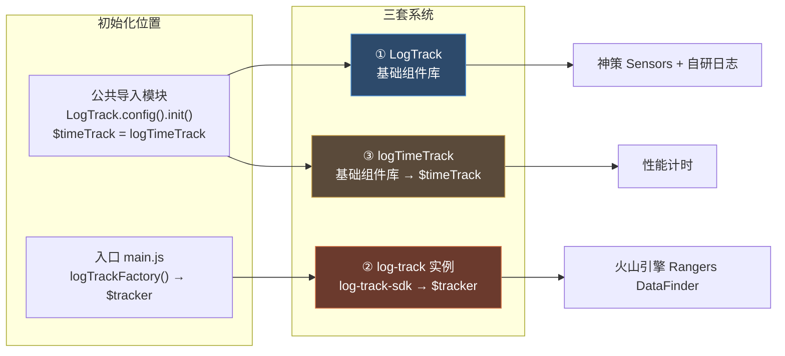
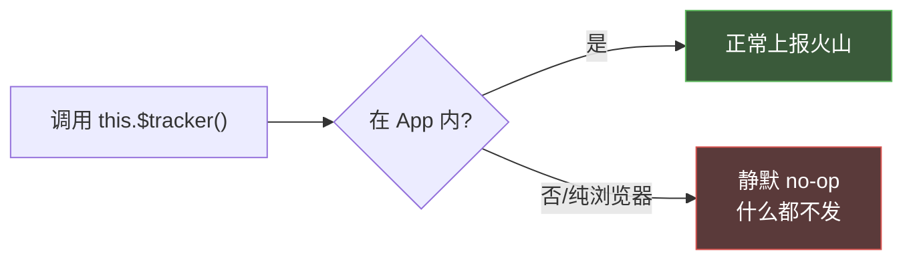

# 三大埋点系统详解

> 目标：搞清每套系统的来源、初始化位置、调用 API、在什么环境生效、什么时候该用。

## 全景图



---

## LogTrack —— 主埋点系统

### 来源
来自基础组件库，在工具模块里 re-export，业务页面 `import { LogTrack } from '@/utils'`。

### 初始化
公共导入模块：

```js
import { Log, httpRequest, logTimeTrack, LogTrack } from './utils';

if (process.env.VUE_APP_ENVIRONMENT !== 'PRODUCTION') {
  // 非生产：开 debug、同时发自研日志 + 神策日志
  LogTrack.config({ debug: debugLog, customLog: true, sensorsLog: true }).init();
} else {
  LogTrack.init();   // 生产
}
```

`config` 三个开关：

| 参数 | 含义 | 默认 |
|---|---|---|
| `debug` | 神策 debug 日志，控制台打印 | false |
| `customLog` | 是否发**自研日志**（`window._la` → `logserver.example.com`） | true |
| `sensorsLog` | 是否发**神策 Sensors** 日志 | true |

> 即：一条 `LogTrack.track()` 默认会同时发到**神策**和**自研日志**两个后台。

### 调用 API

```js
LogTrack.track(trackObj, eventType)
```

- `trackObj`：参数对象（`page_name`、`module_name`、`key1` 等，详见 [字段口径](/p/tracking-fields/)）
- `eventType`：事件类型，四选一

| eventType | 含义 | 何时用 |
|---|---|---|
| `'page'` | 页面曝光 / 页面时长 | 进页面、停留心跳 |
| `'show'` | 元素 / 列表展示 | 列表加载完、弹窗打开 |
| `'click'` | 点击交互 | 用户点按钮、点列表项 |
| `'autoTrack'` | 路由自动曝光 | 仅 App 根组件自动调用，业务别用 |

### 调用样例
知识卡页面组件：

```js
import { LogTrack } from '@/utils';
// ...
LogTrack.track({
  page_name: '知识卡',
  page_type: 2,
  page_title: '知识卡',
  url: window.location.href,
  module_name: '导航栏',
  item_name: '返回按钮',
  btn_name: '返回',
  key1: JSON.stringify({ user_status: 'normal' })
}, 'click');
```

### 什么时候用
**绝大多数业务埋点都用它**：页面曝光、列表曝光、按钮点击、弹窗展示、停留时长。

---

## $tracker —— 火山引擎 Rangers（App 内专用）

### 来源
来自 `log-track-sdk`，在入口 `main.js` 里用工厂函数创建实例并挂到 Vue 原型：

```js
import logTrackFactory from 'log-track-sdk';

const logTrackInstance = logTrackFactory(
  process.env.VUE_APP_ENVIRONMENT == 'PRODUCTION' ? 'prod' : 'qa',
  {
    initConfig: { enable_native: false },
    enableOutAPP: false,                                   // ← 关键：浏览器 H5 不跑
    requestAutoTrackParams: { classKey: 'web_auto_track', itemKey: 'project_H5' }
  }
);
logTrackInstance.init();

Vue.prototype.$tracker = (eventName, params) => {
  logTrackInstance.logTrack(eventName, params);
};
```

### 它背后到底是谁
读 `log-track-sdk` 源码，它的 SDK 脚本是：

```
https://lf3-data.volccdn.com/obj/data-static/log-sdk/collect/5.0/collect-rangers-v5.1.6.js
```

即**火山引擎 Rangers / DataFinder** SDK，上报地址 `https://gator.volces.com`，生产 / 测试 各一套 appId。

### ⚠️ 生效环境（重要）
源码里 `init()` 只在 `平台 === APP || enableOutAPP` 时才加载 SDK。本项目 `enableOutAPP: false`，所以：



> 纯浏览器里调 `$tracker` 不会报错，但也不会发任何数据。本地调试时别指望在浏览器 Network 里看到它的请求。

### 调用 API

```js
this.$tracker(eventName, params)
```

- `eventName`：自定义事件名，统一加 `sndd_hs_` 前缀
- `params`：参数对象

### 常见事件名（来自真实代码）

| 事件名 | 含义 |
|---|---|
| `sndd_hs_page` | 页面曝光 / 时长 |
| `sndd_hs_show` | 元素展示 |
| `sndd_hs_click` | 点击 |
| `sndd_hs_knowledge_publishing_course_play` | 音频播放时长 |
| `sndd_hs_h5_campaign_view` | 活动页曝光 |
| `sndd_hs_h5_info_click` | 活动信息点击 |

### 什么时候用
- 业务方明确要求事件进**火山 / DataFinder** 后台时
- 需要和 App 原生埋点对齐口径的自定义事件
- 音频 / 视频播放时长这类特殊采集

> 日常页面埋点**不要**随手用 `$tracker`，优先用 ① LogTrack。只有需求文档点名要 `sndd_hs_xxx` 事件时才用。

---

## $timeTrack —— 性能计时点

### 来源
`logTimeTrack` 来自基础组件库，在公共导入模块挂到原型：

```js
Vue.prototype.$timeTrack = logTimeTrack;
```

### 调用 API

```js
this.$timeTrack(label)
```

传一个标签名，记录"从启动到现在过了多久"。

### 调用样例
App 根组件：

```js
created() {
  this.$timeTrack('appCreated');   // Vue 创建时刻
  // ...
}
mounted() {
  this.$timeTrack('appMounted');   // 挂载时刻
}
```

首页活动页：

```js
this.$timeTrack('homeActivityMounted');          // 首页挂载
this.$timeTrack('homeActivityPageDataLoad');     // 首页数据加载完
```

### 什么时候用
**只用来测性能耗时**（启动、首屏、数据加载），跟用户行为无关。业务埋点不要用这个。

---

## 三套对比一表

| | ① LogTrack | ② $tracker | ③ $timeTrack |
|---|---|---|---|
| 来源 | 基础组件库 | log-track-sdk | 基础组件库 |
| 后台 | 神策 + 自研日志 | 火山 Rangers | 性能后台 |
| 生效环境 | 全环境 | **仅 App 内** | 全环境 |
| 调用 | `LogTrack.track(obj, type)` | `this.$tracker(name, params)` | `this.$timeTrack(label)` |
| 事件类型 | page/show/click/autoTrack | 自定义 `sndd_hs_*` | 计时标签 |
| 用途 | 业务埋点（主力） | 自定义事件 / 播放时长 | 性能监控 |
| 占比 | ~90% | ~9% | ~1% |

---

下一篇 → [埋点的七种写法](/p/tracking-patterns/)
