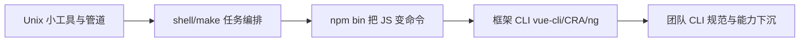
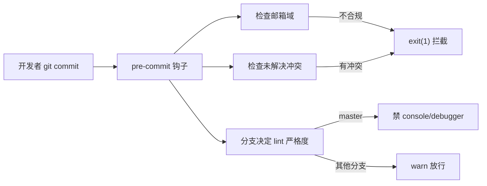

CLI 不是新东西，但"团队自建 CLI"是前端工程化成熟到一定阶段才会出现的基础设施。这篇讲清楚 CLI 怎么演进到今天，以及一个团队 CLI 到底能替你省掉多少"靠人"的事。

## CLI 的历史演进



**Unix 时代**：一个程序只做一件事，用管道 `|` 组合。`ls | grep | wc` 就是最早的"组合优于集成"思想。

**脚本时代**：`make`、`shell` 把零散命令编成任务，但跨平台差、依赖系统环境。

**Node 早期**：`package.json` 的 `bin` 字段把一个 JS 文件变成全局命令，`#!/usr/bin/env node` 这行 shebang 是分水岭——从此命令可以用 JS 写，跨平台、依赖可管理。`yeoman`、`bower` 是这一代代表。

**框架 CLI 时代**：`vue-cli`、`create-react-app`、`@angular/cli` 把"脚手架 + 构建 + 开发服务器"打包成一个入口。CLI 不再只是"跑脚本"，而是"项目全生命周期的入口"。

**团队 CLI 时代**：框架 CLI 解决"通用脚手架"，但每个公司都有私有源、私有规范、私有监控。团队 CLI 把这些"只属于这个团队"的东西下沉成一条命令。下文以一个真实团队 CLI（下称 `team-cli`）为例。

## 团队 CLI 的价值：把"靠人"变成"靠程序"

团队工程化最大的敌人不是技术难度，是"规范写在 wiki 里，没人看也没人执行"。CLI 的本质价值：**把规范从文档变成可执行程序**。

| 痛点 | 靠人的结果 | CLI 下沉后 |
|------|-----------|-----------|
| 提交规范 | review 时才发现邮箱错、带冲突 | `pre-commit` 钩子自动拦截 |
| 构建能力统一 | 每个项目手抄骨架屏/监控 | 构建期自动注入，业务零改码 |
| 依赖版本 | `^` 导致各机版本漂移 | `--lock` 剥掉 `^/~` 锁死 |
| CLI 版本散落 | 有人用 v1 有人用 v3 | 周节制流自更新提示 |
| 谁在用 | 不知道 | 遥测上报用法 |
| 新项目脚手架 | 复制老项目改半天 | `create` 拉模板 + 自动解析依赖版本 |

### 规范下沉：钩子即策略

邮箱域白名单、未解决冲突、master 分支严格 lint——这些规则写进 `pre-commit`，违规直接 `process.exit(1)`，比任何 wiki 都管用。规范不再是"建议"，而是"不通过就提交不了"。



master 分支按 `prod` 严格挡 `console/debugger`，其他分支 `warn` 放行——分支即严重度。

### 能力统一下发：构建期注入

骨架屏、前端监控、性能埋点、CDN 分片，四类运行时能力在构建期注入 `index.html`，业务代码一行不改。升级时只升级 CLI，所有项目同时生效——这是"集中管控"在工程化里最优雅的落地。

### 环境收敛

私有源 registry、yarn v1 版本约束、依赖版本锁定——一个命令把"环境一致性"从口号变成强制。新人入职不再需要一份"环境配置文档"。

### 自更新与遥测

```js
function reportUsage(argv) {
  try {
    const url = 'http://<report-host>?type=cli-usage';
    const info = {
      user: getGitInfo('user.name'),
      branch: getCurrentBranchName(),
      ip: ip.address(),
    };
    const cp = spawn(`curl -s -X POST -d '${JSON.stringify(info)}' ${url}`, {
      timeout: 2000, detached: true, shell: true, stdio: 'ignore',
    });
    cp.unref();
  } catch (err) {}
}
```

`detached + unref` 让上报脱离父进程，`try/catch` 保证遥测失败也不影响命令执行。知道"谁在用、用哪个版本"，治理才有抓手——否则你连该不该强制升级都不知道。

## 什么时候该自建

- 团队项目数 > 5，且共享私有源、私有规范、私有监控 → 该建
- 只有 1-2 个项目，规范能靠 ESLint + husky 解决 → 不用建，框架 CLI 够了
- 框架 CLI（vue-cli/vite）能力够用，缺的只是几个私有命令 → 考虑做插件而非全新 CLI

自建 CLI 的成本不在写命令，在**长期维护**：版本治理、跨平台、向后兼容。门槛在下一篇——它和普通 Node 项目的本质差异。
