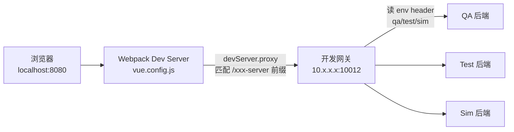
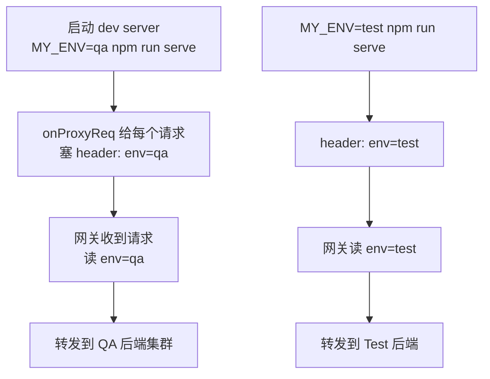

## 前言

前后端分离项目里有一个很常见的设计：**前端代码里只写相对路径**，不写后端域名。比如调接口统一用 `/partner-server/xxx`、`/course-server/xxx`，`baseURL` 留空。这样做的好处是同一份代码能跑在本地、测试、生产任意环境，不用改代码换域名。

那问题来了：本地开发时，`/partner-server/xxx` 谁来接？浏览器直接请求这个相对路径会打到 `localhost:8080`（dev server），dev server 本身没有后端逻辑。答案就是 **dev server 的 proxy**。本文用 Vue CLI 项目（`vue.config.js`）讲清楚本地代理怎么配、怎么用一套网关服务多个环境。

## 整体链路



关键点：前端只认识 `/xxx-server` 这种前缀，真正转发到哪、走哪个环境，全是 proxy 决定的。

## devServer.proxy 配置

核心就是 `vue.config.js` 里 `devServer.proxy` 一段：

```js
module.exports = {
  devServer: {
    proxy: {
      // 匹配所有 -server 结尾的路径前缀
      '^(\\/\\S{0,}-server|\\/imagecompress)': {
        target: 'http://10.x.x.x:10012',  // 共享开发网关
        changeOrigin: true,
        onProxyReq: (proxyReq, req) => {
          // 注入 env header，告诉网关走哪个环境
          proxyReq.setHeader('env', process.env.MY_ENV || 'qa');
        },
      },
    },
  },
};
```

几点说明：

- **正则匹配前缀**：`^(/\S{0,}-server|/imagecompress)` 一条规则盖住所有 `-server` 结尾的业务接口和图片压缩接口，不用每个前缀写一条。
- **`changeOrigin: true`**：把请求头里的 Host 改成 target 的地址，避免后端/网关按 Host 做路由时认错。
- **`onProxyReq` 注入 env header**：这是「一套网关多环境」的关键，下面单独讲。

## 一套网关多环境

很多公司不会给每个本地开发都单独部署一套后端，而是共用一个开发网关。这个网关怎么知道当前请求该转发到 QA、Test 还是 Sim？靠请求头里的 `env`。



- `env` 取 `qa` / `test` / `sim`，对应网关后面不同的后端集群。
- 前端切环境只要改启动参数，不动代码。比如 `MY_ENV=test npm run serve` 就切到 Test 环境。
- 网关本身是 Spring Cloud Gateway 之类的动态路由网关，路由规则存 Redis，按 header 分流。

> 这个 `env` header 是约定出来的，不是 HTTP 标准。本质是「在请求头里带一个环境标识，让共享网关做分发」。

## 变体：pathRewrite 转发到真实部署

有时候本地不想走共享网关（网关挂了、或者要联调某个刚部署的版本），想直接打到一个真实环境的前端代理上：

```js
'/market/': {
  target: 'https://qa.example.com',
  changeOrigin: true,
  // 不做 pathRewrite，原样转发 /market/xxx
},
```

H5 项目里还有更细的：`/market/` 在 QA 时指向 QA 的 H5 域名，注释里还留了 LAN IP 的写法（指向同事电脑上的本地后端），用来和后端同学面对面联调。

```js
// '/market/': {
//   target: 'http://192.168.x.x:8080',  // 同事本地后端
//   changeOrigin: true,
// },
```

这种 LAN IP 联调就是：后端在自己电脑起服务，前端把 proxy 指过去，两个人在同一个局域网里调一个接口，省去部署到测试环境的往返时间。

## 特殊代理：/coolcdn 和 /wximg

除了业务接口，还有两类资源也得代理：

### /coolcdn —— 静态资源同源化

生产环境前端跑在 CDN 上（比如 `//static-cdn.example.com/h5/`），引用的图片、字体也在 CDN。本地开发时如果直接引 CDN 资源，会触发跨域，或者 CDN 有 referer 校验直接 403。把 `/coolcdn/` 代理到 CDN 域名，前端代码里写 `/coolcdn/xxx.png`，本地访问时 dev server 帮你去 CDN 拿，**同源、无 CORS、无防盗链问题**。

### /wximg —— 微信头像防盗链

微信头像是 `thirdwx.qlogo.cn` 的域名，这域名有 referer 校验，直接 `` 引用会返回防盗链图。代理 `/wximg/` 到微信域名，dev server 帮你取，绕过 referer 校验。

```js
'/wximg': {
  target: 'https://thirdwx.qlogo.cn',
  changeOrigin: true,
  pathRewrite: { '^/wximg': '' },
},
```

这两类代理的核心思想一样：**把第三方资源套一层同源路径，让 dev server 当你的代理跑腿**。生产环境再用 nginx 做同样的事（下一篇线上代理会讲）。

## 小结

| 场景 | 代理配置 | 解决的问题 |
|---|---|---|
| 业务接口 | `^(/\S{0,}-server)` → 网关 | 前端只写相对路径 |
| 多环境 | `onProxyReq` 注入 `env` header | 一套网关服务多环境 |
| 联调 | `target` 指向同事 LAN IP | 面对面联调省部署 |
| CDN 资源 | `/coolcdn` → CDN 域名 | 同源化，绕 CORS/防盗链 |
| 微信头像 | `/wximg` → 微信域名 | 绕 referer 防盗链 |

本地代理的本质一句话：**前端只认前缀，proxy 决定前缀去哪**。下一篇讲这套东西到了线上怎么用 nginx 实现。
