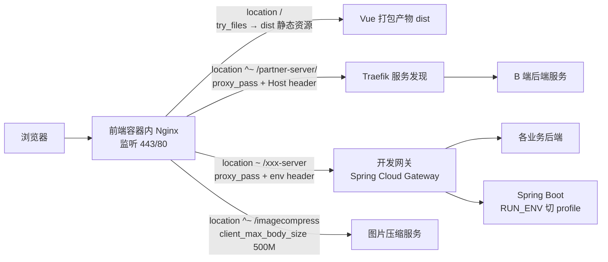
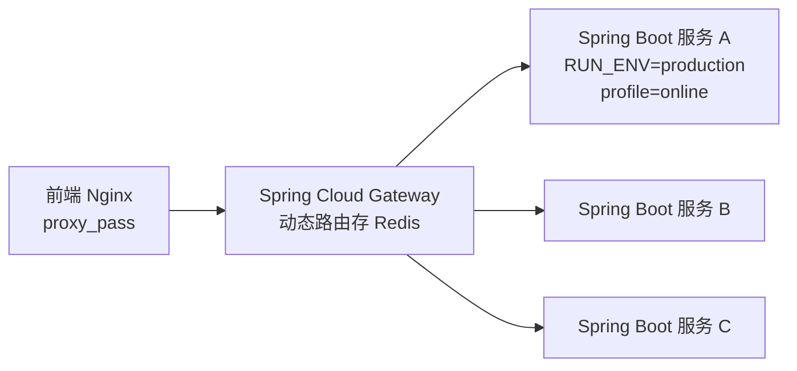

## 前言

上一篇讲了本地代理：前端只写 `/xxx-server` 相对路径，dev server 帮你转发。到了线上，dev server 没了，谁来转发？**nginx 跑在前端容器里**承担这个角色。

本文拆解线上这条链路：浏览器 → 前端容器里的 nginx → 后端网关 → Spring Boot 服务。素材来自实际项目，已脱敏。

## 整体链路



三个要点：nginx 既出静态资源，又做反向代理；非生产用「env header + 统一网关」分发，生产用「Host header + Traefik 服务发现」或直连公网域名；最后端是 Spring Boot，靠 `RUN_ENV` 切 Spring profile。

## nginx 跑在前端容器里

前端构建产物是静态文件（dist），需要一个 web server 来出。这个项目没有把 nginx 单独部署，而是**把 nginx 塞进前端 Docker 镜像里**：

```dockerfile
FROM <内部基础镜像>
COPY . $APP_HOME
EXPOSE 80
ENTRYPOINT ["docker/entrypoint.sh"]
CMD ["/usr/sbin/nginx"]
```

这个镜像本质是个 nginx 容器。入口脚本 `entrypoint.sh` 的职责只有一个：**根据环境变量选一份 nginx 配置**。

## RUN_ENV 切换配置文件

`entrypoint.sh` 的核心逻辑：

```bash
case ${RUN_ENV} in
  production) cat docker/nginx/app.production > docker/nginx/app.conf ;;
  qa)         cat docker/nginx/app.qa         > docker/nginx/app.conf ;;
  test)       cat docker/nginx/app.test       > docker/nginx/app.conf ;;
  sim)        cat docker/nginx/app.sim        > docker/nginx/app.conf ;;
esac
exec "$@"   # 启动 nginx
```

- 每个环境一份独立的 `app.<env>` 配置（域名、端口、后端地址都不同）。
- 容器启动时按 `RUN_ENV` 把对应那份 `cat` 覆盖到 `app.conf`，nginx 加载它。
- 同一个镜像跑遍所有环境，只是启动参数不同。这和本地用 `MY_ENV` 切 dev server proxy 是同一个思路。

### 一个真实的反面教材

某项目 `entrypoint.sh` 里 production 分支写的是 `cat docker/nginx/app.production`，但仓库里实际的文件名是 `app.prod`——**文件名不匹配，`cat` 静默失败，`app.conf` 是空的**。线上之所以还能跑，是因为某次构建恰好把 prod 配置写进了 `app.conf`，纯属巧合。

教训：`cat` 失败不会报错，entrypoint 一定要加 `[ -f docker/nginx/app.$RUN_ENV ] || exit 1` 之类的校验。**文件名约定写进 CI 检查，别靠人记。**

## 两层 server：SSL 终止 + 应用服务器

非生产环境的 nginx 配置通常是两层 `server`：

```nginx
# 第一层：对外 vhost，只做 SSL 终止 + 域名分发
server {
  listen 443 ssl;
  server_name b-qa.example.com;
  ssl_certificate     /etc/nginx/ssl/example.com.crt;
  ssl_certificate_key /etc/nginx/ssl/example.com.key;
  location / { proxy_pass http://127.0.0.1:8132; }   # 转给本机第二层
}
server {
  listen 80;
  server_name b-qa.example.com;
  location / { proxy_pass http://127.0.0.1:8132; }
}

# 第二层：真正出静态资源 + 代理后端
server {
  listen 8132;
  root /root/jenkins/workspace/b-qa/dist;

  location ~ /(.*)-server {
    proxy_set_header env qa;              # 告诉网关走 QA
    proxy_pass http://10.x.x.x:10012;
  }
  location ^~ /imagecompress {
    proxy_set_header env qa;
    proxy_pass http://10.x.x.x:10012;
  }
  location / { try_files $uri $uri/ /index.html; }   # SPA 回退
}
```

为什么分两层？第一层纯粹是「SSL 证书 + 域名」的薄封装，第二层才装业务逻辑。这样多环境共享同一个 SSL 配置，业务变化只动第二层。**端口编号本身编码了环境**（末位 1=test、2=test2、3=qa、4=sim 是常见约定）。

## 三种生产路由策略

生产环境不像测试那样全走一个共享网关，而是按需分流，出现三种策略：

### 策略一：env header + 统一网关（非生产）

上面那段就是。所有 `-server` 前缀全打到一个网关，靠 `env` header 分流到 test/qa/sim 后端。简单、一处配置盖住所有接口，但所有流量都过网关这个单点。

### 策略二：Host header + Traefik 服务发现（B 端生产）

```nginx
location ^~ /partner-server/ {
  proxy_pass http://default-traefik-discovery/;
  proxy_set_header Host          partner.example.com;
  proxy_set_header X-Real-IP    $remote_addr;
  proxy_set_header X-Forwarded-For $proxy_add_x_forwarded_for;
  proxy_next_upstream error timeout invalid_header http_502 http_503 http_504;
}

location ^~ /trainingCamp-server/ {
  proxy_pass http://default-traefik-discovery/;
  proxy_set_header Host          camp.example.com;
  proxy_read_timeout 30s;
}
```

精妙之处：**两个 location 的 `proxy_pass` 指向同一个 Traefik，但 `Host` header 不同**。Traefik 按 Host header 路由到不同服务。一份 upstream 服务多个业务，靠 Host 区分。

### 策略三：直连公网域名（H5 生产）

```nginx
location /mall-server/  { proxy_pass http://mall-api.example.com/; }
location /live-server/  { proxy_pass http://live-api.example.com/; }
location /course-server/{ proxy_pass http://course-api.example.com/; }
```

一个 location 一个后端公网域名，最直白。H5 业务多、各自独立部署，干脆直连，不绕网关。

| 策略 | 适用 | 优点 | 缺点 |
|---|---|---|---|
| env header + 网关 | 非生产 | 一处配置盖全部 | 网关单点 |
| Host header + Traefik | B 端生产 | 一份 upstream 多服务 | 依赖 Traefik |
| 直连公网域名 | H5 生产 | 简单直白 | 配置多、改后端要动 nginx |

## SPA 回退、健康检查、共享配置

三段所有配置都有的共性：

```nginx
# SPA 回退：找不到文件就回 index.html，交给前端路由
location / { try_files $uri $uri/ /index.html; }

# 健康检查：容器编排/K8s 探活
location = /ping { return 200; }

# 共享配置：把 CDN 代理、微信头像代理等公共片段抽出来 include
include confs/router.conf;
```

`router.conf` 里装的是跨环境复用的小技巧，下一篇细节文章会展开。本地代理文章讲过的 `/coolcdn`、`/wximg` 在线上也是这里实现的。

## 长连接调优

直播、长轮询这类场景，nginx 默认配置会出问题（连接被提前关、缓冲导致数据堆积）。QA 环境的 H5 配置里有一组典型调优：

```nginx
proxy_http_version 1.1;        # 用 HTTP/1.1 支持长连接
proxy_set_header Connection ''; # 清空 Connection 头，不禁用 keepalive
proxy_buffering off;            # 关缓冲，后端数据立即透传给客户端
proxy_cache off;                # 关缓存
proxy_read_timeout 24h;        # 读超时拉到 24 小时，长连接不被掐
client_max_body_size 200m;      # 直播推流允许大 body
```

这套组合是给直播课堂用的——长连接、流式数据、大 body，默认 nginx 配置会全部踩坑。

## client_max_body_size 分级与故障转移

- **body 限制按业务分级**：图片压缩 `500M`、直播 `200M`、普通接口默认或 `5M`、微信消息 `50M`。不是统一放开，按 location 各自设。
- **`proxy_next_upstream` 故障转移**：`error timeout invalid_header http_502 http_503 http_504`——当前后端返回这些错误时，nginx 自动换下一个 upstream 重试。生产链路必备。

## 安全反模式：别把 TLS 私钥提交进仓库

素材里发现两个项目都把 `ssl` 目录（`.crt` + `.key`）直接提交进了 git 仓库。这是严重的安全反模式：

- TLS 私钥一旦泄露，整个域名的 HTTPS 流量可被解密/中间人。
- 应该用 K8s Secret / Vault / docker secret 挂载，**私钥永远不进版本控制**。
- 同理，APM agent 的 license key 也不该硬编码在 `entrypoint.sh` 里，应当走环境变量或 secret。

> 已经泄露的要立即吊销重签，并轮换所有相关凭据。

## 后端链路：nginx 之后是什么

nginx 把请求转给后端，但后端不是单个 Spring Boot 实例直接接，中间还有一层**网关**：



### 后端也有 RUN_ENV

和前端用 `RUN_ENV` 切 nginx 配置完全对应，后端用 `RUN_ENV` 切 Spring profile：

```bash
case ${RUN_ENV} in
  develop)    APP_PROFILE=dev;      JAVA_OPTS="-Xms256m -Xmx256m" ;;
  test)       APP_PROFILE=test;     JAVA_OPTS="-Xms256m -Xmx256m" ;;
  simulation) APP_PROFILE=simulate; JAVA_OPTS="-Xms2g -Xmx2g"    ;;
  production) APP_PROFILE=online;   JAVA_OPTS="-Xms3g -Xmx3g"    ;;
esac
exec java $JAVA_OPTS ... -jar app.jar --spring.profiles.active=$APP_PROFILE
```

- 同一个 jar 镜像，靠 `RUN_ENV` 决定加载哪份 `application-{profile}.yml`。
- JVM 堆也按环境分级：开发 256m，模拟 2g，生产 3g。
- 这就是「一次构建，处处运行」的真正落地——**配置不烧进镜像，启动时注入**。

### 网关为什么用 Spring Cloud Gateway

- 动态路由：路由规则存 Redis，不用重启网关就能改路由。
- 一个网关后挂几十个微服务，nginx 只管「打到网关」，网关管「打到哪个服务」。
- docker-compose 模板里这套平台脚手架是齐的：eureka（注册中心）、config（配置中心）、gateway（9999 端口）、auth、upms、monitor、zipkin（链路追踪）、tx-manager（分布式事务）……**唯独没有 nginx**——nginx 只活在前端/代理这一层，后端平台靠的是 Spring 生态自己那一套服务发现与治理。

## 小结

| 层 | 谁来做 | 怎么切环境 |
|---|---|---|
| 浏览器 → 容器 | nginx 443/80 | SSL 证书 + 域名 |
| nginx 配置选择 | entrypoint + RUN_ENV | `cat app.<env> > app.conf` |
| nginx → 后端 | location + proxy_pass | env header / Host header / 直连域名 |
| nginx → 网关 → 服务 | Spring Cloud Gateway | 动态路由存 Redis |
| 后端 profile | Spring `--spring.profiles.active` | RUN_ENV 切 profile + JVM heap |

一句话串起本地和线上：**前端只认前缀，本地用 dev server proxy 决定前缀去哪，线上用 nginx 决定前缀去哪，环境差异全靠启动时注入一个变量**。
