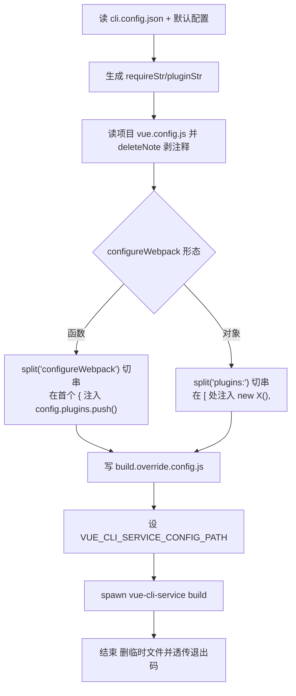
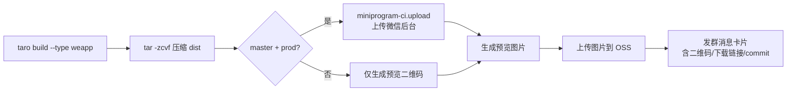

这篇把一个团队 CLI 该有的功能列全，每个功能一句话点出难点，再给一个简单有效的解法。代码均脱敏。

## 功能全景

| 功能 | 难点 | 解法 |
|------|------|------|
| 命令注册分发 | 命令多了硬编码不可扩展 | 约定式 registry：`command/<name>/index.js` 导出 `main` |
| 参数解析 | 别名/布尔/数组混 | `minimist` + 集中 `alias` 表 |
| 脚手架 create | 模板与依赖版本耦合 | `git clone` 模板 + `npm view` 拉最新版本写入 deps |
| 构建编排 build | 统一下发配置又不改业务码 | 文本改写 `vue.config.js` + 环境变量重定向 |
| 构建期 HTML 注入 | 四类能力逐项目手抄 | `html-webpack-plugin` 钩子 + cheerio |
| lint 治理 | 规则统一 + 严重度切换 | CLI 自带 eslintrc + env 切 mode |
| git 钩子 | 规范靠人 | yorkie `gitHooks` 物化 + `pre-commit` 校验 |
| 依赖安装 | 私有源 + 版本漂移 | 私有 registry + `--lock` 剥 `^/~` |
| 自更新 | 频繁检查拖慢启动 | 本地 `checkdate` 周节制流 + 手写 semver |
| 遥测 | 上报阻塞主流程 | `detached + unref + try/catch` |
| 本地配置 | 污染宿主项目 | `~/.team-cli/` 目录 |
| 终端体验 | 长任务无反馈 | `ora` spinner + `colors` + `inquirer` |
| 跨平台 | POSIX 工具 Win 失败 | `shelljs` / 纯 Node API 替代（残留脆弱点见末尾） |
| CI 集成 | 仓库带 dist + 小程序闭环 | dist 保留式提交 + `miniprogram-ci` + 群消息通知 |

下面挑最关键的展开。

## 命令注册：约定优于配置

**难点**：命令越来越多，`if (cmd === 'x')` 式分发无法扩展，加命令要改主调度。

**解法**：约定 `command/<name>/index.js` 导出 `main(options)` 即完成注册，启动时按目录自动发现并校验 `typeof main === 'function'`，别名集中在 `alias.js`。

```js
#!/usr/bin/env node
const argv = require('minimist')(process.argv.slice(2));
const alias = require('./command/alias');

function loadModule(name) {
  const sub = alias[name] || name;
  try {
    const mod = require(`./command/${sub}`);
    if (typeof mod.main === 'function') return mod;
  } catch (e) {}
}

invokeCommand(argv._[0], argv);
```

```js
// alias.js —— 别名集中在一张表，加命令零侵入主调度
module.exports = {
  h: 'help', dev: 'serve', i: 'install',
  up: 'update', v: 'version', hook: 'githook',
};
```

## 构建编排：文本改写替代 webpack-chain

**难点**：要给所有业务项目统一下发骨架屏、监控、埋点、CDN 分片，但不能要求每个项目用同一套 `webpack-chain`，更不能改业务代码。

**解法**：对项目 `vue.config.js` 做**文本级改写**，生成临时 `build.override.config.js`，再用 `VUE_CLI_SERVICE_CONFIG_PATH` 环境变量让 `vue-cli-service` 加载改写后的配置而非原文件。



核心是 `configureWebpack` 有函数和对象两种形态，**用字符串切分而不是 AST**处理：

```js
// 函数形态：在 configureWebpack 函数体的首个 { 后注入 plugins.push
function setConfigWebpackStr(data) {
  const paramsName = getConfigParame(fileConfig, 'configureWebpack'); // 还原形参名
  const newPluginStr = pluginStr.replace(/.plugins/, `${paramsName}.plugins`);
  if (data.indexOf('configureWebpack') > -1) {
    const [before, after] = data.split('configureWebpack');
    const inserted = after.replace(/{/, `{${newPluginStr}`);  // 首个 { 注入
    return `${requireStr}${before}configureWebpack${inserted}`;
  }
  // 未配置 configureWebpack：在 module.exports 首个 { 注入整个钩子
  const [before, after] = data.split('module.exports');
  const inserted = after.replace(/{/, `{configureWebpack: ${paramsName} => {${newPluginStr}},`);
  return `${requireStr}${before}module.exports${inserted}`;
}
```

对象形态类似，沿 `plugins:` 切，在 `[` 处注入 `new X(),`。改写完写文件、设环境变量、起子进程：

```js
fs.writeFileSync('build.override.config.js', rewritten);
process.env.VUE_CLI_SERVICE_CONFIG_PATH = 'build.override.config.js';
const command = spawn('npx', ['vue-cli-service', ...argv._], { stdio: 'inherit' });
command.on('close', code => {
  deleteFile('build.override.config.js');  // 清理临时文件
  code === 0 ? spinner.succeed('成功') : spinner.fail(`失败: ${code}`);
  process.exit(code);
});
```

**脆弱点（诚实说）**：字符串改写依赖标识符与花括号位置，`deleteNote` 剥注释时含 `//` 的字符串或正则可能被误伤。解法是给一个 `--base` 透传作为逃逸舱，脆弱项目直走原生构建。本地跑通多项目构建兜底。

## 构建期 HTML 注入

**难点**：首屏白屏、前端监控、性能埋点若逐项目手抄，升级一次要改 N 个仓库。

**解法**：四个插件挂 `html-webpack-plugin` 的 `before-html-processing` / `after-html-processing` 钩子，用 cheerio 改 HTML。以页面耗时埋点为例：

```js
class injectTime {
  apply(compiler) {
    compiler.plugin('compilation', compilation => {
      compilation.plugin('html-webpack-plugin-after-html-processing', (data, cb) => {
        let html = data.html;
        html = html.replace('</title>', '</title><script>window.__page_start__ = Date.now();</script>');
        html = html.replace('</body>', '<script>window.__page_end__ = Date.now();</script></body>');
        data.html = html;
        cb && cb(data);
      });
    });
  }
}
```

监控注入（`injectBl`）读 `cli.config.json` 里的监控 PID，**没配 PID 就直接 return 不注入**，避免无监控项目被注入空探针；挂的是 `before-html-processing`，把探针文件里的占位 PID 替换成真实 PID 后塞进 `#inject` 节点：

```js
class injectBl {
  apply(compiler) {
    let pid;
    try {
      if (fs.existsSync('cli.config.json')) {
        pid = JSON.parse(fs.readFileSync('cli.config.json')).monitorPid;
        if (!pid) return;  // 未配置 PID，跳过注入
      } else { return; }
    } catch (e) { return; }

    compiler.plugin('compilation', compilation => {
      compilation.plugin('html-webpack-plugin-before-html-processing', (data, cb) => {
        const $ = cheerio.load(data.html);
        let probe = fs.readFileSync(probeFile).toString();
        probe = probe.replace(/<placeholder-pid>/, pid);
        $('#inject').text(probe);
        data.html = $.html();
        cb && cb(data);
      });
    });
  }
}
```

四类能力（骨架屏/监控/埋点/CDN 分片）各自一个插件，按需在 `cli.config.json` 的 `plugins` 数组里开关。升级时只升 CLI，全项目生效。

## git 钩子：规范即拦截

**难点**：企业邮箱、未解决冲突、master 严格 lint 靠人盯不住。

**解法**：`utils/git.js` 提供 git plumbing 只读层，`githook` 命令提供执行层；通过 yorkie 的 `gitHooks` 字段把钩子物化进 `.git/hooks`。

```js
function preCommit(args) {
  const branch = getCurrentBranchName().toLowerCase();
  const files = getGitDiff();
  const eslintFiles = files.filter(f =>
    ['.js', '.vue', '.ts'].includes('.' + getFileFormat(f).extend));

  checkGitEmail();              // 邮箱域白名单
  const conflicts = checkConflicts(files);
  if (conflicts.length > 0) {
    Logger.log('未解决冲突，请修复后再提交');
    process.exit(1);
  }
  eslint({ isProd: branch === 'master', files: eslintFiles });
}

function checkGitEmail() {
  const email = getGitInfo('user.email').toLowerCase();
  const reg = /@company\.com$/i;
  // ci-bot 为编译账户，允许提交
  if (email !== 'ci-bot' && !reg.test(email)) {
    Logger.log('请用公司邮箱: git config user.email name@company.com');
    process.exit(1);
  }
}
```

master 分支按 `prod` 严格挡 `console/debugger`，其他分支 `test` 放行——分支即严重度。`package.json` 里物化钩子：

```json
"gitHooks": {
  "pre-commit": "team-cli githook pre-commit",
  "pre-push": "team-cli githook pre-push"
}
```

## 自更新：周节制流

**难点**：每次命令都 `npm view` 查远程版本，启动慢；不查又版本散落。

**解法**：本地存一个 `checkdate` 文件做周节制流，一周查一次远程，结果缓存本地；版本比较手写 3 段 semver，零依赖。

```js
const dayStep = 7;
function isChecked() {
  const checkDateStr = readLocalConfig('checkdate');
  if (checkDateStr) {
    if (compareAsc(new Date(), new Date(checkDateStr)) < 0) return true; // 本周已检查
    saveCheckDate();
    return false;
  }
  saveCheckDate();
  return false;
}

function compareVersion(a, b) {
  const pa = a.split('.'), pb = b.split('.');
  for (let i = 0; i < 3; i++) {
    const na = +pa[i], nb = +pb[i];
    if (na > nb) return 1;
    if (nb > na) return -1;
  }
  return 0;
}
```

已检查过的周期内读本地缓存的远程版本，省掉 `npm view` 网络请求；只有跨周才重新查远程。

## 依赖安装：私有源 + 锁版本

**难点**：私有源要内网/VPN，`^`/`~` 导致各机版本漂移。

**解法**：私有 registry + `--lock` 剥掉 `^/~` 锁死。装完读 `package.json`，把目标包的 `^` 前缀去掉写回：

```js
function lockDepsVer(depList) {
  const pkg = readPackageJSON();
  depList.forEach(dep => {
    const v = pkg.dependencies[dep];
    if (v) pkg.dependencies[dep] = v.replace(/^[\^~]/, '');
  });
  writePackageJSON(pkg);
}
```

## 其余功能一句话

- **遥测**：`spawn` 起 curl，`detached + unref` 脱离父进程，`try/catch` 兜底，上报失败不影响命令。
- **本地配置**：`~/.team-cli/` 目录存 `checkdate`、`version`，不碰业务项目。
- **终端体验**：`ora` 给 spinner，`colors` 给颜色，`inquirer` 给交互式选择。
- **CI 集成**：`push` 把 `dist` 一起提交（仓库带产物）；`mpbuild` 跑 `miniprogram-ci` 上传微信后台 + 生成预览二维码 + 群消息卡片通知，只在 `master + prod` 触发真上传，防测试产物误传正式。

## 小程序构建闭环：mpbuild

`mpbuild` 是 CLI 里最长的命令，把"构建 → 压缩 → 上传 → 通知"串成一条：



关键防呆：只有 `branch 含 master 且 env=prod`（或显式 `--isUpLoad=true`）才真上传微信后台，其他情况只出预览二维码，避免测试包误传正式。通知卡片里带分支、环境、构建者、commitId、压缩包下载链接。

**脱敏提醒**：这一步涉及群机器人凭证和上传密钥。源码里这些是明文 `app_id`/`app_secret`——**绝不能写进文章**，真实环境必须走环境变量或 CI Secret 注入，不要硬编码进仓库。

## 跨平台：POSIX 依赖的取舍

**为什么这么做**：团队开发机假设全是 macOS / Linux，`rm -rf`、`tar -zcvf`、`which`、`ln -s`、`cp -r` 这些 POSIX 命令开箱即用，写起来最快，没必要引第三方库。在这个前提下，**没问题**。

**前提变了才出事**：一旦团队进了 Windows 机器，或 CI 跑在 Windows runner 上，这些调用直接挂。这是"环境假设"换来的便利的代价。

**扩展跨平台**：用 `shelljs`（`shell.rm('-rf', x)`）或纯 Node API（`fs.rmSync(x, {recursive:true, force:true})`）替代 POSIX 调用。

| | 好处 | 坏处 |
|---|------|------|
| `shelljs` | 贴近 shell 写法、改动小 | 多一个依赖、部分命令比原生慢 |
| 纯 Node API | 零依赖、最快、最可控 | 写法啰嗦、`tar` 压缩等无标准库等价物需引包 |

取舍：团队环境稳定且封闭 → POSIX 可接受；团队有跨系统可能或要开源 → 一开始就用纯 Node API，`tar` 这类用 `archiver` 之类的包补齐。
