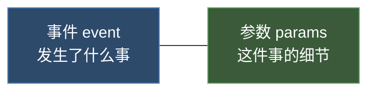
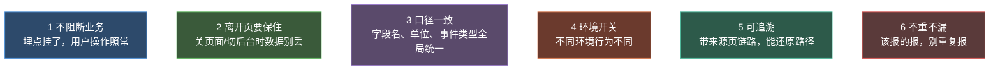
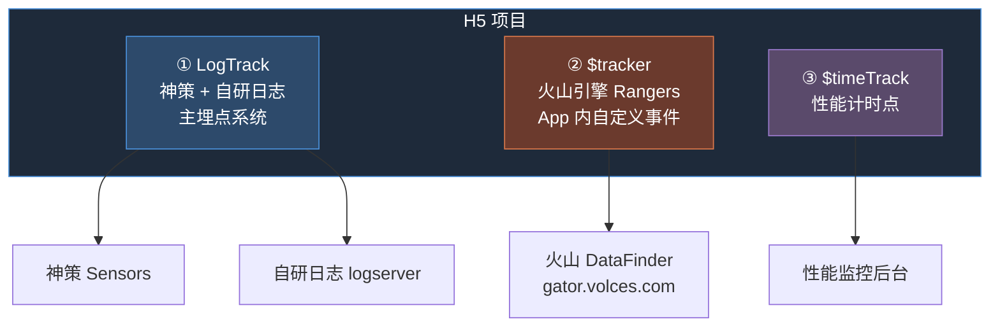

# 埋点入门：先搞懂"埋点"是什么

> 目标：读完这篇，你能用自己的话讲清楚"埋点在干嘛"，并知道一套典型前端项目用了哪几套埋点系统。

## 用一句话理解埋点

**埋点 = 在代码里"埋"下记号，把用户做过的事，变成一条条数据，发给后台统计。**

打个比方：你开了一家超市，想知道"顾客进门了吗""拿了哪瓶水""走到收银台了吗"。你就在门口、货架、收银台各安排一个保安，每发生一件事就记一笔。代码里的"保安"就是埋点代码。

## 埋点的本质：事件 + 参数

每一条埋点数据，本质就两部分：



举个例子（真实写法）：

```
事件：click               ← 用户点了"立即订阅"按钮
参数：
  page_name   = 少年闻天下   ← 在哪个页面
  module_name = 底部购买栏   ← 页面哪个模块
  btn_name    = 立即订阅     ← 具体哪个按钮
  key1        = {"user_status":"member","price":99}  ← 其它细节，打包成 JSON
```

后台拿到这条数据，就能回答："有多少人点了立即订阅？会员和非会员各点多少？"

## 什么时候需要埋点

| 场景 | 例子 | 事件类型 |
|---|---|---|
| 用户打开一个页面 | 进了"少年闻天下"页 | `page` 页面曝光 |
| 页面上某个东西展示出来了 | 课程列表加载出来了 | `show` 元素展示 |
| 用户点了一下 | 点了返回、点了课程项 | `click` 点击 |
| 用户停在这个页面多久 | 看了 30 秒新闻 | `page` + duration 时长 |
| 页面性能 | App 启动到可交互花多久 | 计时点 |

## 埋点的几个重要性质

埋点不是随便写一行上报就完事。它有几个性质，决定了"埋得好不好"。新手先记住这六条：



### 不阻断业务
埋点是"附加动作"，永远排在业务动作之前调用，且不能让它的异常影响用户。
```js
goToBack() {
  this.track({ ... });          // 先埋点
  this.$router.back();          // 再做业务；埋点报错不该影响返回
}
```

### 离开页要保住
用户关页面、切后台的瞬间，请求可能还没发出去就断了。所以停留时长类埋点要用**心跳定时上报** + `visibilitychange` 兜底，而不是只等离开那一下才报。（详见 [写法 G 心跳](/p/tracking-patterns/)）

### 口径一致
同一个概念，全项目字段名、单位必须统一。比如停留时长：`LogTrack` 里叫 `duration`、`$tracker` 里叫 `duration_ms`，单位都是毫秒——填反或单位错，后台就对不上。（详见 [字段口径](/p/tracking-fields/)）

### 环境开关
埋点在不同环境表现不同：生产关 debug、测试开 debug；火山 `$tracker` 仅 App 内生效、纯浏览器静默不报。改环境要记得核对开关。

### 可追溯
一条埋点最好能回答"用户从哪来"。`autoTrack` 自动带 `refer_page_name`（来源页），能还原用户的浏览路径，不只是孤立的事件。

### 不重不漏
该报的场景一个不能少（进页、展示、点击、时长），不该重复的别多报。比如 `hidden` 和 `pagehide` 都监听时，同一次离开可能报两遍——这是已知风险，要有去重意识。

> 这六条会在后续每篇里反复出现，带着它们读代码就能看出"为什么这么写"。

---

## 一套典型项目用了哪几套埋点系统

这是最关键的一张图。一个 App 内的 H5 项目常常**同时跑着三套独立的埋点系统**，新手最容易在这里绕晕：



| 系统 | 调用样子 | 发给谁 | 一句话定位 |
|---|---|---|---|
| ① LogTrack | `LogTrack.track({...}, 'click')` | 神策 + 自研日志 | **主系统**，绝大多数埋点用它 |
| ② $tracker | `this.$tracker('sndd_hs_xxx', {...})` | 火山引擎 Rangers | 仅 App 内生效，自定义事件名 |
| ③ $timeTrack | `this.$timeTrack('appCreated')` | 性能后台 | 测启动 / 加载耗时，不是业务埋点 |

> 新手记住：**90% 的业务埋点用的是 ① LogTrack**。② ③ 是特殊场景才用。下一篇详细讲这三套。

## 埋点代码长什么样（先看个直观例子）

知识卡页面组件里点"返回按钮"的埋点：

```js
goToBack() {
  this.track({                              // 调埋点
    other: { module_name: '导航栏', item_name: '返回按钮', btn_name: '返回' }
  });
  if (env.isApp) {
    JS2Native({ name: 'closeWindow' });     // 真正的业务动作：关 webview
  } else {
    this.$router.back();
  }
}
```

注意一个**新手最容易踩的坑**：埋点代码和业务动作是分开的两步。先埋点、再做业务，互不干扰。埋点出错不该影响用户操作。

---

## 配套 Demo：亲手玩一遍

光看代码不够直观，我做了个纯本地的 Demo 把这套机制跑给你看——**不接任何真实 SDK、不用装依赖**，打开就能玩。

👉 [打开 Demo](/tracking-demo/)

Demo 长这样：左边是一个迷你业务页（列表 / 详情），右边是「埋点事件流」面板，你每做一个动作，面板里就实时冒出对应的上报记录，和后端真正收到的数据一模一样。

**怎么玩：**

1. 打开页面，右侧已经有 `appCreated`、`autoTrack`、列表 `show` 三条——对应进页自动曝光。
2. 点列表里任意课程项 → 看 `click` 事件，自动跳进详情页。
3. 在列表页停留 3 秒 → 心跳触发，多一条带 `duration` 的 `page`（这就是写法 G）。
4. 点底部「双发演示」按钮 → 同一次点击同时冒出火山和神策+自研两条（写法 C 双系统并行）。
5. 顶部勾选「App 内」→ 火山从「静默」变成真上报；不勾就是纯浏览器静默 no-op。
6. 关掉「神策」或「自研日志」开关 → 对应后端的事件流立刻消失，直观看到环境开关的作用。

把 Demo 和上面讲的六条性质对着看：不阻断业务、离开页保住、环境开关、不重不漏，都能在面板里直接观察到。

---

下一篇 → [三大埋点系统详解](/p/tracking-systems/)
