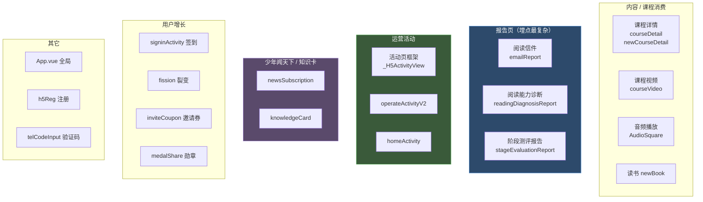

# 埋点点位地图

> 目标："哪些地方埋了点"。按业务模块整理，给新手一张寻宝图。
>
> 统计口径：`LogTrack.track` 调用点 ~40 个文件、`$tracker` 调用点 ~20 个文件、`v-log` 指令 ~13 个组件、`$timeTrack` 2 处。下面按模块归类。

## 模块全景

---

## 全局入口

| 位置 | 写法 | 点位 |
|---|---|---|
| App 根组件 | F autoTrack | `LogTrack.track({}, 'autoTrack', true, routes)` 全路由自动曝光 |
| App 根组件 | $timeTrack | `appCreated`、`appMounted` 性能计时 |
| 入口 main.js | 初始化 | `logTrackFactory` → `$tracker`（火山实例） |
| 公共导入模块 | 初始化 | `LogTrack.config().init()`、`$timeTrack` 注册 |

---

## 报告页模块（埋点最复杂）

这三个页面是全项目埋点最重的，都用了 **C 双系统并行 + G 停留时长心跳**，部分还带模块曝光时长。

| 页面 | 写法 | 事件 | 说明 |
|---|---|---|---|
| 阅读信件报告页 | C + G | `sndd_hs_page`、`sndd_hs_bottom_show`、`page` | 心跳 3s、`visibilitychange`、滚动到底上报 |
| 阅读诊断报告页 | C + G | `sndd_hs_page/show`、`page/show` | 11 个模块曝光时长，详见报告页埋点规格文档 |
| 阶段测评报告页 | C + G | `sndd_hs_page/show/click` | 4 模块曝光，见报告页埋点规格文档 |
| 简化版报告页 | C | `sndd_hs_*` | 简化版报告 |

> 已有规格文档：报告页埋点规格文档（讲透时长 / 曝光 / 离开时机，强烈推荐先读）。

---

## 少年闻天下 / 知识卡模块

已有规格文档：项目埋点规格文档。落地代码：

| 页面 | 写法 | 调用点数 | 事件 |
|---|---|---|---|
| 少年闻天下订阅页 | A 直接调 | 23 | page / show / click 全覆盖 |
| 知识卡页面 | B this.track 封装 | ~9 | page / show / click |
| 知识卡详情页 | B this.track 封装 | ~3 | page / click |

事件覆盖：页面曝光、课程列表批量曝光、返回、Tab 切换、订阅 / 续费、课程项点击、月份 / 年份筛选、百宝箱、推荐课程、续费弹窗、Banner 等。详见项目埋点规格文档。

---

## 课程 / 内容消费模块

| 页面 | 写法 | 点位 |
|---|---|---|
| 课程详情页 | A + D v-log | `ev__course_detail_play` 播放点击 |
| 新版课程详情页 | A + D evLogTrack | 课程详情曝光 / 播放 |
| 课程视频页 | A + D evLogTrack | 视频页曝光 / 播放 |
| 课程计划页 | A | 课程计划 |
| 音频广场组件 | ② $tracker | `sndd_hs_knowledge_publishing_course_play` 音频播放时长 |
| 视频组件 | A | `LogTrack.track(this.evLogTrack, 'page')` |
| 音频组件 | D v-log | `v-log:click.ev__click` |
| 读书页 | A + D evLogTrack | 读书页 |
| 免费音频课页 | A | 免费音频课 |

> 音频 / 视频播放时长统一走 **② $tracker**（火山），因为要和 App 原生播放埋点对齐。

---

## 运营活动模块

| 页面 | 写法 | 点位 |
|---|---|---|
| 活动页事件组件 | E 配置驱动 | 按后台配置 `eventType` 自动 `LogTrack.track` |
| 运营活动页 | ② $tracker | `sndd_hs_h5_campaign_view`、`sndd_hs_sy_page_view` |
| 活动宣传组件 | ② $tracker | `sndd_hs_h5_info_click` |
| 底部活动按钮组件 | ② $tracker | `sndd_hs_h5_campaign_click` |
| 弹窗组件 | ② $tracker | 弹窗点击 |
| 订阅广场组件 | ② $tracker | 订阅广场 |
| 订阅包组件 | ② $tracker | 订阅包 |
| 首页活动页 | A + $timeTrack | `homeActivityMounted`、`homeActivityPageDataLoad` 性能 |

> 运营活动大量用 **② $tracker**，事件名带 `h5_campaign` / `h5_info` 前缀。

---

## 用户增长模块

| 页面 | 写法 | 点位 |
|---|---|---|
| 签到活动页 | A + ② $tracker | `sndd_hs_click` 签到点击 |
| 签到视频列表组件 | ② $tracker | `sndd_hs_click`、`sndd_hs_show` |
| 签到成功组件 | ② $tracker | `sndd_hs_show` 签到成功 |
| 裂变页 | A | 裂变页 |
| 兑换课程页 | A | 12 处 click |
| 领礼物页 | A | 领礼物 |
| 券成功页 | A | 券成功 |
| 好友助力页 | A | 好友助力 |
| 勋章分享页 | A | 勋章分享 |
| 邀请吃饭页 | A | 4 处 |
| 邀请有礼页（含分享/任务栏组件） | A | 邀请有礼 |
| 新签到任务页 | A | 新签到任务 |

---

## 训练营 / 实体勋章模块

| 页面 | 写法 | 点位 |
|---|---|---|
| 训练营消息群页 | A | 3 处 |
| 训练营新群提示页 | A | 2 处 |
| 训练营群提示页 | A | 1 处 |
| 训练营简化结果页 | A + classKey | `camp_config` 远程配置 |
| 训练营简化阅读报告页 | A + classKey | `camp_config` |
| 训练营短信二维码页 | A | 3 处 |
| 实体勋章页系列（首页/详情/成功/好友/营地） | A + ② $tracker | 勋章页系列 |

> `classKey: 'camp_config'` 是远程配置开关，控制是否开全埋点 / 热力图圈选（详见 [三大埋点系统 ②](/p/tracking-systems/)）。其它 classKey：`h5_exhibition_config`、`LISTENING_CARD`、`mall`、`h5_review`。

---

## 其它组件

| 组件 | 写法 | 点位 |
|---|---|---|
| 注册组件 | A + D v-log | 注册流程 |
| 验证码输入组件 | A + D v-log | `获取验证码`、`立即领取` |
| 留言项组件 | D v-log | `点赞`、`取消点赞` |
| 留言组件 | D v-log | `写留言` |
| 答题组件（含弹窗） | D v-log | 答题 |
| 抢音频组件 | D v-log | 抢音频 |
| 标签页组件 | D v-log | `ev__course_detail_view` |
| 领礼物按钮组件 | D v-log | 领礼物按钮 |
| 课程按钮组件 | D v-log | `ev__course_detail_play` |
| 每日问答页 | A | 12 处（每日问答） |
| 免费券页 | A | 免费券 |
| AI 挑战页（含图片组件） | ② $tracker | AI 挑战 |
| AI 工具页（含课程列表等） | ② $tracker + A | AI 工具页 |
| 新报告页 | ② $tracker | 新报告 |
| 自动召回课程页 | ② $tracker | 自动召回课程 |
| 对话 bot 混入 | ② $tracker | 对话 bot |
| 会员卡逻辑 | ② $tracker | 会员卡 `sndd_hs_${event}` |

---

## 已有埋点文档清单

接手前，先读这两份既有规格文档（项目维护者写的，比本系列更细）：

| 文档 | 内容 |
|---|---|
| 项目埋点规格文档 | 少年闻天下 + 知识卡 列表 / 详情页全量埋点字段表 |
| 报告页埋点规格文档 | 报告页时长 / 模块曝光 / 离开时机 / 新老口径差异 / 注意点 |

---

下一篇 → [字段口径与 key1 规约](/p/tracking-fields/)
