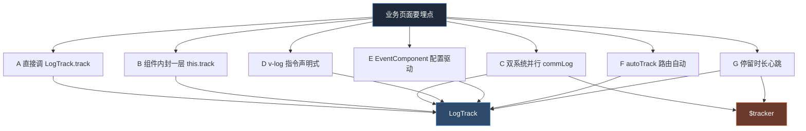
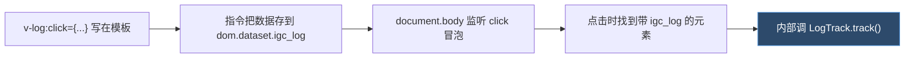
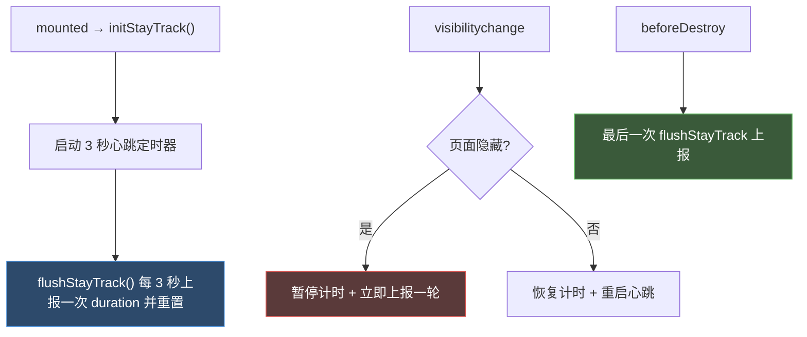
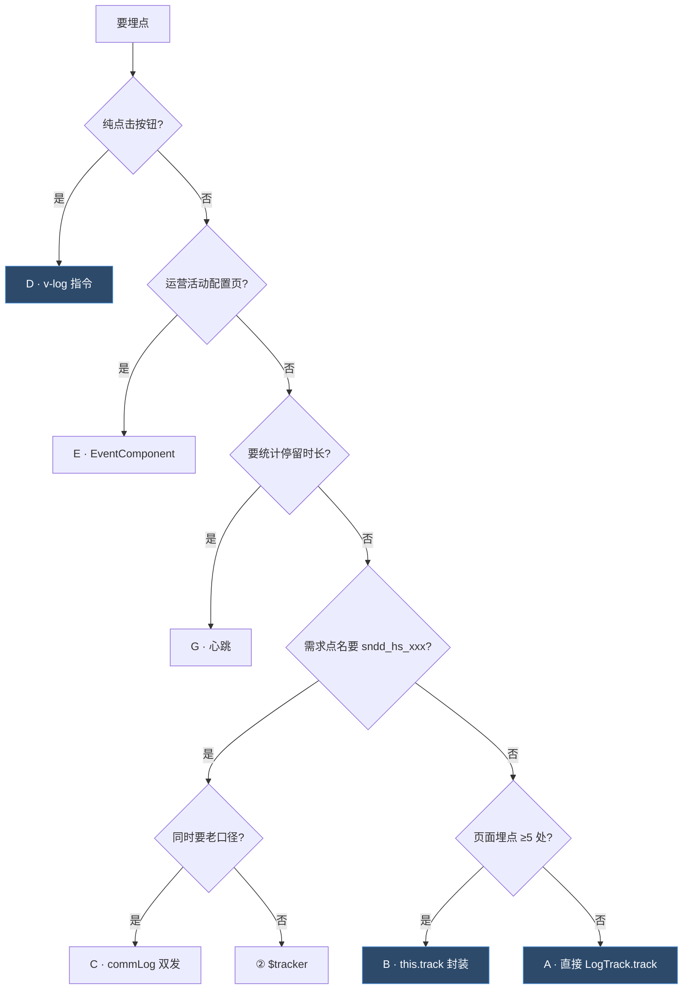

# 埋点的七种写法

> 目标：项目里"埋点代码"有七种不同写法。读完这篇你能认出每一种，知道它解决什么问题、照着抄就行。
>
> 先记一句话：**七种写法只是"怎么调"的不同，背后最终都落到 ① LogTrack 或 ② $tracker 上**（见 [三大埋点系统](/p/tracking-systems/)）。



---

## A · 直接调 `LogTrack.track`

**最常见**，90% 的页面就用这一种。

```js
import { LogTrack } from '@/utils';

// 点击返回
LogTrack.track({
  page_name: '少年闻天下', page_type: 2, page_title: '少年闻天下',
  url: window.location.href,
  module_name: '导航栏', item_name: '返回按钮', btn_name: '返回',
  key1: JSON.stringify({ user_status: 'member' })
}, 'click');
```

**特征**：每次埋点手写完整字段，调 `LogTrack.track(obj, eventType)`。

**代表文件**：少年闻天下订阅页（一个文件 23 处）、兑换课程页（12 处）、每日问答页（12 处）。

**适用**：埋点不多的页面，直接写最清楚。

---

## B · 组件内封一层 `this.track`

**问题**：一个页面有十几个埋点，每次都写 `page_name/page_type/page_title/url` 太啰嗦，改一处要改十几处。
**解法**：在组件里封一个 `track` 方法，把公共字段固定下来，只传变化的部分。

知识卡页面组件：

```js
methods: {
  // 通用埋点：公共字段写死，扩展数据合并进 key1
  track(extra = {}, eventType = 'click') {
    LogTrack.track({
      page_name: '知识卡',
      page_type: 2,
      page_title: '知识卡',
      url: window.location.href,
      main_item_id: '',
      key1: JSON.stringify({
        user_status: this.userStatus || 'normal',
        ...extra.key1Data        // 变化的细节塞这
      }),
      ...extra.other              // module_name/item_name/btn_name 塞这
    }, eventType);
  },

  goToBack() {
    this.track({
      other: { module_name: '导航栏', item_name: '返回按钮', btn_name: '返回' }
    });
  }
}
```

**特征**：`this.track({ other: {...}, key1Data: {...} }, 'click')`，把字段拆成"固定的"和"变化的"两层。

**适用**：单页面埋点 ≥ 5 处，字段重复多。知识卡列表页、知识卡详情页都用这种。

---

## C · 双系统并行 `commLog`

**问题**：同一个行为，业务方要求**同时**进神策/自研（老口径）和火山（新口径）两套后台。
**解法**：封一个方法，里面同时调 `LogTrack.track` 和 `$tracker`。

阅读信件报告页：

```js
commLog(event, options) {
  var config = options || {};
  // ① 发火山（新口径，事件名 sndd_hs_xxx）
  this.$tracker('sndd_hs_' + event, this.getTrackerBaseData(config.trackerData));
  // ② 发神策+自研（老口径，事件类型 page/show/click）
  LogTrack.track(Object.assign({}, this.getLogTrackBaseData(config.logData), {
    key1: JSON.stringify({ /* ... */ })
  }), event);
}
```

**特征**：一个方法里两行上报，`$tracker` + `LogTrack.track`。

**注意**：两套口径字段名可能不同（详见 [字段口径](/p/tracking-fields/)），比如时长在 `$tracker` 里叫 `duration_ms`，在 `LogTrack` 里叫 `duration`。

**代表文件**：阅读信件报告页、阅读诊断报告页、阶段测评报告页。这三个是本项目埋点最复杂的页面。

---

## D · `v-log` 指令声明式埋点

**问题**：按钮太多，每个 `@click` 里写 `LogTrack.track` 太烦，还容易和业务逻辑混在一起。
**解法**：用 `v-log` 指令，写在模板上，点一下自动埋点。

```html
<!-- 点这个按钮自动上报 click -->
<button v-fastclick="sendCode" v-log:click="{ ...log, name: '获取验证码' }">获取验证码</button>
```

带 `ev__` 修饰符可指定事件名：

```html
<div v-log:click.ev__course_detail_play="evLogTrack"></div>
```

### 它怎么工作的

`v-log` 由基础组件库的 `vueExtends/log.js` 注册。原理：



即：**v-log 最终也是调 LogTrack**，只是把埋点从 JS 搬到了模板上。

**代表文件**：验证码输入组件、留言项组件、课程按钮组件、音频组件、课程详情页、注册组件、领礼物按钮组件。

**适用**：纯点击埋点、不想污染业务方法。注意它依赖 `v-fastclick`，且 `<a>/<input>/<button>` 标签会被自动识别。

---

## E · EventComponent 配置驱动埋点

**问题**：运营活动页的组件是**后台配置出来的**（按钮文案、跳转、事件都由接口返回），写死埋点不现实。
**解法**：用一个通用 `EventComponent`，根据配置里的 `eventType` 自动埋点。

活动页事件组件：

```js
trackEvent(eventType) {
  let trackObj = {
    page_name: '专题详情页',
    page_type: 2,
    page_title: this.$parent.activityName,
    item_index: this.$parent.index,
    main_item_type: '活动'
  };
  if (this.componentType === 'button') {
    trackObj.btn_name = this.$parent.btnTxt;
  }
  LogTrack.track(trackObj);   // ← 配置驱动，自动上报
}
```

**特征**：埋点字段从 `this.$parent`（父组件 = 后台配置）取，不写死。

**适用**：运营活动体系，组件由配置渲染的场景。

---

## F · `autoTrack` 路由自动曝光

**问题**：每个页面进都手动写一次 `page` 曝光太容易漏。
**解法**：App 启动时一次性把所有路由注册进自动曝光。

App 根组件：

```js
created() {
  let routes = this.$router.options.routes;
  LogTrack.track({}, 'autoTrack', true, routes);   // ← 全路由自动 page 曝光
  this.$timeTrack('appCreated');
}
```

**特征**：`LogTrack.track({}, 'autoTrack', true, routes)`，第 3、4 个参数是 autoTrack 专用。

**背后**：神策全埋点，事件 `sndd_sensor_autoTrack`，切路由自动发页面访问日志，还带 `refer_page_name`（来源页）链路。

**注意**：**只在 App 根组件调一次**，业务页面不要重复调。

---

## G · 停留时长心跳

**问题**：想知道用户在页面待了多久，但用户可能切后台、可能直接关页面，单一时机抓不准。
**解法**：定时心跳 + 可见性监听 + 离开兜底。

阅读信件报告页是参考实现，核心三个方法：



关键代码骨架：

```js
data() {
  return {
    pageStayDuration: 0,          // 累计停留毫秒
    pageVisibleStartTime: 0,      // 本轮可见开始时间
    stayTrackHeartbeatTimer: null // 心跳定时器
  };
},
mounted() { /* ... */ this.$nextTick(() => this.initStayTrack()); },
beforeDestroy() { this.flushStayTrack(); /* 最后一次上报 */ },

methods: {
  initStayTrack() {
    this.restartStayTrack();
    document.addEventListener('visibilitychange', this.handleTrackVisibilityChange);
  },
  startStayTrackHeartbeat() {
    this.stayTrackHeartbeatTimer = setTimeout(() => {
      this.flushStayTrack({ resetAfterFlush: true, continueHeartbeat: true });
    }, 3000);                     // ← 每 3 秒
  },
  flushStayTrack(options) {
    this.pausePageDuration();     // 把当前可见段累加进 pageStayDuration
    if (this.pageStayDuration > 0) {
      // 双系统上报时长
      this.$tracker('sndd_hs_page', { /* ..., duration_ms */ });
      LogTrack.track({ /* ..., key1: {duration} */ }, 'page');
    }
    if (options.resetAfterFlush) { this.resetStayTrackState(); }
    if (options.continueHeartbeat) { this.startStayTrackHeartbeat(); }
  },
  handleTrackVisibilityChange() {
    if (document.hidden) { this.stopStayTrackHeartbeat(); this.flushStayTrack({resetAfterFlush:true}); }
    else { this.resumePageDuration(); this.startStayTrackHeartbeat(); }
  }
}
```

**特征**：`pageStayDuration` + `pageVisibleStartTime` 两个变量管计时，`visibilitychange` 管切后台，`beforeDestroy` 兜底。

**代表文件**：阅读信件报告页、阅读诊断报告页、阶段测评报告页。后两个还多了**模块曝光时长**（每个模块进视口开始计时、离开累加）。

**适用**：需要统计"用户看了多久"的报告页 / 内容页。

---

## 速查：我该用哪种？



---

下一篇 → [埋点点位地图](/p/tracking-points-map/)
