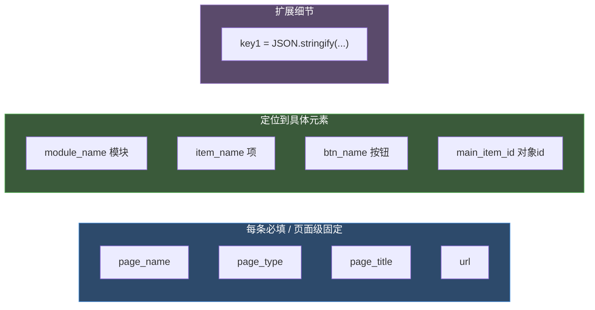
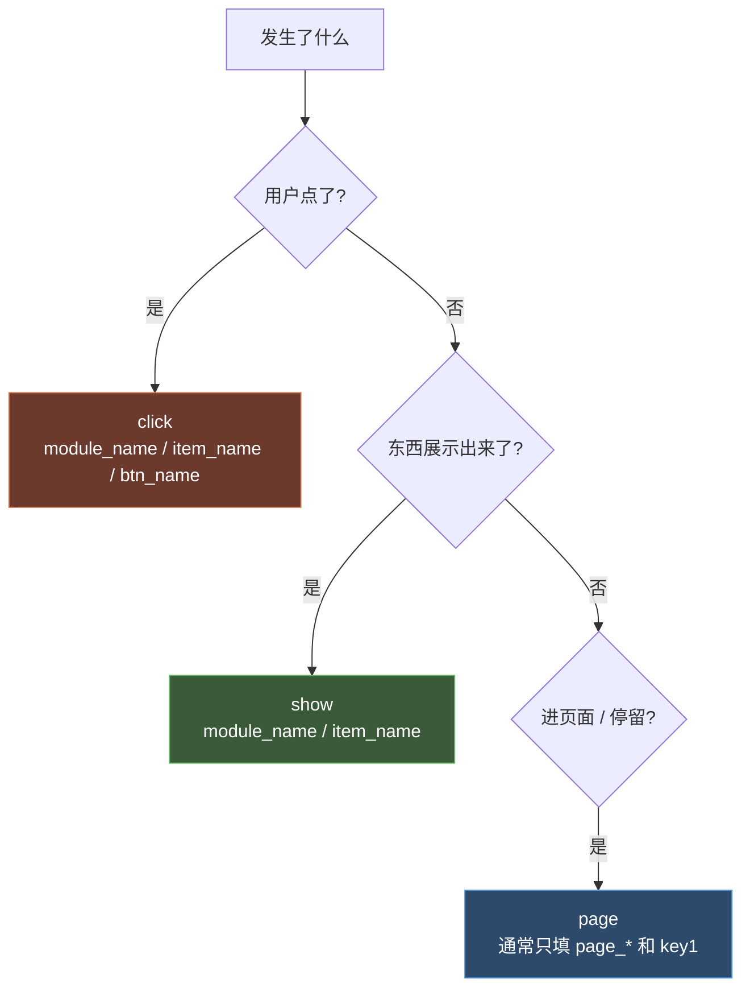

# 字段口径与 key1 规约

> 目标：搞清 `LogTrack.track` 的字段都什么意思、`key1` 为什么要 `JSON.stringify`、新老两套口径差在哪。这是新手最容易填错字段的地方。

## LogTrack 标准字段表

一条 `LogTrack.track(obj, 'click')` 的 `obj` 用这些字段。**前 4 个几乎每条都要填，后面按场景填**。

| 字段 | 类型 | 含义 | 示例 |
|---|---|---|---|
| `page_name` | string | 页面中文名（业务定，全局唯一） | `少年闻天下` |
| `page_type` | number | 页面类型，本项目活动页统一 `2` | `2` |
| `page_title` | string | 页面标题，一般同 page_name | `少年闻天下` |
| `url` | string | 当前页面地址 | `window.location.href` |
| `main_item_id` | string | 主对象 id（点的是哪个课程 / 卡片） | `item.chapterId` |
| `module_name` | string | 页面内模块名 | `课程列表`、`导航栏` |
| `item_name` | string | 模块内项名 | `列表项`、`返回按钮` |
| `btn_name` | string | 按钮文案 | `立即订阅`、`返回` |
| `key1` | string | **所有扩展细节，JSON 字符串** | `JSON.stringify({user_status, ...})` |

### 哪些字段属于哪类



---

## key1 规约（最重要）

### 规则
**所有扩展字段，统一合并进 `key1` 一个字段，用 `JSON.stringify` 包成字符串。不再用 key2、key3。**

这是项目维护者定的硬规约（见项目埋点规格文档开头）。

### 为什么这么做
后台只认 `key1` 一个扩展位，多个字段挤进去比开 key2/key3 更统一、更好解析。

### 正确写法

```js
key1: JSON.stringify({
  user_status: 'member',          // 用户状态
  chapter_id: item.chapterId,     // 章节 id
  is_free: true,                  // 是否免费
  list_type: 'free',              // 列表类型
  current_month: 8,
  jump_url: jumpUrl               // 跳转地址
})
```

### 错误写法（别这样）

```js
// ❌ 用 key2、key3
{ key1: JSON.stringify({user_status:'member'}), key2: chapter_id, key3: is_free }

// ❌ key1 不 stringify
{ key1: { user_status: 'member' } }

// ❌ 把扩展字段平铺到 obj 顶层
{ user_status: 'member', chapter_id: 123, module_name: '课程列表' }
```

### 常见 key1 内部字段

| 字段 | 含义 | 常见值 |
|---|---|---|
| `user_status` | 用户状态 | `normal` / `expired_member` / `member` |
| `current_tab` | 当前 tab | `knowledge` / `material` / `essay` |
| `list_type` | 列表类型 | `free` / `all` / `member` |
| `chapter_id` / `course_id` | 内容 id | - |
| `is_free` / `is_locked` | 是否免费 / 锁定 | `true` / `false` |
| `current_month` / `current_year` | 月份 / 年份 | `8` / `2026` |
| `jump_url` | 跳转地址 | - |
| `duration` | 停留时长（毫秒） | `pageStayDuration` |
| `list_data` | 列表批量数据 | `[{id,title,publishTime}]` |
| `list_count` / `page_index` | 列表条数 / 页码 | - |

---

## 事件类型怎么选



| 事件类型 | 何时触发 | 关键字段 |
|---|---|---|
| `page` | mounted / created 后 / 停留心跳 | page_* + key1(duration) |
| `show` | 列表加载完 / 弹窗打开 / Banner 有数据 | module_name + item_name + key1 |
| `click` | 用户点击 | module_name + item_name + btn_name + key1 |

> `page` 和 `show` 时 `btn_name` 一般填 `-` 或空。

---

## 新老两套口径（双系统并行时）

在 [写法 C 双系统](/p/tracking-patterns/) 的 `commLog` 场景里，同一条数据要发两套，**字段名不一样**，新手填错就串台。

| | ② $tracker（火山，新口径） | ① LogTrack（神策+自研，老口径） |
|---|---|---|
| 调用 | `this.$tracker('sndd_hs_xxx', payload)` | `LogTrack.track(payload, 'page')` |
| 事件标识 | 事件名 `sndd_hs_page` / `sndd_hs_show` / `sndd_hs_click` | 事件类型 `page` / `show` / `click` |
| 页面停留时长字段 | `duration_ms` | `duration` |
| 模块曝光时长字段 | `duration_ms` | `expose_duration` |
| 页面名字段 | `page_name` | `page_name` + `page_title` + `page_type` |
| 是否带 url | 自动补 `window.location.href` | 需手填 `url` |

### 对照例子（来自阅读诊断报告页）

页面离开时双发：

```js
// ② 新口径：火山
this.$tracker('sndd_hs_page', {
  page_name: '阅读能力诊断和成长规划报告',
  page_id: this.userEvaluationId,
  duration_ms: this.pageStayDuration        // ← 注意是 duration_ms
});

// ① 老口径：神策+自研
LogTrack.track({
  page_name: '阅读能力诊断和成长规划报告',
  page_title: '...',
  page_type: 2,
  url: window.location.href,
  page_id: this.userEvaluationId,
  duration: this.pageStayDuration           // ← 注意是 duration
}, 'page');
```

---

## page_name / page_type 约定（已知）

| page_name | page_type | 出处 |
|---|---|---|
| 少年闻天下 | 2 | newsSubscription |
| 知识卡 | 2 | knowledgeCard/index |
| 知识卡详情 | 2 | knowledgeCard/detail |
| 阅读营给孩子的一封信 | 2 | emailReport |
| 阅读能力诊断和成长规划报告 | - | readingDiagnosisReport |
| 测评报告 | - | stageEvaluationReport |
| 专题详情页 | 2 | EventComponent（运营活动） |

> 新增页面时，`page_name` 跟产品对齐、全局唯一；活动类页面 `page_type` 统一填 `2`。

---

## 停留时长单位

- `LogTrack` 的 `duration` / `expose_duration`：**毫秒**（来自 `Date.now()` 差值）
- `$tracker` 的 `duration_ms`：**毫秒**（名字里带 `_ms` 提醒）
- `AudioSquare` 的 `play_duration`：**秒**（`audio.currentTime`，注意不是毫秒）

> 填时长字段先确认单位，别把秒当毫秒报。

---

## 自检清单（提交前过一遍）

- [ ] `key1` 用了 `JSON.stringify`，没用 key2/key3
- [ ] `page_name` / `page_type` / `page_title` / `url` 都填了
- [ ] `click` 事件有 `module_name` + `item_name` + `btn_name`
- [ ] `page` / `show` 的 `btn_name` 填 `-` 或空
- [ ] 双发场景 `duration_ms` / `duration` 别填反
- [ ] 埋点代码在业务动作**之前**，互不影响
- [ ] `$tracker` 事件名带 `sndd_hs_` 前缀
- [ ] 时长单位确认（毫秒 / 秒）

---

← 上一篇 [埋点点位地图](/p/tracking-points-map/) ｜ 系列完
