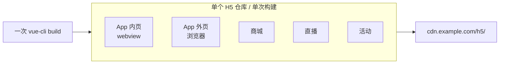
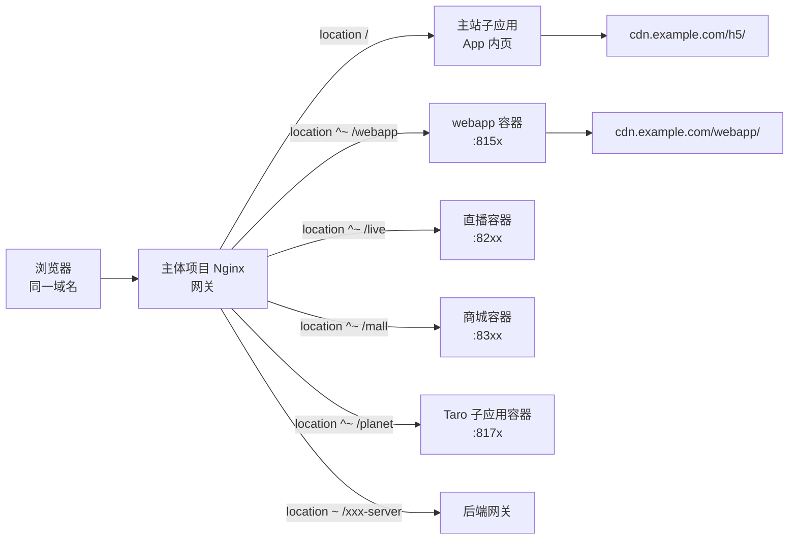
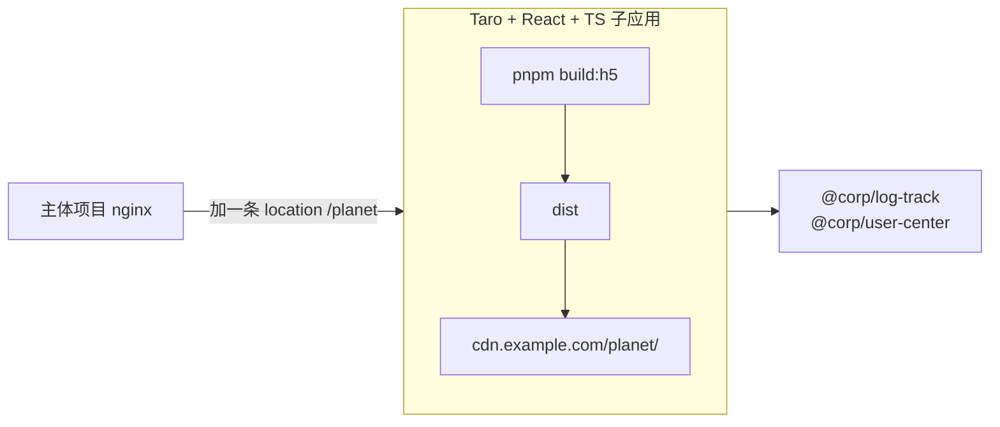
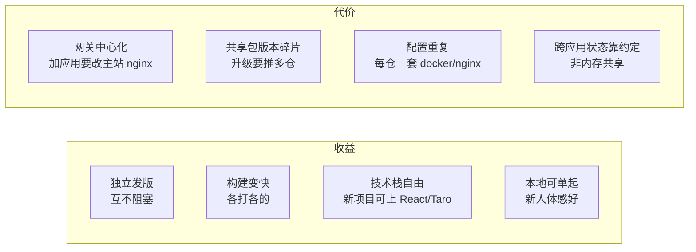

## 前言

业务跑了两三年，H5 仓库从"几个活动页"长成了一个怪物：App 内 webview 页、App 外浏览器页、协议页、商城、直播、活动、AI 学伴……全挤在一个 Vue2 单体里，一次 `yarn build` 全员停摆，发布相互阻塞，新业务想换技术栈动不了。

本文记录这次拆包：**不拆域名、不上微前端框架，靠 nginx 网关 + 路由前缀约定 + 内部 npm 包，把一个巨石拆成同域十几个独立子应用**。素材来自实际项目，已脱敏。

## 拆之前：一个单体包打天下



痛点很直接：

- **构建串行**：一次 build 越来越慢，谁发版谁锁全仓。
- **发布耦合**：活动页改个文案，整个 App 内主站一起上线。
- **技术栈锁死**：新业务想上 Taro/React 跨端，老壳是 Vue2，塞不进去。
- **本地起不动**：全量跑起来依赖太多，新人体感差。

## 拆的目标形态：同域 + 网关

不拆域名、不动用户侧 URL，靠**主体项目当网关**，把不同路径反向代理到不同子应用容器：



关键点：**主体项目拥有域名、SSL、CDN 代理、后端网关**，子应用只是它 nginx 里的若干 `location`。对用户还是一个域，对内部是十几个独立容器、独立仓库、独立发版。

## 要点一：路由前缀约定，构建期注入

每个子应用必须"知道自己挂在哪个路径下"。约定：一份 `cli.config.json` 声明 `routeBase`，构建期同时决定 **publicPath（CDN 资源路径）** 和 **router base（路由基）**。

```json
// cli.config.json（webapp 子应用）
{ "routeBase": "webapp" }
```

```js
// vue.config.js —— 同一个值喂给 publicPath 和 DefinePlugin
const fs = require('fs');
const cfg = JSON.parse(fs.readFileSync('cli.config.json'));
let publicPath = `/${cfg.routeBase || ''}`;

if (process.env.VUE_APP_ENVIRONMENT === 'PRODUCTION') {
  publicPath = '//cdn.example.com' + publicPath + '/';
} else if (process.env.VUE_APP_ENVIRONMENT === 'STAGING') {
  publicPath = '//qa-cdn.example.com' + publicPath + '/';
}

module.exports = {
  publicPath,
  chainWebpack: config => {
    config.plugin('define').tap(args => {
      args[0].AppCfg = { routeBase: JSON.stringify(cfg.routeBase) };
      return args;
    });
  }
};
```

```js
// router/index.js —— 路由基与 publicPath 同源，深链刷新才不会 404
const base = `/${AppCfg.routeBase || ''}`;
export default new Router({ mode: 'history', base, routes: [...] });
```

**为什么 publicPath 必须和 router base 同源**：history 模式下，`/webapp/draft` 这种深链刷新时，nginx 把请求落到子应用容器，容器返回 `index.html`，html 引用的 JS 走 `//cdn.example.com/webapp/app.xxx.js`。只要 publicPath 和路由前缀错一位，要么资源 404，要么刷新白屏。

## 要点二：nginx 网关反向代理

主体项目的 nginx 配置是整套拆包的"目录索引"——每个 `location` 就是一个子应用：

```nginx
server {
  listen 8100;
  root /app/dist;            # 主体项目自己的静态资源

  # 主站兜底
  location / {
    try_files $uri $uri/ /index.html;
  }

  # —— 拆出去的子应用，各跑各的端口 ——
  location ~ ^/webapp { proxy_pass http://127.0.0.1:8150; }
  location ~ ^/live/   { proxy_pass http://127.0.0.1:8210; }
  location ~ ^/mall    { proxy_pass http://127.0.0.1:8310; }
  location ~ ^/planet/ { proxy_pass http://127.0.0.1:8170; }

  # —— 后端网关，所有 *-server 走统一入口 ——
  location ~ /(.*)-server {
    proxy_set_header env $env_name;
    proxy_pass http://gateway.internal:10012;
  }

  include /app/docker/nginx/confs/router.conf;  # CDN/微信头像等公共代理
}
```

`router.conf` 是各子应用共享的公共反代（CDN 资源、微信头像、登录跳转、健康检查）：

```nginx
location ^~ /static-cdn/ { proxy_pass http://static-cdn.example.com/; }  # CDN 代理
location ^~ /wximg/      { proxy_pass https://thirdwx.qlogo.cn/; }       # 微信头像代理
location ~ /weblogin     { rewrite ^.*$ /$arg_target permanent; }       # 第三方授权跳转
location = /ping         { return 200; }                                 # 健康检查
```

子应用自己的容器只监听一个端口、吐自己的 dist：

```nginx
# webapp 容器内
server {
  listen 8150;
  location ^~ /webapp {
    alias /app/dist/;            # 注意是 alias 不是 root，前缀要剥掉
    try_files $uri $uri/ /index.html;
  }
}
```

**易错点**：主体项目用 `proxy_pass` 透传完整路径 `/webapp/...`，子应用容器必须用 `alias` 把 `/webapp` 前缀剥掉定位文件，而不是 `root`。用错就 404。

## 要点三：共享代码走内部 npm 包，不走共享仓库

拆包最怕"为了复用又把代码塞一起"。这里把公共能力**发布成内部 scoped 包**，各子应用按版本独立消费：

| 包 | 作用 | 谁用 |
|---|---|---|
| `@corp/ui` | 统一移动端组件库 | Vue 系子应用 |
| `@corp/base-components` | Vue 扩展 + 埋点组件 | Vue 系子应用 |
| `@corp/log-track` | 统一埋点工厂 | 全部子应用 |
| `@corp/user-center` | 登录态/用户信息 | 需鉴权的 |
| `@corp/encrypter` | 请求加密 | 涉密接口 |
| `@corp/lib/fetch` | 统一请求封装 | 全部 |

每个子应用 `package.json` 里**各自锁版本**：

```jsonc
// 主站
"@corp/ui": "0.28.31",
// webapp
"@corp/ui": "0.28.13",
// 直播
"@corp/ui": "0.28.27",
```

这是**特性不是 bug**：各子应用升级节奏不同，互不阻塞。代价是版本碎片化（见下文难点）。

启动期公共逻辑用一份 `commonImports.js` 约定（复制而非共享运行时）：

```js
// commonImports.js —— 每个子应用都有一份几乎一样的
import Vue from 'vue';
import CorpUI from '@corp/ui';
import { vueExtends, LogTrack, pageLogTrack, Log } from '@corp/base-components';

if (process.env.VUE_APP_ENVIRONMENT !== 'PRODUCTION') {
  const url = new URLSearchParams(location.search);
  const debugLog = !!url.get('debug_log');
  LogTrack.config({ debug: debugLog }).init();
  Log.config({ debug: true });
} else {
  LogTrack.init();
}

Vue.prototype.$pageTrack = pageLogTrack;
Vue.use(CorpUI);
Vue.use(vueExtends);
```

## 要点四：构建插件化，按子应用选配

加载动画、监控脚本这些"注入到 html 里"的构建期能力，做成 webpack 插件，由 `cli.config.json` 的 `plugins` 数组决定开哪些：

```jsonc
// 主站：开 loading 注入 + 监控
{ "plugins": ["injectLoading", "sourcePath", "injectTime", "injectBl"] }

// webapp：只要监控
{ "plugins": ["sourcePath", "injectBl"], "routeBase": "webapp" }
```

插件本质是钩 `html-webpack-plugin` 用 cheerio 改 html：

```js
class injectLoading {
  apply(compiler) {
    compiler.plugin('compilation', compilation => {
      compilation.plugin('html-webpack-plugin-after-html-processing', (data, cb) => {
        const $ = cheerio.load(data.html);
        $('#app').html(fs.readFileSync(loadingHtml).toString());
        data.html = $.html();
        cb && cb(data);
      });
    });
  }
}
```

监控注入（`injectBl`）读 `cli.config.json` 里的监控 PID，没有 PID 直接跳过，避免无监控项目被注入空探针：

```js
class injectBl {
  apply(compiler) {
    let pid;
    if (fs.existsSync('cli.config.json')) {
      pid = JSON.parse(fs.readFileSync('cli.config.json')).monitorPid;
      if (!pid) return;  // 未配置 PID，不注入
    } else { return; }

    compiler.plugin('compilation', compilation => {
      compilation.plugin('html-webpack-plugin-before-html-processing', (data, cb) => {
        const $ = cheerio.load(data.html);
        let probe = fs.readFileSync(probeFile).toString();
        probe = probe.replace(/<placeholder-pid>/, pid);  // 替换探针里的占位 PID
        $('#inject').text(probe);
        data.html = $.html();
        cb && cb(data);
      });
    });
  }
}
```

好处：子应用**只引自己需要的构建期副作用**，主站的 loading 样式不污染纯协议页；升级监控探针只改 CLI，全项目生效。

## 要点五：独立容器 + 独立环境配置

每个子应用自带 `docker/` 目录：独立 Dockerfile、独立 nginx、独立 `entrypoint.sh`。环境切换靠 `RUN_ENV` 选 nginx 配置：

```bash
#!/bin/sh
case ${RUN_ENV} in
  production) cat docker/nginx/app.production > docker/nginx/app.conf ;;
  staging)    cat docker/nginx/app.staging    > docker/nginx/app.conf ;;
esac
exec "$@"
```

这样每个子应用**独立上 CI、独立打镜像、独立灰度**，互不阻塞。代价是配置文件在每个子仓库都有一份，环境新增节点时要逐个改。

## 难点：拆包真正痛在哪

### 1. 路由边界划不清

单体里 App 内页和 App 外页混着写，哪些迁到 `/webapp`、哪些留主站，没有干净标准。迁错一条深链，App 里老版本 webview 点进去就 404。**解法**：按"宿主"切——App 内 webview 走主站，独立浏览器入口走 webapp，提前拉全量 URL 清单逐条核对。

### 2. 共享包版本碎片化

同一个 `@corp/ui`，主站、webapp、直播各锁一个版本。一个组件 bug 修了，得催三个仓库分别升级，线上行为可能不一致。**解法**：核心包定升级节奏（双周统一推进），非核心包允许滞后；监控各子应用依赖版本差。

### 3. 登录态跨子应用

子应用是不同 Vue 实例、不同内存，store 不共享。但**同域**保住了 cookie/token。**解法**：鉴权收敛到 `@corp/user-center` 包，它读 cookie、暴露统一 `isLogin()`，子应用不自己管 token；跨应用跳转靠 URL 带参 + user-center 兜底。

### 4. 埋点要统一但各自初始化

每个子应用是独立 SPA，埋点 SDK 得各自 init，但上报口径要一致。**解法**：`@corp/log-track` 暴露工厂函数，各子应用入口传入自己的项目标识：

```js
const tracker = logTrackFactory(env === 'PRODUCTION' ? 'prod' : 'qa', {
  requestAutoTrackParams: { classKey: 'web_auto_track', itemKey: 'project_webapp' }
});
tracker.init();
Vue.prototype.$tracker = (name, params) => tracker.logTrack(name, params);
```

`itemKey` 区分来源，上报字段对齐，埋点平台侧再聚合。

### 5. 网关层耦合

新增一个子应用 = 改主体项目的 nginx 加一条 `location` + 起新容器。主体项目成了"中心节点"，它的发版会动到所有子应用的路由表。**解法**：把 nginx 路由表抽成独立配置仓库或动态生成，主体项目尽量只发配置不发代码；子应用端口规范化分配。

### 6. 本地开发体验

拆完没法本地起全部子应用。**解法**：dev server 做"开发网关改造"——本地只起当前子应用，`vue.config.js` 里把 `*-server` 后端接口代理到公共开发网关，前端接口照写相对路径：

```js
devServer: {
  proxy: {
    '^(\\/\\S{0,}-server|\\/imagecompress)': {
      target: 'http://gateway.internal:10012',
      changeOrigin: true,
      onProxyReq: proxyReq => proxyReq.setHeader('env', getEnv())
    },
    '\\.json$': {
      target: 'http://gateway.internal:10012',
      changeOrigin: true,
      onProxyReq: proxyReq => proxyReq.setHeader('env', getEnv())
    }
  }
}
```

部分子应用（如直播）再配 `mocker-api` 做 mock，本地零依赖后端。

### 7. 历史遗留不敢动

老单体里有一套"设计稿转 rem"的自定义 loader，注释写着"历史原因，不敢强行改动"。拆包时这类遗产只能原样搬进对应子应用，**不在拆包顺手重构**——拆包是结构性变更，行为必须保持等价。

### 8. 跨应用跳转硬编码

`location.href = '/webapp/draft'` 散落各处，路径一改全断。**解法**：跨应用入口集中到一个工具模块，禁止业务代码硬编码路径：

```ts
// membership.ts —— 所有跳会员页的入口必须走这里
export function goToMembership(from: MembershipFrom) {
  navigateTo(`/packageB/membership/index?from=${from}`);
}
// 业务侧
goToMembership('course_detail');  // 而非硬编码 URL
```

新增入口时，先在 `MembershipFrom` type 里追加枚举值，再在调用处用函数跳转，入口一览表可追溯。

## 新技术栈子应用如何融入

拆包最大的收益显现：**新业务可以换技术栈**，只要遵守网关路由约定。

例如某个新子应用用 Taro 4 + React 18 + TypeScript + Zustand + Vite（跨微信小程序 + H5），和老 Vue2 主站完全不同栈。它只需：

1. 申请新路由前缀（如 `/planet`）。
2. 构建产出 H5 dist，publicPath 指向 `//cdn.example.com/planet/`。
3. 主体项目 nginx 加一条 `location ^~ /planet { proxy_pass ... }`。
4. 复用 `@corp/log-track`、`@corp/user-center` 等 npm 包（与框架无关的部分）。



老仓库一行不用动。**这是同域拆包比"强行统一技术栈"高明的地方**：网关只认路径和静态资源，不认框架。

## 代价与收益



一句话总结：**用 nginx 网关把"一个域"切成"多个独立部署单元"，用内部 npm 包把"共享代码"切成"版本化契约"，用路由前缀约定把"路径"变成"子应用边界"**。它不是微前端框架，却用最小成本拿到了微前端 80% 的收益——前提是接受网关层的中心化和共享包的版本治理成本。
