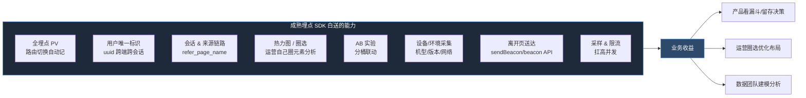
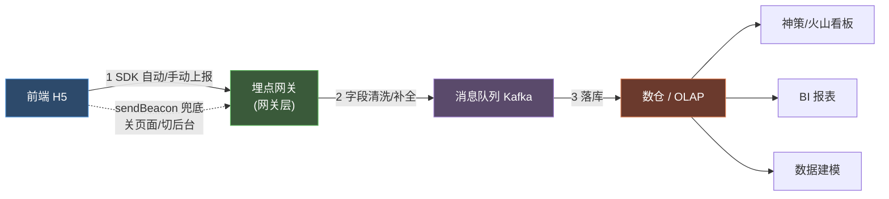
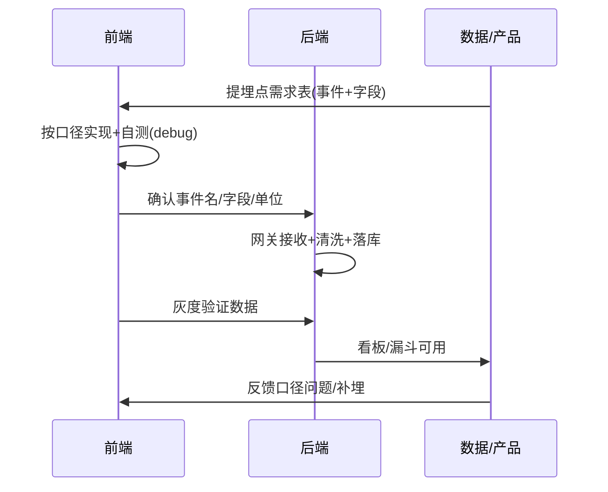

# 生产环境推荐实践

> 目标：教学 demo 用本地 console 模拟就够了，但**真要上线**，研发该怎么做。这篇讲清楚：生产为什么接真实 SDK、好处是什么、前端和后端各自的责任、前后端怎么对齐口径。
>
> 面向：要把埋点从"能跑"推到"能分析、能信"的研发同学。

## 教学模拟 vs 生产，差在哪

| 维度 | 本地 console 模拟（demo） | 生产真实接入 |
|---|---|---|
| 数据去哪 | 控制台 / 页面面板 | 埋点后台（神策 / 火山 / 自建） |
| 能分析吗 | 不能，只是看一眼 | 能出看板、漏斗、留存、路径 |
| 用户身份 | 无 | uuid / user_pid，跨端跨会话识别 |
| 离开页送达 | 模拟 flush | 真实网络，可能丢 → 要 `sendBeacon` 兜底 |
| 环境隔离 | 开关切换 | 多套 appId / 域名 / 密钥 |
| 采样/限流 | 无 | 高流量场景必须 |

**结论**：模拟只验证"机制对不对"；生产要解决"数据准不准、全不全、能不能用"。

## 生产为什么要接真实 SDK（好处）

一句话：**自研上报容易，但"用户是谁、从哪来、看了多久、丢没丢"这些工程问题，成熟 SDK 已经踩过坑**。生产接 SDK 是站在它肩膀上，不是重复造轮子。

## 生产数据流（前端 → 后端 → 看板）

## 前端研发职责

### SDK 接入与初始化
- 在入口文件创建实例、传入 appId / 上报域名 / 环境开关
- 环境隔离：生产 / 测试 / sim 用不同 appId，别把测试数据灌进生产
- `enableOutAPP` 之类开关按需配，明确"App 内外行为差异"

### 公共字段与开关统一管理
- `page_name` / `page_type` / `url` 等公共字段抽成常量或封装函数，别散落各页面
- `key1` 一律 `JSON.stringify`，不开 key2/key3（见 [字段口径](/p/tracking-fields/)）

### 停留时长与离开页兜底
- 心跳定时上报 + `visibilitychange` 暂停/恢复 + `beforeDestroy` flush（见 [写法 G 心跳](/p/tracking-patterns/)）
- **生产关键**：离开页上报优先用 `navigator.sendBeacon()`，比普通 XHR 更能在页面关闭时送达
- `hidden` 与 `pagehide` 监听注意去重，避免同一次离开报两遍

### 不阻断业务
- 埋点调用排在业务动作之前，且 `try/catch` 包裹或 SDK 内部吞异常
- 埋点挂了，用户操作必须照常

### 密钥与脱敏（开源/公开仓库时）
- appId、上报域名、密钥走环境变量（`.env.*`），不硬编码进源码
- 开源仓库用占位值 + 文档说明，真实密钥只在 CI/部署注入
- 用户敏感信息（手机号、token）**绝不**进埋点字段，`key1` 里只放分析需要的业务 id

### 灰度与采样
- 新埋点先灰度小流量验证数据是否符合预期，再全量
- 高频事件（滚动、播放进度）考虑采样，别把网关打爆

### 自测
- 开 debug 开关，控制台确认每条事件字段完整、单位正确
- 对照需求文档逐条核对"该报的场景都报了"
- 新老口径双发时，确认 `duration_ms` / `duration` 没填反

## 后端研发职责

### 接收网关
- 提供稳定上报接口，支持高并发；前端 SDK 直连或经业务网关转发
- 鉴权：校验来源合法性，防伪造刷量

### 字段清洗与补全
- 前端缺的公共字段（IP、UA、地域、时间戳）在网关/消费侧补全
- 异常字段过滤：`page_name` 为空、`key1` 非法 JSON 等落"脏数据表"告警，别污染主表

### 新老口径映射
- 前端双发（`$tracker` 的 `duration_ms` vs `LogTrack` 的 `duration`）在后端做归一映射，落库统一字段名
- 维护一份"事件名 → 业务含义"字典表，供数据同学查

### 去重与幂等
- 同一次离开可能因 `hidden` + `pagehide` 重复上报 → 后端按 `(session_id, event, timestamp 窗口)` 去重
- 上报请求支持幂等键，防网络重试导致重复

### 监控与告警
- 上报量突增/突降告警（可能是 SDK 加载失败或页面白屏）
- 字段缺失率、脏数据率纳入监控
- 离开页事件送达率单独看（`sendBeacon` 失败兜底统计）

### 数据落库与查询
- 落数仓 / OLAP，供神策、火山、自建 BI 查询
- 大表分区按天，冷热分层

## 前后端协作口径

- **统一字典**：事件名、字段名、单位、枚举值前后端共用一份文档（项目对应埋点规格文档 / 报告页埋点规格文档）
- **单位先行**：时长是毫秒还是秒，需求阶段就定死，别等数据对不上才查
- **变更走流程**：改字段名 / 加字段要同步更新字典 + 通知后端做映射，别前端单方面改

## 生产自检清单

前端：
- [ ] appId / 密钥走 env，未硬编码
- [ ] 公共字段抽封装，`key1` 已 stringify
- [ ] 离开页用 `sendBeacon`，`hidden`/`pagehide` 去重
- [ ] 埋点 `try/catch`，不阻断业务
- [ ] debug 自测字段完整、单位正确
- [ ] 新埋点灰度后再全量

后端：
- [ ] 网关鉴权 + 限流
- [ ] 字段补全 + 脏数据过滤
- [ ] 新老口径归一映射
- [ ] 去重 / 幂等
- [ ] 上报量 / 送达率 / 脏数据率监控告警
- [ ] 事件字典表维护

---

← [字段口径与 key1 规约](/p/tracking-fields/) ｜ 系列完 · demo 见 [demo](/tracking-demo/)
